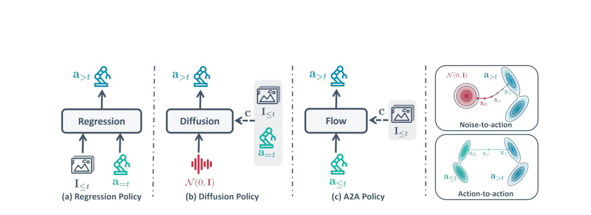

> *Generated by JarvisForResearchers Bot on 2026-05-01*

## TL;DR
Action-to-Action Flow Matching (A2A) replaces the stochastic noise initialization inherent in diffusion-based robotics policies with an informed starting point derived directly from historical proprioceptive action sequences. This paradigm shift allows for fast, single-step action generation by transforming the distribution of past actions into the distribution of future actions within a shared latent space, significantly reducing inference latency.

## The Problem
Diffusion-based policies, while powerful for modeling complex distributions, suffer from a critical bottleneck in real-time robotic applications: high inference latency. This latency stems directly from the "denoise-from-scratch" paradigm, which necessitates multiple iterative denoising steps to converge from an initial stochastic noise sample to a coherent action sequence. For control loops requiring high update rates, this iterative nature is prohibitive.

## Key Contributions
We introduce Action-to-Action Flow Matching (A2A), a novel policy paradigm that fundamentally alters action generation by moving away from uninformed sampling toward informed initialization. A2A leverages a sequence of historical proprioceptive actions, which are embedded into a high-dimensional latent space, to serve as the starting point for action generation, thereby circumventing the need for costly iterative denoising. Empirical validation demonstrates that A2A achieves high training efficiency, exhibits extremely fast inference speed (down to 0.56 ms latency), and maintains improved generalization capabilities when tested on unseen configurations.

## How It Works


*Figure 1 Comparison of robotic policy paradigms. (a) Regression Policy: Deterministic mapping from multi-modal inputs
to actions. (b) Diffusion Policy: Generative modeling via iterative denoising from Gaussian noise. (c) A2A Policy:
Informed action generation through a structured flow between histor*

A2A is built upon the framework of flow matching. The core mechanism involves transforming the distribution of historical actions, denoted $a_{\le t}$, directly into the distribution of future actions, $a_{>t}$, all within a unified latent space $Z$. The architecture employs an action encoder ($E_a$) and a decoder ($D_a$) to manage this transformation. Specifically, $E_a$ maps the trajectory history to an initial latent state $z_0$, and $D_a$ reconstructs the target future action $\hat{a}_{>t}$ from the final latent state $z_1$. Visual observations, $I_{\le t}$, are processed separately by a visual encoder ($E_I$) and projected into a global conditioning vector $c$ via an MLP. The flow itself is learned by training a flow net, constructed using AdaLN-MLP blocks, to predict the vector field $v_\tau$ that governs the trajectory $dz_\tau/d\tau = v_\tau(z_\tau)$. The overall training objective, $L_{total}$, is a composite loss function combining the Flow matching loss ($L_{FM}$), the Autoencoder reconstruction loss ($L_{AE}$), and an Inference consistency loss ($L_{IC}$).

### Condition Path
This component is responsible for integrating high-dimensional visual data into the policy's decision-making process. It utilizes a ResNet-18 backbone to encode the visual observations ($I_{\le t}$). The resulting feature map is then passed through a linear projector to yield a global conditioning vector, $c$, which conditions the subsequent flow network.

### Source Path (Action Encoder $E_a$)
The Source Path is tasked with extracting the relevant dynamics from the past. It employs a Convolutional Neural Network (CNN) featuring a 5 kernel size to compress the $n$-frame history of proprioceptive actions ($a_{\le t}$) into a compact latent starting point, $z_0$. This $z_0$ serves as the informed initialization for the flow process.

### Flow Net
The Flow Net is the core generative component, responsible for defining the transformation path. It is architecturally built using AdaLN-MLP blocks. Its function is to predict the vector field, $v_\tau$, which dictates the necessary transport from the initial latent state $z_0$ to the target latent state $z_1$ within a shared 512-dimensional latent space.

### Residual MLP Decoder ($D_a$)
The Residual MLP Decoder acts as the final projection layer. It takes the target latent state, $z_1$, output by the Flow Net and transforms it into the predicted future action sequence, $\hat{a}_{>t}$.

## Results
| Metric | Value | Baseline | Source |
| :--- | :--- | :--- | :--- |
| Success Rate (Close Box) | 92 (%) | N/A | Table 1 |
| Success Rate (Pick Cube) | 92 (%) | N/A | Table 1 |
| Success Rate (Stack Cube) | 86 (%) | N/A | Table 1 |
| Success Rate (Open Drawer) | 92 (%) | N/A | Table 1 |
| Success Rate (Pick-Place Bowl) | 90 (%) | N/A | Table 1 |
| Training Convergence Speed | up to 20$\times$ faster than vanilla diffusion | Vanilla Diffusion | Section 4.1 |
| Training Convergence Speed | up to 5$\times$ faster than flow matching methods | Flow Matching methods | Section 4.1 |
| Inference Latency | 0.56 ms | N/A | Section 4.1 |

## Why This Matters
The shift from noise-based diffusion to action-to-action flow matching addresses a fundamental constraint in deploying complex generative models for real-time robotics. By replacing stochastic initialization with a physically informed starting point derived from historical state, A2A drastically reduces the computational overhead associated with iterative sampling. Furthermore, the reliance on rich temporal history via $E_a$ provides a strong physical prior, which enhances the policy's robustness against minor visual perturbations, while the multi-task loss formulation ensures a balanced optimization across generative fidelity, latent space structure, and physical executability.

## Limitations & Open Questions
A primary limitation of the A2A framework is its inherent sensitivity to input quality; if the preceding action sequences ($a_{\le t}$) are corrupted by subtle noise, the performance of A2A degrades commensurately due to its reliance on these historical inputs. Additionally, the formulation requires the specification of a user-defined weight, $\lambda_0 \in \mathbb{R}^+$, within the Inference consistency loss ($L_{IC}$), the optimal tuning of which remains an empirical challenge.

---

## Citation

**Paper:** [2602.07322](https://arxiv.org/abs/2602.07322)

```bibtex
@article{260207322,
  title   = {Action-to-Action Flow Matching},
  author  = {Jindou Jia and Gen Li and Xiangyu Chen and Tuo An and Yuxuan Hu and Jingliang Li et al.},
  journal = {arXiv preprint arXiv:2602.07322},
  year    = {2026},
  url     = {https://arxiv.org/abs/2602.07322}
}
```
