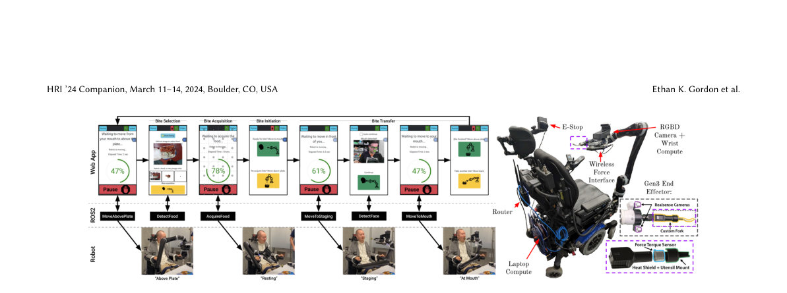

> *Generated by JarvisForResearchers Bot on 2026-05-01*

## TL;DR
We present a robot-assisted feeding system that integrates hardware (Kinova arms, Jetson Nano) with a ROS2 stack to enable self-feeding for mobility-impaired individuals. The system achieves adaptability to novel food textures via multi-modal online learning during bite acquisition and employs real-time, interaction-aware control for safe bite transfer into the mouth.

## The Problem
A significant public health issue is the reliance on assistance for eating; in the United States alone, at least 1.8 million people require help with feeding. This dependency imposes substantial emotional burdens, specifically feelings of shame on the recipients, and creates a significant, time-intensive logistical burden on caregivers.

## Key Contributions
Our work makes three primary contributions:
1. We deliver a robot-assisted feeding system that simultaneously embodies Safety, Portability, and User Control.
2. We employ multi-modal online learning to ensure tractable adaptation when encountering unseen food types during the bite acquisition phase.
3. We implement a bite transfer mechanism that utilizes real-time mouth perception coupled with an interaction-aware control strategy, leveraging multimodal sensing (visual and haptic).

## How It Works


*Figure 1: (Left) Diagram of the system logic. The user drives the app, which calls an API on the robot computer. (Right) Hardware system for
both the Gen2 and Gen3 base. No external wires are needed.
1.2
Software
Our software stack is built on ROS2 and the ros2-control frame-
work2. We have configur*

The system architecture integrates specific hardware components with a robust ROS2 software framework. User interaction is mediated through a React web application, which drives a finite state machine implemented via ROS2 action servers, services, and topics. Bite acquisition is managed using a 26-dimensional interpretable acquisition schema, augmented by a contextual bandit framework that incorporates haptic post hoc context for online adaptation. Bite transfer is achieved by combining real-time mouth perception derived from multiple in-hand cameras with a physical interaction-aware control method that fuses visual and haptic data to navigate within the user's oral cavity.

### Kinova Gen2 (JACO)
This is a 6-DOF robot arm. It has been modified to incorporate an eye-in-hand system, which permits continuous rotation of the wrist joint, providing necessary degrees of freedom for precise manipulation tasks.

### Kinova Gen3
This 6-DOF robot arm is equipped with an additional camera and features an Nvidia Jetson Nano developer kit mounted on its wrist. This setup allows for localized, high-throughput perception processing, specifically managing an Intel Realsense D415 RGBD camera.

### Custom, 3d-printed fork assembly
This assembly is held by the robot gripper. Crucially, it is instrumented with a 6-DOF ATI Nano25 force-torque transducer, providing direct, high-fidelity feedback on contact forces during interaction.

### Lenovo Legion 5 laptop
This unit serves as the primary computational hub. It is equipped with an Nvidia RTX 3060 6GB GPU and is mounted externally on the user's wheelchair, facilitating the system's portability requirement.

### React app
This application functions as the primary user interface, accessible via a standard web browser. It acts as the logical control 'seat' for the entire system, managing high-level state transitions and user commands.

### Watchdog system
This is a dedicated, single-node process responsible for enforcing hard safety constraints. It continuously verifies system invariants and issues an 'all-clear' signal, acting as a final layer of safety validation.

## Results
No quantitative results were provided in the outline.

## Why This Matters
The design explicitly addresses critical gaps in prior work. The system is engineered for portability, meaning it can operate using the battery power of any standard powered wheelchair without requiring dedicated, fixed wiring for the utensil. Furthermore, user agency is maintained because control is centralized in the web application, allowing the recipient to initiate, halt, or modify the system's operation at any point. Safety is not monolithic; it is enforced across four distinct layers: Compliant Hardware, Compliant Control, Software Anomaly Detection, and Emergency Intervention.

## Limitations & Open Questions
Two primary limitations must be acknowledged. First, the system's usability is contingent on the user's capacity to interface with the web application using available assistive technologies. Second, the overall safety profile is fundamentally dependent on the operational integrity of the watchdog system and the reliability of the emergency stop mechanisms.

---

## Citation

**Paper:** [2403.04134](https://arxiv.org/abs/2403.04134)

```bibtex
@article{240304134,
  title   = {An Adaptable, Safe, and Portable Robot-Assisted Feeding System},
  author  = {Ethan Kroll Gordon and Rajat Kumar Jenamani and Amal Nanavati and Ziang Liu and Haya Bolotski and Raida Karim et al.},
  journal = {arXiv preprint arXiv:2403.04134},
  year    = {2024},
  url     = {https://arxiv.org/abs/2403.04134}
}
```
