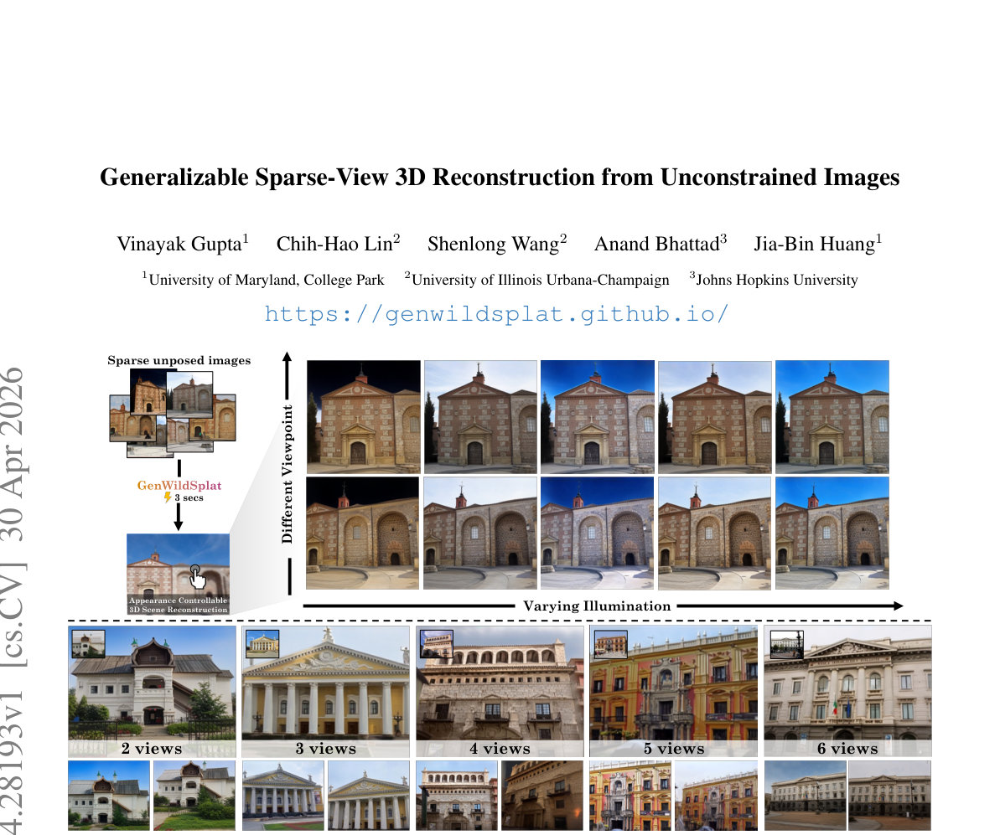

> *Generated by JarvisForResearchers Bot on 2026-05-01*

## TL;DR
GenWildSplat is a feed-forward framework designed for generalizable 3D scene reconstruction from sparse, unposed images. It achieves this by decoupling geometry from illumination via an appearance adapter, allowing it to adapt to target lighting conditions, and by explicitly modeling occlusions using a pre-trained semantic segmentation network, thereby eliminating the need for per-scene optimization.

## The Problem
Reconstructing a coherent 3D representation of a scene from a limited set of sparse, unposed input images presents significant challenges in real-world deployment. These challenges are exacerbated by environmental variability, specifically fluctuating illumination and the presence of transient occlusions (e.g., moving people or vehicles). Existing methodologies often necessitate scene-specific optimization loops, which are computationally prohibitive and fail when applied to novel or sparse input views. Furthermore, purely feed-forward models typically exhibit brittleness when faced with lighting conditions divergent from those encountered during training. Prior state-of-the-art methods struggle to generalize robustly across datasets characterized by high visual diversity, such as MegaScenes, due to the combined difficulties of sparse input, varied lighting, and heavy occlusion.

## Key Contributions
We introduce GenWildSplat, a novel feed-forward framework that enables 3D scene reconstruction from sparse, unposed multi-view images without requiring any per-scene optimization. A core contribution is the integration of an appearance adapter, which modulates the intrinsic scene appearance based on a light code estimated by a dedicated light encoder, thereby enabling appearance adaptation to arbitrary target lighting. Furthermore, we leverage a pre-trained semantic segmentation network to generate explicit occlusion masks, which guides the reconstruction process to focus supervision solely on static scene content, mitigating the impact of transient objects.

## How It Works


*Figure 1. GenWildSplat reconstructs 3D scenes from sparse, unposed images with varying illumination and transient objects in a single
3-second feed-forward pass, and no per-scene optimization is required. Given 2–6 input views, our method predicts novel views under
target lighting conditions while h*

GenWildSplat processes the input set of sparse, unposed multi-view images, $\mathcal{I}$, through a VGGT transformer backbone, $\phi_\theta$, to extract rich, multi-view features, $\mathbf{F}$. These features are then routed to specialized prediction heads: the Depth Head ($h_D$) predicts per-view depth maps ($\mathbf{D}$), the Camera Head ($h_C$) estimates the necessary camera parameters ($\mathbf{K}, \mathbf{E}$), and the Gaussian Head ($h_{\text{gauss}}$) outputs the appearance-independent properties and canonical Spherical Harmonic (SH) coefficients ($\mathbf{c} \in \mathbb{R}^{75}$) for the 3D Gaussians ($\mathbf{G}_c$).

To handle illumination variation, a Light Encoder ($\text{ELight}$) processes each input image $I^{(i)}$ to derive a per-view light code, $\mathbf{L}_i$, which is a 16-dimensional vector. This light code is then fed into the Appearance Adapter ($\text{Flight}$), an MLP, which modulates the canonical Gaussians $\mathbf{G}_c$ into target-lit Gaussians, $\mathbf{G}_{l_i}$.

To ensure robustness against dynamic elements, a pre-trained Segmentation Network provides binary occlusion masks, $\mathbf{S}$, identifying transient classes. The final reconstruction is achieved by using a Differentiable Rasterizer ($\mathcal{R}$) to project the transformed Gaussians $\mathbf{G}_{l_i}$ into a rendered image $\hat{I}_j$. The training objective incorporates a masked reconstruction loss, $\mathcal{L}$, which utilizes the occlusion masks $\mathbf{S}$ to enforce supervision only on static scene geometry and appearance. The entire training regimen is structured around a curriculum learning strategy across three distinct stages.

### VGGT transformer backbone $\phi_\theta$
This component is responsible for extracting a unified, multi-view feature representation, $\mathbf{F}$, from the set of sparse, unposed input images, $\mathcal{I}$. It acts as the primary feature extractor, aggregating information across the input views to form a comprehensive scene representation that feeds into all subsequent prediction heads.

### Depth Head $h_D$
This head takes the extracted multi-view features, $\mathbf{F}$, and maps them to per-view depth maps, $\mathbf{D}$. This provides the initial geometric constraint necessary for 3D structure inference from the 2D inputs.

### Camera Head $h_C$
Utilizing the features $\mathbf{F}$, this head estimates the necessary camera parameters, specifically the intrinsic matrix ($\mathbf{K}$) and the extrinsic transformation ($\mathbf{E}$), for each input view. This allows for the geometric alignment required for consistent 3D reconstruction.

### Gaussian Head $h_{\text{gauss}}$
This head operates on $\mathbf{F}$ to output the intrinsic properties of the 3D Gaussians. Crucially, it predicts appearance-independent Gaussian properties and the canonical SH coefficients ($\mathbf{c} \in \mathbb{R}^{75}$), representing the scene's geometry and base spectral signature before illumination adaptation.

### Light Encoder $\text{ELight}$
This 2D CNN-based encoder processes each individual input image, $I^{(i)}$, to generate a compact, 16-dimensional lighting vector, $\mathbf{L}_i$. This vector serves as the explicit encoding of the scene's illumination state for that specific view.

### Appearance Adapter ($\text{Flight}$)
This MLP serves as the mechanism for appearance adaptation. It takes the canonical Gaussian colors ($\mathbf{G}_c$) and modulates them using the corresponding light code ($\mathbf{L}_i$) derived from $\text{ELight}$. The output is the target-lit Gaussian color, $\mathbf{G}_{l_i}$, which is ready for rendering under the desired lighting conditions.

### Segmentation Network
This component is a pre-trained network (specifically YOLOv8 Segmentation [13]) whose function is to identify and delineate transient objects within the input frames. It outputs binary occlusion masks, $\mathbf{S}$, which are used to mask out regions corresponding to moving or non-static elements during the loss calculation.

### Differentiable Rasterizer $\mathcal{R}$
This module takes the set of transformed, target-lit Gaussians, $\mathbf{G}_{l_i}$, and performs the projection and rendering operation to synthesize a predicted image, $\hat{I}_j$. Its differentiability is essential for backpropagating gradients through the rendering process to update the network weights.

## Results
| Metric | Value | Baseline | Source |
| :--- | :--- | :--- | :--- |
| Inference Time | 3 seconds | N/A | Abstract |
| Performance on PhotoTourism | State-of-the-art feed-forward rendering quality | Optimization-based methods [16, 36, 54] | Abstract |
| Performance on MegaScenes | Generates clean and consistent renderings across diverse scenes | Prior SOTA methods | Figure 6 |

## Why This Matters
The introduction of GenWildSplat addresses a critical bottleneck in real-world robotics and computer vision: the dependency on computationally expensive, iterative optimization for 3D reconstruction. By establishing a robust, feed-forward pipeline, we enable rapid, deployable 3D scene understanding from unconstrained inputs. The decoupling of geometry from illumination via the Appearance Adapter provides a mechanism for controllable appearance transfer, which is vital for tasks requiring scene understanding under varying environmental conditions. Finally, the integration of external priors, such as semantic segmentation, provides a principled method for filtering out noise introduced by dynamic elements, leading to more stable and geometrically accurate reconstructions.

## Limitations & Open Questions
The current formulation is not explicitly trained to render novel views or lighting conditions that are entirely outside the distribution observed during training, despite demonstrating strong generalization to unseen views. Furthermore, the training process necessitates a carefully constructed curriculum learning strategy to effectively manage the inherent ill-posed nature of simultaneously inferring geometry, illumination, and occlusion from sparse observations. Future work should investigate methods to further decouple these factors or develop more robust regularization schemes that reduce the reliance on the curriculum structure.

---

## Citation

**Paper:** [2604.28193](https://arxiv.org/abs/2604.28193)

```bibtex
@article{260428193,
  title   = {Generalizable Sparse-View 3D Reconstruction from Unconstrained Images},
  author  = {Vinayak Gupta and Chih-Hao Lin and Shenlong Wang and Anand Bhattad and Jia-Bin Huang},
  journal = {arXiv preprint arXiv:2604.28193},
  year    = {2026},
  url     = {https://arxiv.org/abs/2604.28193}
}
```
