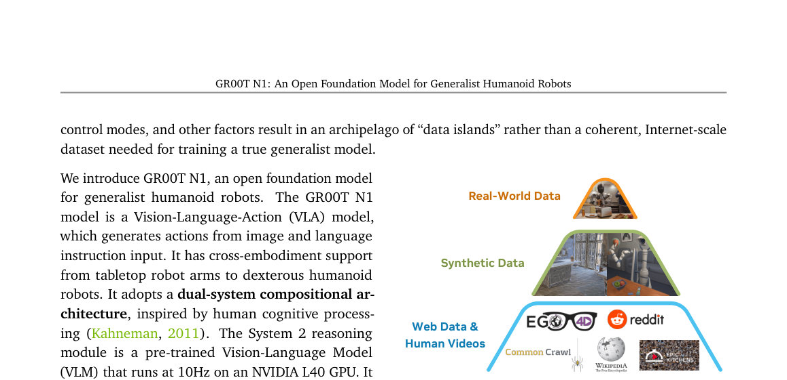

> *Generated by JarvisForResearchers Bot on 2026-05-01*

## TL;DR
GR00T N1 is an open Vision-Language-Action (VLA) foundation model for humanoid robots. It employs a dual-system architecture: a Vision-Language Model (System 2) handles high-level reasoning from visual input and language, while a Diffusion Transformer (System 1) generates real-time motor actions via flow-matching. Training is structured via a data pyramid to unify heterogeneous data sources, addressing the lack of large-scale humanoid robot datasets.

## The Problem
The objective of creating autonomous robots capable of executing complex, everyday tasks in unstructured human environments necessitates a generalist robot model. Such a model must possess the capacity to reason about novel situations and robustly handle real-world variability. However, the current landscape suffers from a critical deficiency: the absence of large-scale, Internet-like datasets specifically curated for humanoid robots. This scarcity results in what we term an "archipelago of 'data islands'," where models are trained on isolated, non-transferable datasets. Furthermore, the inherent variability across different robot embodiments, sensor suites, actuator degrees of freedom, and control paradigms complicates the construction of a coherent, Internet-scale dataset. Consequently, there is a pressing need for a full-stack solution that integrates the necessary hardware, sophisticated models, and comprehensive data infrastructure to achieve human-level physical intelligence.

## Key Contributions
We introduce GR00T N1, an open Vision-Language-Action (VLA) foundation model specifically designed for humanoid robots. Our primary architectural contribution is the adoption of a dual-system compositional architecture, which explicitly separates high-level cognitive processing from low-level motor control by integrating a Vision-Language Model (System 2) and a Diffusion Transformer (System 1). To overcome data limitations, we developed an effective co-training strategy structured around a data pyramid. This pyramid systematically unifies heterogeneous data sources, progressing from broad priors derived from Web Data and Human Videos, through synthetic data generation, and finally grounding the model in specific Real-World Data.

## How It Works


*Figure 1: Data Pyramid for Robot Foundation Model
Training. GR00T N1’s heterogeneous training corpora
can be represented as a pyramid: data quantity de-
creases, and embodiment-specificity increases, moving
from the bottom to the top.*

GR00T N1 functions as a unified VLA model operating under a dual-system paradigm. System 2, which is a pre-trained Vision-Language Model (VLM) leveraging Eagle-2, is responsible for interpreting the environment state and the specified task goal, deriving this understanding from visual perception and natural language instructions at a frequency of 10Hz. Concurrently, System 1, a Diffusion Transformer (DiT) trained using action flow-matching, generates the requisite fluid motor actions at a higher frequency of 120Hz. These two modules are tightly coupled and subjected to end-to-end joint training. The training regimen capitalizes on the data pyramid, utilizing latent actions extracted from human videos and neural trajectories, alongside synthetic and real-robot data. This methodology ensures the model acquires broad visual and behavioral priors while maintaining strict grounding in executable, embodied actions.

### Vision-Language Module (System 2)
This component is instantiated as a pre-trained Vision-Language Model (VLM). Its function is to process the robot's visual perception stream and the accompanying language instruction to achieve a comprehensive interpretation of the current environment state and the overarching task objective. For the GR00T-N1-2B variant, we utilize Eagle-2 (Li et al., 2025) and specifically extract features from the 12th layer of this VLM for downstream processing by the action generation system.

### Diffusion Transformer Module (System 1)
This module is a specialized DiT variant engineered to generate closed-loop motor actions. It operates by employing flow-matching techniques during training. Crucially, this DiT cross-attends to the token outputs provided by the VLM (System 2), allowing the action generation process to be conditioned on the high-level reasoning derived from the language and vision inputs. Furthermore, it incorporates embodiment-specific encoders and decoders to manage the heterogeneity of physical platforms.

### State and Action Encoders
To facilitate the integration of diverse physical inputs into the unified Transformer architecture, we employ dedicated Multi-Layer Perceptrons (MLPs) for each specific robot embodiment. These encoders are responsible for projecting the robot's state vectors and the action vectors—which can possess varying dimensionalities depending on the hardware—into a shared, consistent embedding dimension that the DiT can process effectively.

### Action Decoder
Following the final processing block within the DiT, an MLP serves as the Action Decoder. This component takes the final set of $H$ tokens outputted by the Transformer and maps them back into the specific motor action space required by the robot hardware, thereby predicting the executable control signals.

## Results
| Metric | Value | Baseline | Source |
| :--- | :--- | :--- | :--- |
| Performance on standard simulation benchmarks | outperforms the state-of-the-art imitation learning baselines | state-of-the-art imitation learning baselines | Abstract |
| Performance on language-conditioned bimanual manipulation tasks | achieving strong performance with high data efficiency | N/A | Abstract |

## Why This Matters
The GR00T N1 framework offers a tangible pathway toward realizing generalist robotics. The efficacy of the dual-system approach—decoupling complex, symbolic reasoning (VLM) from continuous, high-frequency control (DiT)—demonstrates a viable architectural pattern for complex embodied AI. Moreover, the data pyramid strategy provides a concrete methodology for mitigating the pervasive issue of data scarcity in robotics. By systematically structuring data acquisition across web-scale, synthetic, and real-world modalities, we show how to build robust behavioral priors that generalize across different physical instantiations, a critical step toward scalable, real-world deployment.

## Limitations & Open Questions
The current implementation exhibits dependencies on external, pre-trained components, specifically the Eagle-2 VLM, which itself is finetuned from SmolLM2 and SigLIP-2. This introduces a dependency chain that requires careful management. Additionally, the training pipeline is inherently complex, necessitating sophisticated data generation infrastructure, including the processes for latent action extraction from human demonstrations and the synthesis of neural trajectories. Future work must focus on making the entire pipeline more self-contained and exploring methods to improve the robustness of the latent action space mapping across vastly different embodiments.

---

## Citation

**Paper:** [2503.14734](https://arxiv.org/abs/2503.14734)

```bibtex
@article{250314734,
  title   = {GR00T N1: An Open Foundation Model for Generalist Humanoid Robots},
  author  = {NVIDIA and : and Johan Bjorck and Fernando Castañeda and Nikita Cherniadev and Xingye Da et al.},
  journal = {arXiv preprint arXiv:2503.14734},
  year    = {2025},
  url     = {https://arxiv.org/abs/2503.14734}
}
```
