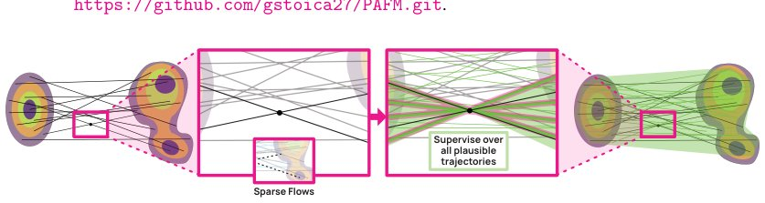

> *Generated by JarvisForResearchers Bot on 2026-05-05*

## TL;DR
Posterior-Augmented Flow Matching (PAFM) generalizes standard Flow Matching (FM) by replacing single-target supervision with an expectation over an approximate posterior of valid target completions, thereby reducing gradient variance.

## The Problem
In high-dimensional image generation utilizing Flow Matching (FM), the training signal is inherently sparse and high-variance. Specifically, each training sample only supervises a single trajectory and a single intermediate point. This constraint means that a given intermediate point $z_{i,t}$ can plausibly lie on numerous trajectories leading to different valid targets under the same conditioning. This sparse, under-constrained supervision leads to flow collapse, where the learned dynamics tend to overfit to specific, sampled source-target pairings rather than learning the general underlying data manifold dynamics. Existing theoretical frameworks and objective refinements for FM typically maintain the assumption of a one-target-per-intermediate coupling, failing to address this fundamental issue of trajectory ambiguity.

## Key Contributions
We introduce Posterior-Augmented Flow Matching (PAFM), which fundamentally shifts the supervision paradigm from single-target prediction to predicting the expected velocity over all plausible continuation trajectories, weighted by their posterior likelihood. We provide a proof demonstrating that PAFM yields an unbiased estimator of the original FM objective, i.e., $L(\text{PAFM})(\theta) = L(\text{FM})(\theta)$. Furthermore, we demonstrate that this aggregation of information across multiple plausible flows effectively reduces the gradient variance compared to standard FM.

## How It Works


*Figure 1: Left: Standard FM provides a sparse, one-to-one supervision signal, pairing each interme-
diate point with a single target and yielding a single plausible flow. Right: Our PAFM aggregates
supervision over the full posterior of compatible targets, producing a denser, more coherent set of
pl*

PAFM reformulates the FM objective by conditioning the velocity prediction not on a single sampled endpoint $y_i$, but on the expectation over the posterior distribution of valid targets given the intermediate state $z_{i,t}$. This posterior, $p_t(z_j|z_{i,t}, y_i)$, is generally intractable. We factor this posterior into two components: the likelihood of the intermediate state $z_{i,t}$ under a hypothesized endpoint $z_j$, $p_t(z_{i,t}|z_j)$, and the prior probability of that endpoint $z_j$ under the condition $y_i$, $p_t(y_i|z_j)$.

To handle the intractability, we employ a sampling strategy that constructs a mixture over $K$ candidate targets, $\{z_j\}_{j=1}^K$. We then utilize Self-Normalized Importance Sampling (SNIS) to weight these candidates according to their posterior likelihoods. This aggregation of gradients derived from multiple plausible flows effectively lowers the variance of the training gradient estimate by a factor related to the Effective Sample Size, $\text{ESS}(z_{i,t}) \geq 1$, relative to standard FM.

### Flow Matching (FM) Objective
The standard FM objective is defined as:
$$L(\text{FM})(\theta) = \mathbb{E}_{t \sim \text{Unif}[0,1), (z_i, y_i) \sim \text{data}(\bullet), z_{i,t} \sim p_t(\bullet|z_i)} \left\| f_\theta(z_{i,t}|t, y_i) - v(z_{i,t}|z_i) \right\|^2$$
This objective requires predicting the velocity $v$ at time $t$ given the current latent $z_{i,t}$ and the final target $y_i$.

### Posterior-Augmented Flow Matching (PAFM) Objective
PAFM modifies this by integrating over the posterior of targets:
$$L(\text{PAFM})(\theta) = \mathbb{E}_{t \sim \text{Unif}[0,1), y_i \sim \text{data}(y), z_{i,t} \sim p_t(\bullet), z_j \sim p_t(\bullet|z_{i,t}, y_i)} \left\| f_\theta(z_{i,t}|t, y_i) - v(z_{i,t}|z_j) \right\|^2$$
Here, the expectation is taken over the distribution of plausible targets $z_j$ given the intermediate state $z_{i,t}$ and condition $y_i$.

### Conditional Probability Path $p_t(z_{i,t}|z_j)$
We model the likelihood of reaching a specific target $z_j$ from the current latent $z_{i,t}$ using a Gaussian distribution: $N(\mu_t z_j, \alpha_t^2 \text{Id})$. The log-likelihood is proportional to $-\|z_{i,t} - (1-t)z_j\|^2 / 2t^2$. This term quantifies how likely the current state $z_{i,t}$ is to be on a path leading to $z_j$.

### Condition Likelihood $p_t(y_i|z_j)$
This term measures the compatibility between a candidate target $z_j$ and the input condition $y_i$. For class-conditioned FM, this is deterministic (1 if $y_i = y_j$, 0 otherwise). For more complex conditioning, this requires an approximation.

### Self-Normalized Importance Sampling (SNIS)
Since the true posterior $p_t(z_j|z_{i,t}, y_i)$ is intractable, we approximate the expectation using SNIS. This technique computes the gradient estimator $\hat{\mu}_{\text{SNIS}}g(z_{i,t}|K) = \sum_{j=1}^K w_j g(z_j|z_{i,t}, y_i)$, where the weights $w_j$ are derived by normalizing the importance weights based on the posterior likelihoods of the $K$ sampled candidates $\{z_j\}_{j=1}^K$.

## Results
| Metric | Value | Baseline | Source |
| :--- | :--- | :--- | :--- |
| FID50K improvement | up to 3.4 | FM | Abstract |

## Why This Matters
PAFM provides a principled method to mitigate the high variance inherent in trajectory-based generative modeling. By replacing the brittle, single-point supervision of standard FM with an expectation over a set of plausible continuations, we effectively densify the training signal. This allows the model to learn a more robust and generalized flow dynamics, leading to measurable improvements in sample quality, as evidenced by the FID score reduction. Furthermore, the method is architecturally flexible, supporting various strategies for sourcing candidate targets $\{z_j\}_{j=1}^K$, such as FAISS k-nearest-neighbor retrieval, and incurs only marginal computational overhead across different model scales and architectures.

## Limitations & Open Questions
The primary limitation is that the true posterior $p_t(z_j|z_{i,t}, y_i)$ remains intractable, necessitating practical approximations. Similarly, the condition likelihood $p_t(y_i|z_j)$ requires approximation, particularly in continuous-conditioned generation, although using models like CLIP offers an intuitive starting point for this approximation.

---

## Citation

**Paper:** [2605.00825](https://arxiv.org/abs/2605.00825)

```bibtex
@article{260500825,
  title   = {Posterior Augmented Flow Matching},
  author  = {George Stoica and Sayak Paul and Matthew Wallingford and Vivek Ramanujan and Abhay Nori and Winson Han et al.},
  journal = {arXiv preprint arXiv:2605.00825},
  year    = {2026},
  url     = {https://arxiv.org/abs/2605.00825}
}
```
