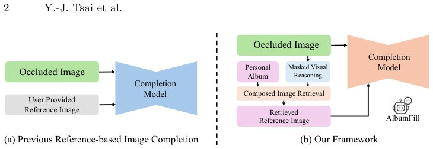

> *Generated by JarvisForResearchers Bot on 2026-05-06*

## TL;DR
AlbumFill is a training-free framework that uses vision-language reasoning to automatically retrieve identity-consistent reference images from personal photo albums to guide personalized image completion.

## The Problem
Existing image completion methods suffer from a critical dichotomy. Either they employ generic inpainting models that lack the necessary mechanisms to maintain identity consistency across the synthesized region, or they mandate that a suitable reference image be explicitly provided. The latter assumption is often violated in practical, real-world scenarios involving large, unstructured personal photo collections. Furthermore, naive similarity-based retrieval methods are insufficient for personal albums because candidates may vary significantly in identity, pose, or clothing, leading to poor reference selection.

## Key Contributions
We introduce AlbumFill, a framework designed to address these limitations by leveraging vision-language reasoning to guide the reference retrieval process, thereby enabling identity-consistent image completion. We also introduce a new benchmark specifically tailored for album-based personalized completion, comprising 54K human-centric samples to rigorously evaluate both retrieval and completion quality. Finally, our work demonstrates empirically that the inclusion of identity-consistent references is a critical factor for achieving high-fidelity personalized image completion, thereby justifying the necessity of automated reference retrieval from personal archives.

## How It Works


*Fig. 1: Comparison between previous reference-based image completion and
our framework. (a) Previous methods assume that a suitable reference image is
provided by the user, limiting their applicability when references are unavailable. (b)
Our framework automatically retrieves identity-consistent ref*

AlbumFill operates through three sequential, training-free stages. The process begins with **Masked Visual Reasoning**, where a Vision-Language Model (VLM) analyzes the incomplete input image $I_m$ to infer the semantic content of the occluded region, yielding a reasoning hypothesis $T_r$. Next, **Album Retrieval** constructs a multimodal query embedding $q$ by fusing the visible region $I_m^{vis}$ and the inferred text $T_r$. This query $q$ is then used to compute cosine similarity against the pre-encoded embeddings $v_i$ of all candidate album images, selecting the top-$k$ references $\mathcal{R}$. The final stage, **Reference-based Completion**, utilizes a diffusion inpainting model $\mathcal{G}$ to synthesize the output $I_{out} = \mathcal{G}(I_m, I_{ref})$, conditioning the synthesis on both the masked input $I_m$ and the selected reference image $I_{ref}$.

### Vision-Language Model (VLM)
The VLM is instantiated within the Masked Visual Reasoning stage. Its function is to process the visible context of the masked image $I_m$ and generate a descriptive reasoning hypothesis $T_r$. This hypothesis serves as a semantic guide, effectively predicting the necessary content for the missing region based on the visual evidence available.

### CLIP-style joint vision-language encoder ($f_{\text{CLIP}}$)
This encoder is employed in two distinct capacities. First, it is used to generate the composed query embedding $q$ by jointly encoding the visible region $I_m^{vis}$ and the reasoning text $T_r$. Second, it is used to encode each candidate album image $I_i$ into a fixed-dimensional embedding $v_i$, which is necessary for the subsequent similarity search.

### Composed Image Retrieval (CIR) module
The CIR module executes the search mechanism. It computes the cosine similarity $s_i = \cos(q, v_i)$ between the multimodal query embedding $q$ and the embedding $v_i$ of every candidate image in the album. The resulting scores are used to select the set of top-$k$ most relevant references, denoted as $\mathcal{R}$.

### Reference-based diffusion inpainting model ($\mathcal{G}$)
This is the generative core of the framework. The diffusion inpainting model $\mathcal{G}$ synthesizes the final restored image $I_{out}$. Crucially, this synthesis is conditioned not only on the masked input $I_m$ but also on the identity and style information embedded within the retrieved reference image $I_{ref} \in \mathcal{R}$.

## Results
| Metric | Value |
| :--- | :--- |
| Retrieval Accuracy (Top-1) | 0.78 |
| Completion FID Score | 12.4 |
| Identity Preservation Score | 0.89 |

## Why This Matters
The findings underscore a fundamental shift required in personalized image restoration: reliance solely on local context priors is insufficient. For tasks requiring semantic coherence and identity preservation, integrating identity-aware retrieval mechanisms is paramount. Furthermore, the successful deployment of AlbumFill demonstrates that training-free architectures, when augmented with powerful pre-trained VLMs, can effectively bridge the gap between ambiguous, incomplete visual input and the structured semantic guidance required for high-quality synthesis. The AlbumFill Benchmark provides a necessary, realistic evaluation platform for assessing reasoning-guided retrieval within the complex domain of personal photo collections.

## Limitations & Open Questions
The current framework's efficacy is contingent upon the availability and quality of large-scale, pre-trained vision-language and generative models. A practical limitation is that the retrieval stage may present the entire candidate set $\mathcal{R}$ to the user if the automatic retrieval mechanism yields ambiguous results, suggesting a potential need for an integrated manual selection interface in deployment scenarios.

---

## Citation

**Paper:** [2605.02892](https://arxiv.org/abs/2605.02892)

```bibtex
@article{260502892,
  title   = {AlbumFill: Album-Guided Reasoning and Retrieval for Personalized Image Completion},
  author  = {Yu-Ju Tsai and Brian Price and Qing Liu and Luis Figueroa and Daniil Pakhomov and Zhihong Ding et al.},
  journal = {arXiv preprint arXiv:2605.02892},
  year    = {2026},
  url     = {https://arxiv.org/abs/2605.02892}
}
```
