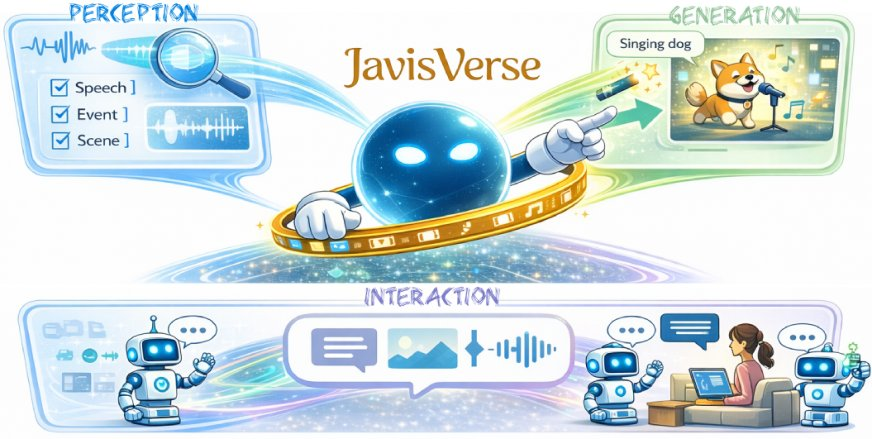

> *Generated by JarvisForResearchers Bot on 2026-05-07*

## TL;DR
This survey provides the first comprehensive review of Audio-Visual Intelligence (AVI) within the paradigm of large foundation models, unifying perception, generation, and interaction research under a coherent framework. It establishes a principled taxonomy and consolidates the methodological foundations necessary for systematic progress in this rapidly evolving domain.

## The Problem
The literature on Audio-Visual Intelligence (AVI) is fragmented, spanning diverse tasks, inconsistent taxonomies, and heterogeneous evaluation practices, which impedes systematic comparison and knowledge integration. Specifically, the existing body of work suffers from several critical issues: the literature remains fragmented across subcommunities with overlapping definitions, inconsistent terminology, and divergent taxonomies that hinder cumulative understanding; evaluation practices vary widely in datasets, metrics, and protocols, especially for open-ended generation, alignment quality, temporal coherence, and human-centric judgments, which complicates reproducibility and benchmarking; and safety and governance concerns, such as privacy in audio/video, consent for speech and music, watermarking and provenance, and the energy footprint of foundation-scale training, are increasingly consequential yet unevenly addressed.

## Key Contributions
This work makes three primary contributions. First, it provides the first systematic and in-depth survey of Audio-Visual Intelligence within the paradigm of large foundation models, unifying perception, generation, and interaction research under a coherent framework. Second, it establishes a principled taxonomy that organizes the diverse audio-visual tasks—covering speech, music, sound events, video, and open-world understanding, generation, and interaction—while clarifying task scope, assumptions, and relationships among subproblems. Third, it consolidates the methodological foundations of AVI, including audio/visual tokenization, cross-modal fusion, autoregressive and diffusion-based generation, instruction alignment, and large-scale pretraining strategies.

## How It Works


*Please provide the figure you would like me to analyze.*

The survey synthesizes methodological foundations for AVI, which build upon modality-specific encoders or tokenizers for audio and vision, followed by cross-modal fusion and alignment techniques. Generative capabilities are addressed using autoregressive transformers for sequence modeling or diffusion models for high-fidelity synthesis, often adapted via cross-attention and guidance mechanisms. Furthermore, LLM-centric methods are synthesized, including Encoder+LLM for perception, LLM+Generator for generation, and unified models for joint perception and generation, all tailored for instruction alignment and preference optimization.

### Audio Modality
The Audio Modality originates from physical vibrations, captured as 1D time-series digital signals (waveform, $a \in \mathbb{R}^L$) or transformed into time-frequency representations (spectrograms). The choice of representation dictates the subsequent processing pipeline, often requiring specialized feature extractors to capture relevant acoustic invariants.

### Visual Modality
The Visual Modality is data represented as images or video, processed through unimodal representations before cross-modal integration. Standard computer vision backbones are employed here, but the complexity scales significantly when dealing with temporal dependencies inherent in video streams.

### Cross-Modal Fusion and Alignment
Cross-Modal Fusion and Alignment techniques are employed to align and integrate representations from the audio and visual modalities. This step is crucial for enabling joint reasoning, ensuring that semantic correspondences between auditory and visual events are preserved across the latent space.

### Autoregressive Generation
Autoregressive Generation utilizes transformers driving sequence modeling for speech, music, and video tokens, enabling conditional decoding and instruction following at scale. This paradigm is fundamentally sequential, making it suitable for modeling temporal dependencies inherent in generative tasks.

### Diffusion Models
Diffusion Models provide high-fidelity synthesis and flexible editing, increasingly adapted to multimodal control via cross-attention and guidance mechanisms. Their strength lies in generating samples that adhere closely to complex, learned data distributions, often surpassing the fidelity limits of purely autoregressive approaches in certain domains.

### LLM-Centric Methods
LLM-Centric Methods encompass architectures utilizing Large Language Models. These include Encoder+LLM for Multimodal Perception, where the LLM interprets fused sensory data, and LLM+Generator for Multimodal Generation, where the LLM guides the synthesis process of a separate generative module.

## Results
(No quantitative results were provided in the outline.)

## Why This Matters
The structured review provided by this survey offers practitioners a clear roadmap for research focus. The field is structured into three main pillars: Perception (Section 5), Generation (Section 6), and Interaction (Section 7), providing a clear roadmap for research focus. Furthermore, the consolidation of key technical components—modality tokenization, cross-modal fusion, and the application of both autoregressive and diffusion-based generation—provides a necessary reference point for engineering design. Ultimately, this synthesis highlights that future research must address open challenges such as temporal synchronization, spatial audio reasoning, and multimodal controllability to advance the state-of-the-art in AVI.

## Limitations & Open Questions
The primary limitations identified in the current literature are that the literature remains fragmented across subcommunities with overlapping definitions, inconsistent terminology, and divergent taxonomies. Concurrently, evaluation practices vary widely in datasets, metrics, and protocols, complicating reproducibility and benchmarking.

---

## Citation

**Paper:** [2605.04045](https://arxiv.org/abs/2605.04045)

```bibtex
@article{260504045,
  title   = {Audio-Visual Intelligence in Large Foundation Models},
  author  = {You Qin and Kai Liu and Shengqiong Wu and Kai Wang and Shijian Deng and Yapeng Tian et al.},
  journal = {arXiv preprint arXiv:2605.04045},
  year    = {2026},
  url     = {https://arxiv.org/abs/2605.04045}
}
```
