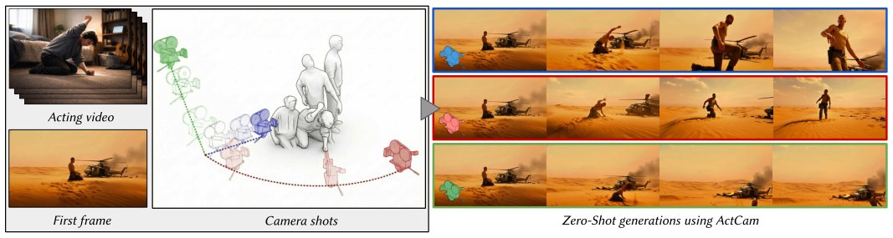

> *Generated by JarvisForResearchers Bot on 2026-05-09*

## TL;DR
ActCam is a training-free framework that achieves joint control over character motion and camera trajectory in image-conditioned video generation by constructing camera-aligned pose and depth conditioning signals.

## The Problem
Controlling both the subject's acting performance and the camera movements (trajectory, parallax, viewpoint changes) simultaneously in video generation remains largely unexplored. Furthermore, existing 2D motion controls become ambiguous under moving cameras because the same 2D signal can correspond to multiple 3D motions. Prior work has shown that Uni3C requires custom architecture and ad-hoc finetuning, which is expensive and limitedly transferable. Crucially, most existing methods fail to solve the joint requirement of controlling an articulated performance while enforcing a non-trivial camera trajectory.

## Key Contributions
ActCam introduces three primary contributions:
1. **Zero-shot joint control:** ActCam is a training-free method for joint acting-motion and camera-trajectory control in image-conditioned video generation.
2. **Condition construction for joint control:** A novel geometry-grounded conditioning pipeline that aligns motion (pose) and scene geometry (depth) to the target camera while preventing static/dynamic interference via reference-character removal, geometry-aware placement, and depth alignment.
3. **Two-phase conditioning pipeline:** A two-phase inference pipeline that adapts the conditioning information depending on the denoising step, leading to a flexible conditioning that preserves dynamic aspects of the scene.

## How It Works


*Fig. 1. Overview. ActCam enables zero-shot joint control of acting motion and camera motion for single-image video generation from a reference image,
assuming only widespread conditioning capability of the backbone model on depth and keypoints. Given a reference image, an acting video representing t*

ActCam operates entirely at inference time by constructing camera-aligned conditioning signals for a pretrained video diffusion backbone (such as VACE). The process begins by estimating a background-only depth map ($D_{bg}$) by inpainting the character out of the reference image ($I_{ref}$). A 3D background mesh is subsequently built from $D_{bg}$. The dynamic actor motion is recovered from the acting video ($V_{act}$) using a monocular 3D human motion estimator (GVHMR). Next, scene transfer aligns the character into the background 3D mesh using weighted centroids and an affine transformation. Finally, two control signals—a depth+pose condition and a pose-only condition—are rasterized under the target camera trajectory ($C$). These signals are fed into the diffusion model using a two-phase conditioning schedule: early steps utilize depth+pose, and later steps use pose-only guidance.

### Reference Image ($I_{ref}$)
This input defines the target character identity and the environment appearance that the generated video must adhere to.

### Acting Video ($V_{act}$)
This video provides the ground truth for the desired performance motion that the subject must exhibit in the output video.

### Target Camera Trajectory ($C$)
This is a per-frame sequence specifying the camera's intrinsic parameters ($K_\tau$) and extrinsic parameters ($R_\tau, t_\tau$) for every frame of the target video.

### Monocular Depth Estimator (MoGe)
MoGe is employed to estimate the reference depth map ($D_{ref}$) directly from the input reference image ($I_{ref}$).

### Inpainting Process
This process is critical for disentangling the scene. It is used to remove the character from $I_{ref}$ to extract a background-only depth map ($D_{bg}$), thereby isolating the static scene geometry.

### Scene Transfer
This component handles the integration of the character into the static environment. It aligns the character into the background 3D mesh by finding a new position while preserving pixel reprojection fidelity, utilizing an importance weighting function $w(u, v) = \exp(-\text{dist}(x_{ref}^{u,v}, M))$.

### 4D Motion Recovery (GVHMR)
GVHMR is utilized to recover the articulated state $S_\tau$ from the input acting video ($V_{act}$), providing the temporal evolution of the character's pose.

### Character 3D Fitting
This step aligns the dynamic poses $S$ recovered from $V_{act}$ with the assembled background 3D scene. This is achieved via a least squares estimation based on a rigid transformation applied at time $\tau=0$.

### Rasterization Operator ($R_C$)
This operator is responsible for generating the dense control signals. It renders the animated skeleton ($\hat{S}_\tau$) and the background 3D mesh under the specific target camera viewpoint $C$.

### Two-Phase Conditioning Schedule
This schedule dictates how the control signals are injected into the diffusion process. Early denoising steps condition on the combined depth+pose signal for strong camera control, while later steps transition to pose-only guidance for refinement.

## Results
| Metric | Value | Baseline | Source |
| :--- | :--- | :--- | :--- |
| Camera adherence and motion fidelity | Improves compared to pose-only control and other pose+camera methods | Pose-only control and other pose+camera methods | Abstract |
| Preference in human evaluations | Preferred | Not specified | Abstract |

## Why This Matters
ActCam provides a practical solution for complex, multi-modal video synthesis tasks without incurring the high cost of model retraining. By systematically constructing camera-aligned conditioning signals—specifically by disentangling static scene geometry from dynamic character motion—it overcomes the ambiguity inherent in using 2D motion cues under arbitrary camera movements. The staged guidance approach further ensures that the diffusion model receives appropriate constraints at the right temporal stage, leading to more coherent and controllable outputs.

## Limitations & Open Questions
The method's efficacy is contingent upon the backbone model possessing robust conditioning capabilities for both depth maps and keypoints. Furthermore, the sequential nature of the pipeline, involving multiple estimation passes (such as $D_{ref}$ and $D_{bg}$), introduces potential for 3D space inconsistencies if the scene transfer mechanism does not perfectly resolve these discrepancies.

---

## Citation

**Paper:** [2605.06667](https://arxiv.org/abs/2605.06667)

```bibtex
@article{260506667,
  title   = {ActCam: Zero-Shot Joint Camera and 3D Motion Control for Video Generation},
  author  = {Omar El Khalifi and Thomas Rossi and Oscar Fossey and Thibault Fouque and Ulysse Mizrahi and Philip Torr et al.},
  journal = {arXiv preprint arXiv:2605.06667},
  year    = {2026},
  url     = {https://arxiv.org/abs/2605.06667}
}
```
