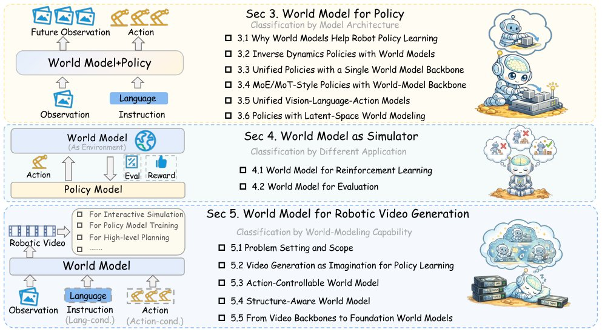

> *Generated by JarvisForResearchers Bot on 2026-05-09*

## TL;DR
This survey provides a robot-learning-centered review of world models, detailing their coupling with robot policies, their function as simulators, and their application in robotic video generation. We establish a fine-grained taxonomy distinguishing major architectural paradigms and functional roles, clarifying how predictive structures enable long-horizon reasoning and data amplification for embodied agents.

## The Problem
Purely reactive Vision-Language-Action (VLA) policies struggle with long-horizon reasoning, temporal credit assignment, and robustness under compounding errors in complex physical environments due to a lack of explicit predictive structure for anticipating world evolution. Without an internal model of dynamics, these policies are inherently brittle when the required sequence of actions extends beyond the immediate sensory horizon.

The existing literature suffers from fragmentation across architectures, functional roles, and embodied application domains. Furthermore, prior surveys lacked a fine-grained view of major world-model paradigms, and previous work did not offer a clear robotics-centered definition of world models in relation to VLA policies and robot learning.

## Key Contributions
We present a policy-centric survey of world models for robot learning, focusing specifically on their coupling with VLA policies for action generation, planning, simulation, evaluation, and data generation. We provide a more fine-grained taxonomy by distinguishing major architectural paradigms and functional roles of world models. Finally, we offer a comprehensive and clearly defined treatment of robotic world models by clarifying their relationship to robot learning, VLA policies, video generation, and simulator-style usage.

## How It Works


*Figure 1 Overview of the organization of this survey. Section 3 reviews how world models are coupled with robot policies
from an architectural perspective. Section 4 examines world models as simulators from an application perspective.
Section 5 focuses on robotic video world models and organizes the*

The survey adopts a robot-learning-centered view, defining a world model as a predictive model of agent-environment dynamics that captures how a robotic or embodied system evolves under actions. This model must provide foresight, imagination-driven planning, and data amplification to be actionable. We systematically examine how these predictive structures are coupled with robot policies, how they function as learned simulators for reinforcement learning and evaluation, and how robotic video world models progress from imagination-based generation to controllable, structured, and foundation-scale formulations. The focus remains on action-conditioned consistency, long-horizon reliability, and practical deployability in embodied tasks.

### World Model
A **World Model** is defined as a predictive model of agent-environment dynamics that captures how a robotic or embodied system evolves under actions, typically modeling a state-transition process: $p(x_{t+1:t+H} | x_t, a_{t:t+H-1}, l)$. This model is the core mechanism for enabling foresight.

### Low-level physical actions (a)
These are the concrete physical actions executed by the agent, such as motor commands. They represent the direct interface between the agent's decision-making process and the physical environment.

### High-level language or task actions (l)
These are high-level semantic actions that specify what the future should be realized, such as a language instruction or goal description. They provide the necessary semantic grounding for long-horizon planning.

### Robot Policy
The **Robot Policy** is a decision-making model that frames physical control as an action prediction task, mapping current environmental observations to future action trajectories: $p(a_{t+1:t+k}|o_t, l)$. It dictates the agent's behavior based on its current state and goals.

### Visuomotor Policy
A **Visuomotor Policy** is a specialized, often lightweight, end-to-end network that establishes a direct mapping from raw states to the action space, typically via regression or generative models. It represents a direct, low-level control mapping without explicit internal world modeling.

### Vision-Language-Action (VLA) Models
**Vision-Language-Action (VLA) Models** are generalist models developed by fine-tuning large-scale Vision-Language Models (VLMs) on large scale robotic trajectory data to achieve cross-task and cross-embodiment generalization. They aim to unify perception, language understanding, and action generation.

## Results
(No quantitative results were provided in the outline.)

## Why This Matters
World models serve as a predictive bridge from semantic intent to physically realizable behavior, directly addressing the limitations inherent in purely reactive VLA policies. The functional role of a world model must be action-conditioned; visually plausible but action-inconsistent futures offer limited value for closed-loop decision making. Consequently, the field is trending towards tighter integration, moving from decoupled pipelines toward single-backbone, MoE/MoT, unified VLA, and latent world-modeling designs.

## Limitations & Open Questions
It must be noted that this survey does not enforce a single narrow formal definition of a world model, acknowledging the diverse implementations in the literature. Furthermore, the focus is strictly on the functional role of world models for robot learning, which is a narrower scope than generic future prediction as studied in computer vision.

---

## Citation

**Paper:** [2605.00080](https://arxiv.org/abs/2605.00080)

```bibtex
@article{260500080,
  title   = {World Model for Robot Learning: A Comprehensive Survey},
  author  = {Bohan Hou and Gen Li and Jindou Jia and Tuo An and Xinying Guo and Sicong Leng et al.},
  journal = {arXiv preprint arXiv:2605.00080},
  year    = {2026},
  url     = {https://arxiv.org/abs/2605.00080}
}
```
