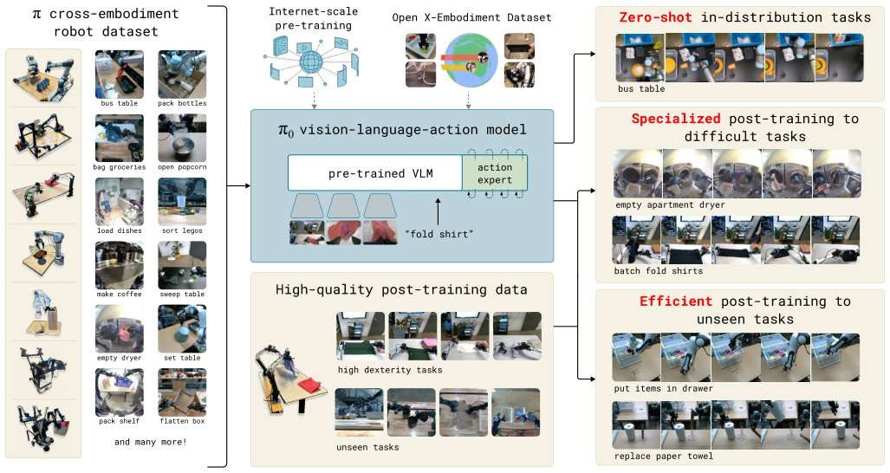

> *Generated by JarvisForResearchers Bot on 2026-05-10*

## TL;DR
$\pi_0$ introduces a novel generalist robot policy architecture that integrates a pre-trained Vision-Language Model (VLM) backbone with a conditional flow matching mechanism. This design enables the policy to generate continuous, high-frequency action sequences directly from multimodal observations, allowing for complex, dexterous task execution via prompting or fine-tuning.

## The Problem
The pursuit of generalist robot systems capable of operating effectively in unstructured, real-world environments is fundamentally constrained by limitations in data availability, generalization capacity, and operational robustness. Current methodologies often fail to capture the physically situated versatility inherent to human performance. Specifically, prior work has struggled with two critical issues: first, many Vision-Language Action (VLA) models rely on autoregressive discretization for action representation, which is inherently ill-suited for the high-frequency, continuous control signals required by dexterous manipulation; and second, existing large-scale robot learning efforts have generally operated on tasks of limited complexity or utilized datasets orders of magnitude smaller than those necessary to train foundation models capable of broad generalization. Furthermore, a unified framework combining a VLM backbone with flow matching for action generation in a VLA context has remained unexplored.

## Key Contributions
We present three primary contributions to this field:
1. A novel generalist robot policy architecture that synergistically leverages VLM pre-training and conditional flow matching.
2. An empirical investigation into effective pre-training and post-training recipes necessary for realizing such robot foundation models.
3. A demonstration of a level of dexterity and task generality that substantially surpasses the capabilities exhibited by previously reported robot foundation models.

## How It Works


*Fig. 1: Our generalist robot policy uses a pre-trained vision-language model (VLM) backbone, as well as a diverse cross-
embodiment dataset with a variety of dexterous manipulation tasks. The model is adapted to robot control by adding a separate
action expert that produces continuous actions via fl*

$\pi_0$ is architected to inherit the vast semantic knowledge encoded within a pre-trained VLM while simultaneously modeling the continuous, high-dimensional distribution of physical actions. The policy processes a comprehensive observation $o_t = [I^1_t, ..., I^n_t, \ell_t, q_t]$, which comprises multiple RGB images ($I^i_t$), language tokens ($\ell_t$), and the robot's proprioceptive state ($q_t$). The objective is to predict an action chunk $A_t = [a_t, ..., a_{t+H-1}]$, where $H=50$. This prediction is framed as a continuous density estimation problem solved via conditional flow matching. The training objective minimizes the conditional flow matching loss: $L_\tau(\theta) = \mathbb{E}_{p(A_t|o_t), q(A_\tau^t|A_t)||v_\theta(A_\tau^t, o_t) - u(A_\tau^t|A_t)||^2$. Inference proceeds by numerically integrating the learned vector field $v_\theta$ from the noise level $\tau=0$ to $\tau=1$, typically employing the forward Euler integration rule.

### VLM backbone
This component is initialized using PaliGemma, allowing $\pi_0$ to immediately benefit from the Internet-scale semantic knowledge acquired during its large-scale pre-training phase. It serves as the primary encoder for interpreting the multimodal observation $o_t$.

### Action expert
This is a distinct module, parameterized with 300M parameters and initialized from scratch. Its role is to model the continuous distribution of actions conditioned on the VLM's encoded state. It implements the conditional flow matching mechanism necessary for generating high-fidelity, continuous action trajectories.

### Observation input $o_t$
The input vector $o_t$ is heterogeneous, comprising $n$ RGB images ($I^1_t, ..., I^n_t$), a sequence of language tokens ($\ell_t$), and the robot's proprioceptive state ($q_t$). Crucially, the image and state data are projected into the embedding space compatible with the VLM's internal representations before being processed.

### Action chunk $A_t$
The target output is the action chunk $A_t$, defined as a sequence of $H=50$ future actions, $[a_t, ..., a_{t+H-1}]$. This fixed-length sequence allows the model to plan over a short horizon while maintaining the continuous nature of the action space.

## Results
The empirical evaluation demonstrates the efficacy of the proposed training regimen:

| Metric | Value | Baseline | Source |
| :--- | :--- | :--- | :--- |
| Pre-training data scale | over 10,000 hours of robot data | N/A | Section V |
| Robot configurations used in pre-training | 7 different robot configurations | N/A | Section III |
| Tasks in pre-training | 68 tasks | N/A | Section III |

## Why This Matters
The integration of VLM priors with flow matching addresses the core limitations of prior VLA approaches. By replacing discrete action sampling with continuous density modeling, $\pi_0$ is inherently better suited for the fine-grained, high-frequency control required for dexterous manipulation. The ability to leverage massive, general-purpose VLM knowledge allows the policy to generalize semantic instructions to novel physical scenarios, moving robotics closer to the level of versatility seen in human performance.

## Limitations & Open Questions
A primary limitation is that the overall performance is highly contingent upon the effectiveness of the separation between the pre-training and post-training phases. Furthermore, the architectural complexity necessitates rigorous management of the interface and information flow between the VLM backbone and the specialized Action expert. Future work must investigate more robust methods for mitigating potential divergence during the integration of these two distinct learning paradigms.

---

## Citation

**Paper:** [2410.24164](https://arxiv.org/abs/2410.24164)

```bibtex
@article{241024164,
  title   = {$π_0$: A Vision-Language-Action Flow Model for General Robot Control},
  author  = {Kevin Black and Noah Brown and Danny Driess and Adnan Esmail and Michael Equi and Chelsea Finn et al.},
  journal = {arXiv preprint arXiv:2410.24164},
  year    = {2024},
  url     = {https://arxiv.org/abs/2410.24164}
}
```
