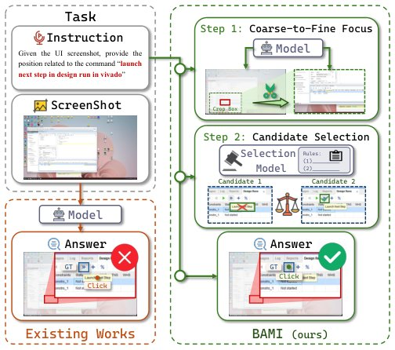

> *Generated by JarvisForResearchers Bot on 2026-05-10*

## TL;DR
BAMI introduces a training-free inference framework that mitigates precision and ambiguity biases in GUI grounding by employing coarse-to-fine focus and candidate selection manipulations.

## The Problem
Existing GUI grounding models exhibit suboptimal performance when evaluated on complex benchmarks such as ScreenSpot-Pro. This degradation is primarily attributable to two systematic biases: precision bias, which arises from the high resolution of input images, and ambiguity bias, which is exacerbated by the intricate nature of modern user interfaces.

The limitations of current approaches are multifaceted. Traditional gradient-based attribution methods are fundamentally ill-suited for the discrete nature of the text-to-coordinate conversion task. Furthermore, while language-space enhancement techniques, such as Chain-of-Thought prompting, have been explored, they have demonstrated limited efficacy for achieving the necessary precision in GUI grounding. Fundamentally, the underlying Multimodal Large Language Models (MLLMs) often possess inherent inductive biases—namely precision bias and ambiguity bias—that constrain their capacity for robust spatial reasoning.

## Key Contributions
We present three primary contributions to address these limitations. First, we introduce the Masked Prediction Distribution (MPD) method, which serves as a diagnostic tool to categorize grounding failures into either knowledge deficiency or inductive bias. Second, we mitigate precision bias by reframing the single-step localization problem into a multi-step, progressive search mechanism via hierarchical coarse-to-fine focus. Third, we correct ambiguity bias by integrating an external Candidate Selection mechanism, which is guided by predefined prompt rules.

## How It Works


*Figure 1. Compared with conventional grounding models, BAMI
achieves accurate localization without additional training via struc-
tured inference with bias-aware manipulations.*

BAMI reframes the standard one-step localization task into a recursive, multi-step structured inference process. The core strategy involves iterative refinement to combat precision bias and structured candidate generation followed by external validation to address ambiguity bias. This entire framework is designed to operate in a training-free manner, enabling direct application atop existing open-source backbone models.

### Masked Prediction Distribution (MPD)
The MPD method functions by systematically probing the model's focus. It achieves this by randomly occluding various regions of the input screenshot. The model's prediction frequencies are then aggregated across 300 distinct perturbations for each sample. This aggregation allows us to map the model's internal focus distribution, which is critical for diagnosing whether a failure is due to a lack of underlying knowledge or an artifact of the model's inherent inductive biases.

### Coarse-to-Fine Focus
To counteract precision bias, we decompose the localization task into a hierarchy of steps. This process is implemented as a progressive search. In each iterative step, the candidate region identified in the preceding round is refined by cropping the original image. This cropping is performed at a scale factor $\lambda < 1$, effectively zooming into the area of interest and allowing for finer coordinate resolution in subsequent predictions.

### Candidate Selection
To resolve ambiguity bias, we move beyond relying on a single prediction. Instead, we generate multiple, mutually exclusive candidate bounding boxes. These candidates are produced through multi-round masked prediction operations. The subsequent selection of the optimal box is not left to the primary MLLM output; rather, it is delegated to an external mechanism guided by predefined prompt rules.

### Correction Model (m)
The Correction Model ($m$) is the external component leveraged during the Candidate Selection phase. Its role is to rectify the erroneous selection preferences exhibited by the grounding model. It operates by evaluating the set of mutually exclusive candidates against a set of prompt rules that encode established GUI priors, such as expected functional features or common UI patterns, thereby selecting the most plausible box.

## Results
The application of BAMI demonstrates a measurable improvement over established baselines on the ScreenSpot-Pro benchmark.

| Metric | Value | Baseline | Source |
| :--- | :--- | :--- | :--- |
| Accuracy on ScreenSpot-Pro benchmark | 57.8% | 51.9% | Abstract |

## Why This Matters
The practitioner takeaways from this work are significant. First, BAMI demonstrates that inference-time reasoning design, as opposed to costly model retraining, can yield substantial performance gains in complex tasks like GUI grounding. Second, the systematic error diagnosis provided by MPD is a crucial methodological advance, enabling researchers to precisely differentiate between failures rooted in knowledge gaps versus those stemming from model inductive biases. Finally, for tasks involving high-resolution inputs, the decomposition strategy inherent in coarse-to-fine focus provides a viable, effective mechanism to circumvent the limitations imposed by discretization.

## Limitations & Open Questions
We acknowledge specific limitations in the current formulation. The coarse-to-fine focus strategy necessitates a trade-off between the number of iterations performed and the chosen crop ratio ($\lambda$). If the cropping is too aggressive, there is a risk of losing critical contextual information necessary for accurate localization. Furthermore, the efficacy of the entire ambiguity correction pipeline is contingent upon the quality and completeness of the prompt design utilized by the external Correction Model ($m$). Future work must focus on optimizing this prompt engineering aspect.

---

## Citation

**Paper:** [2605.06664](https://arxiv.org/abs/2605.06664)

```bibtex
@article{260506664,
  title   = {BAMI: Training-Free Bias Mitigation in GUI Grounding},
  author  = {Borui Zhang and Bo Zhang and Bo Wang and Wenzhao Zheng and Yuhao Cheng and Liang Tang et al.},
  journal = {arXiv preprint arXiv:2605.06664},
  year    = {2026},
  url     = {https://arxiv.org/abs/2605.06664}
}
```
