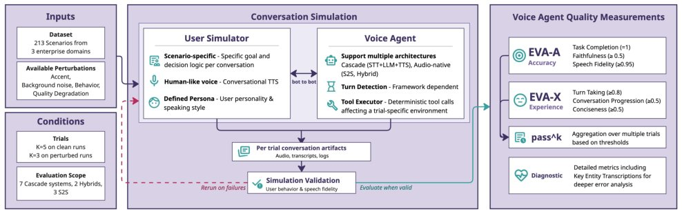

> *Generated by JarvisForResearchers Bot on 2026-05-15*

!!! tip "Why we featured this paper"
    Not yet indexed in S2 — assumed brand-new preprint

## TL;DR
EVA-Bench is an end-to-end evaluation framework designed to address the shortcomings of existing voice agent evaluation methods. It generates realistic, validated bot-to-bot audio conversations across three enterprise domains, utilizing composite metrics EVA-A (Accuracy) and EVA-X (Experience) to surface nuanced, voice-specific failure modes that are missed by transcript-level analysis.

## The Problem
Current evaluation paradigms for voice agents are fundamentally inadequate because they fail to address the complexity of real-world deployment. Specifically, they neglect two critical aspects: first, the generation of realistic simulated dialogues that accurately model acoustic variability and maintain multi-turn contextual coherence; and second, the comprehensive measurement of quality across the full spectrum of voice-specific failure modes. Prior work often isolates component performance (e.g., STT or TTS quality) rather than assessing holistic, end-to-end agent behavior. Furthermore, many simulation methodologies lack rigorous automated validation, meaning observed performance metrics can inadvertently reflect simulator variance rather than the true capability of the agent under test. Existing quality metrics are too coarse, failing to capture critical operational failures such as policy faithfulness, the fidelity of entities at the audio level, or the efficiency of conversational pacing.

## Key Contributions
We introduce EVA-Bench, an end-to-end evaluation framework capable of generating realistic bot-to-bot audio conversations. This framework incorporates validation-gated quality control and controlled acoustic perturbations to stress-test agent robustness. We define two novel, joint metrics: EVA-A (Accuracy) and EVA-X (Experience). These metrics are designed to surface failure modes that are opaque to conventional benchmarks and allow for direct, apples-to-apples comparison between agents implemented using audio-native versus cascade architectures. Finally, we provide three enterprise benchmark datasets, comprising 213 distinct scenarios, specifically engineered to probe these voice-specific failure modes.

## How It Works


*Figure 1 EVA-Bench framework overview. The simulation orchestrates parallel per-scenario bot-to-bot audio sessions
over WebSocket in which the User Simulator — configured with a scenario-specific goal, persona, and conversational
TTS voice — interacts with the Voice Agent under test. The Tool Execut*

EVA-Bench operates by orchestrating fully automated, turn-based audio conversations between a User Simulator and the target agent across three defined enterprise domains: Customer Service Management (CSM), Human Resources Support Desk (HRSD), and IT Service Management (ITSM). The User Simulator is initialized with a specific goal, a defined persona, and a decision tree, allowing for scenario-specific interaction modeling. The simulation environment incorporates a controlled perturbation suite to test robustness against variations in accent and background noise. Crucially, before any quality scoring occurs, the conversation undergoes rigorous Simulator Validation. This validation employs both LLM-as-Judge and LALM-as-Judge checks to verify User Behavioral Fidelity and User Speech Fidelity, respectively. If these checks fail, the simulation is automatically regenerated. Quality assessment is then performed using two composite scores: EVA-A (Accuracy), which aggregates task completion, faithfulness, and speech fidelity; and EVA-X (Experience), which measures conversational progression, conciseness, and turn-taking timing. Aggregate performance is reported using standard statistical measures: pass@1, pass@k, and pass^k.

### User Simulator
The User Simulator is constructed upon a high-quality cascade pipeline. It accepts the user's defined goal, the governing decision tree, and the persona profile as input. Its function is to drive the interaction by communicating with the target agent over a live audio WebSocket connection, ensuring the dialogue flows according to the prescribed scenario logic.

### Tool Executor
The Tool Executor component is responsible for managing all interactions where the agent invokes external tools. This execution is performed deterministically within the simulation environment to ensure that the agent's decision-making process is evaluated against a consistent, predictable backend state.

### Simulator Validation
This component enforces the integrity of the simulation itself. It executes automated checks, specifically User Behavioral Fidelity, judged by an LLM-as-Judge, and User Speech Fidelity, judged by an LALM-as-Judge. The primary function of this stage is quality gating: any failure in these fidelity checks triggers an automatic regeneration of the conversation instance, ensuring that the subsequent quality scores reflect agent performance, not simulation artifacts.

### EVA-A (Accuracy)
EVA-A is a composite metric designed to quantify the functional correctness of the agent's interaction. It integrates three sub-components: task completion (verified via binary hash comparison against the expected outcome), faithfulness (assessed by LLM-as-Judge), and speech fidelity (assessed by LALM-as-Judge).

### EVA-X (Experience)
EVA-X quantifies the subjective quality and flow of the interaction. It is a composite metric derived from three factors: conversation progression (evaluated by LLM-as-Judge), conciseness (evaluated by LLM-as-Judge), and turn-taking timing (determined via timestamp analysis of the audio stream).

## Results
| Metric | Value | Baseline | Source |
| :--- | :--- | :--- | :--- |
| EVA-Apass@1 and EVA-Xpass@1 | no system simultaneously exceeds 0.5 | N/A | Text |
| median pass@k–pass^k gap on EVA-A | 0.44 | N/A | Text |
| mean $\epsilon$ (robustness to perturbations) | up to 0.314 | N/A | Text |

## Why This Matters
The introduction of EVA-Bench shifts the evaluation paradigm from isolated component testing to holistic, end-to-end system assessment. By incorporating rigorous simulator validation and composite metrics like EVA-A and EVA-X, we provide a mechanism to quantify failure modes—such as conversational drift or poor pacing—that are entirely invisible to traditional transcript-based evaluation. This allows researchers and engineers to gain a much more accurate assessment of a voice agent's production readiness, particularly when comparing fundamentally different architectural approaches (e.g., cascade vs. end-to-end).

## Limitations & Open Questions
The current framework necessitates specific implementations for calculating metrics across audio-native and cascade systems, as the observable intermediate signals differ significantly between these architectures. Furthermore, for the purpose of feasibility in perturbation evaluation, we utilized a randomly sampled subset of 90 scenarios (30 per domain), which limits the scope of the robustness claims. Future work should address the generalization of metric definitions across all potential agent architectures and expand the perturbation testing suite to cover a larger fraction of the total scenario space.

---

## Citation

**Paper:** [2605.13841](https://arxiv.org/abs/2605.13841)

```bibtex
@article{260513841,
  title   = {EVA-Bench: A New End-to-end Framework for Evaluating Voice Agents},
  author  = {Tara Bogavelli and Gabrielle Gauthier Melançon and Katrina Stankiewicz and Oluwanifemi Bamgbose and Fanny Riols and Hoang H. Nguyen et al.},
  journal = {arXiv preprint arXiv:2605.13841},
  year    = {2026},
  url     = {https://arxiv.org/abs/2605.13841}
}
```
