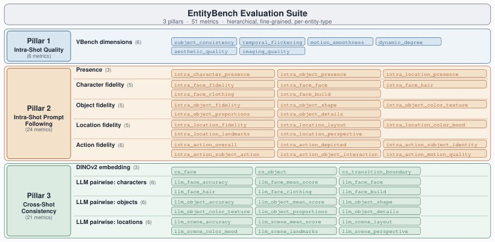

> *Generated by JarvisForResearchers Bot on 2026-05-16*

!!! tip "Why we featured this paper"
    Not yet indexed in S2 — assumed brand-new preprint

## TL;DR
EntityBench establishes a rigorous benchmark for multi-shot video generation by incorporating explicit per-shot entity schedules and a three-pillar evaluation framework that quantifies intra-shot quality, prompt alignment, and cross-shot entity consistency. We introduce EntityMem, a memory-augmented system that leverages persistent, verified per-entity memory banks to significantly enhance cross-shot fidelity.

## The Problem
The generation of coherent, long-sequence videos remains hampered by the difficulty of maintaining consistent representations of entities—characters, objects, and locations—across successive shots. Current evaluation methodologies are insufficient for diagnosing this failure mode. Specifically, existing benchmarks suffer from a lack of standardization, limited entity coverage, and overly simplistic consistency metrics. Furthermore, prior work has failed to explicitly define entity schedules for each shot, nor has it systematically evaluated simultaneous multi-entity consistency over extended sequences (e.g., 12 shots per episode). In most existing paradigms, entity consistency is an emergent property of the architecture rather than a measurable, explicit objective.

## Key Contributions
We make three primary contributions. First, we introduce EntityBench, a comprehensive benchmark featuring explicit per-shot entity schedules that mandates simultaneous multi-entity tracking across characters, objects, and locations. Second, we design a Three-Pillar Evaluation Framework that provides a granular assessment covering intra-shot quality, prompt-following alignment, and cross-shot entity consistency. Third, we demonstrate the efficacy of EntityMem, a memory-augmented system, showing that incorporating quality-gated entity memory management directly improves cross-shot fidelity and consistency.

## How It Works


*Figure 1: Overview of the EntityBench evaluation suite. Three pillars progressively assess whether
each shot is well-formed (Pillar 1), whether it follows its prompt (Pillar 2), and whether entities
remain consistent across shots (Pillar 3). Pillar 2’s per-entity fidelity scores gate admission into
*

EntityBench is constructed from 140 episodes, totaling 2,491 shots, sourced from real narrative media. Crucially, each shot is governed by an explicit per-shot entity schedule detailing the required characters, objects, and locations. The evaluation process is structured around the Three-Pillar Evaluation Framework. Pillar 1 assesses the raw visual quality of individual shots using 6 metrics. Pillar 2 verifies prompt adherence within each shot, employing GroundingDINO for entity localization and a Multimodal LLM to score fidelity against textual descriptions across 24 metrics. Pillar 3 addresses temporal coherence, measuring cross-shot consistency using embedding similarity and LLM pairwise judging across 21 metrics.

### EntityBench
EntityBench constitutes the dataset itself. It comprises 140 episodes, totaling 2,491 shots, derived from real narrative media. Its defining characteristic is the inclusion of explicit per-shot entity schedules, which categorize the complexity of the required entity tracking into easy, medium, and hard tiers.

### Three-Pillar Evaluation Framework
This framework structures the evaluation into three distinct, complementary pillars. Pillar 1 focuses on the intrinsic visual quality of the generated frames (6 metrics). Pillar 2 focuses on semantic correctness within the frame, ensuring the generated entities match the prompt specifications (24 metrics). Pillar 3 focuses on temporal coherence, ensuring entities persist and evolve correctly across shot boundaries (21 metrics).

### GroundingDINO
GroundingDINO is integrated into Pillar 2. Its function is to localize every entity specified in the per-shot schedule. By using the entity registry description as the query, it produces precise per-entity crops, which serve as the input for the subsequent semantic verification stage.

### Multimodal LLM (Comanici et al., 2025)
This component is central to Pillar 2. After GroundingDINO provides localized crops, the Multimodal LLM is tasked with scoring each canonical crop. It evaluates the visual representation against the entity's registry description based on type-specific criteria, such as accurate facial structure, correct geometric shape, or adherence to specified scene layout.

### EntityMem
EntityMem is the proposed architectural enhancement. It functions as a memory-augmented generation system. It maintains a persistent, per-entity memory bank. This bank is populated by specialized VLM-based agents that process and store isolated, verified visual and textual references for each entity. During video generation, the backbone model can query this memory bank to retrieve the canonical representation of an entity, thereby guiding the generation process to maintain fidelity across disparate shots.

## Results
The application of EntityMem on the EntityBench suite demonstrates a measurable improvement in entity preservation.

| Metric | Value | Baseline | Source |
| :--- | :--- | :--- | :--- |
| Character fidelity | +2.33 | N/A | Experiments on EntityBench |

## Why This Matters
The introduction of EntityBench shifts the focus of multi-shot video generation research from merely achieving high frame-level quality to solving the complex problem of long-range entity persistence. The Three-Pillar Framework provides the necessary diagnostic granularity, allowing researchers to pinpoint whether failures stem from poor rendering (Pillar 1), prompt misunderstanding (Pillar 2), or temporal drift (Pillar 3). Furthermore, EntityMem provides a concrete, verifiable mechanism—explicit memory storage and retrieval—to combat the inherent error accumulation in generative models over long sequences, offering a tangible path toward more robust narrative video synthesis.

## Limitations & Open Questions
Two primary limitations must be acknowledged. First, the character deduplication process within the evaluation relies on an LLM (Comanici et al., 2025) to consolidate character clusters that may appear across temporally distant shots, introducing potential LLM-dependent ambiguity. Second, the construction of the benchmark itself necessitates reliance on LLM-based refinement and verification steps during the data curation phase. Future work must address the robustness of these LLM-dependent components and explore alternative, purely visual methods for entity tracking and memory consolidation.

---

## Citation

**Paper:** [2605.15199](https://arxiv.org/abs/2605.15199)

```bibtex
@article{260515199,
  title   = {EntityBench: Towards Entity-Consistent Long-Range Multi-Shot Video Generation},
  author  = {Ruozhen He and Meng Wei and Ziyan Yang and Vicente Ordonez},
  journal = {arXiv preprint arXiv:2605.15199},
  year    = {2026},
  url     = {https://arxiv.org/abs/2605.15199}
}
```
