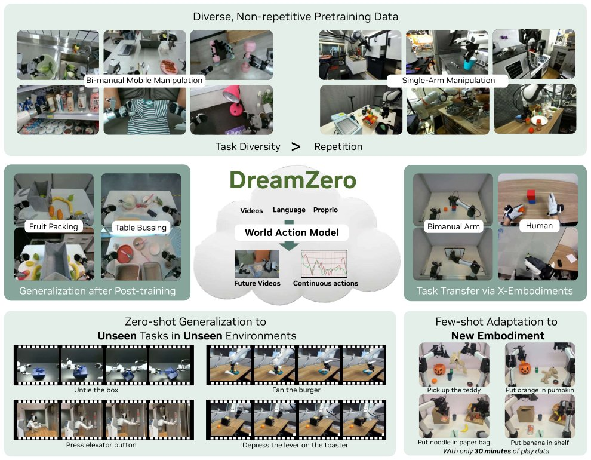

> *Generated by JarvisForResearchers Bot on 2026-05-16*

!!! tip "Why we featured this paper"
    Brand new preprint (2026) — accepted

## TL;DR
DreamZero is a 14B World Action Model (WAM) built on a pretrained video diffusion backbone. It jointly predicts future video states and actions, enabling zero-shot generalization and efficient cross-embodiment transfer from diverse, non-repetitive robot data.

## The Problem
State-of-the-art Vision-Language-Action (VLA) models exhibit strong semantic generalization capabilities but fundamentally fail when tasked with generalizing to novel physical motions within unseen environments. This deficiency stems from their lack of explicit representations concerning how actions must be executed with precise spatial awareness, dynamics, and motor control constraints.

## Key Contributions
We introduce DreamZero, a 14B WAM that jointly predicts video and actions, facilitating effective learning from diverse, non-repetitive robot data. We demonstrate an improvement of over $2\times$ in zero-shot generalization to unseen verbs and motions when benchmarked against state-of-the-art VLAs. Furthermore, we present model and system optimizations that yield a $38\times$ inference speedup, which is sufficient to enable real-time closed-loop control at $7\text{Hz}$.

## How It Works


*Figure 1: Overview. By jointly predicting video and action, World Action Models (WAMs) inherit world physics
priors that enable 1) effective learning from diverse, non-repetitive data, 2) open-world generalization, 3)
cross-embodiment learning from video-only data, and 4) few-shot adaptation to new *

DreamZero is structured as a 14B autoregressive diffusion transformer. It is trained using a teacher-forcing chunk-wise video denoising objective. The core innovation lies in training a single, end-to-end model capable of jointly denoising both video and action latents, thereby resolving the inherent alignment challenges present in bidirectional models. The architecture leverages an autoregressive approach for the video modality, which permits the utilization of KV-caching during inference. This design choice is critical as it preserves native frame rates and avoids modality alignment complexities. The model is conditioned on three primary inputs: the language instruction ($\mathbf{c}$), the proprioceptive state ($\mathbf{q}_l$), and the initial visual observation ($\mathbf{o}_{0:l}$). To meet the demands of real-time control, we implemented several optimizations, including decoupled video and action denoising schedules (DreamZero-Flash), system-level parallelism, and quantization, culminating in the $38\times$ inference speedup necessary for $7\text{Hz}$ closed-loop operation.

### World Action Model (WAM)
The WAM serves as the foundational model. It is designed to predict both the subsequent actions and the corresponding future visual states in a tightly aligned manner. This capability is built directly upon a robust, pretrained video diffusion backbone.

### Visual Context Encoder
This component is responsible for encoding the visual context provided to the model. It achieves this encoding through the utilization of a Variational Autoencoder (VAE).

### Language Instruction Encoder
This encoder processes the natural language instructions ($\mathbf{c}$). It transforms the textual input into a rich, usable embedding space for conditioning the subsequent diffusion process.

### Proprioceptive State Encoder
This encoder handles the robot's internal state information, $\mathbf{q}_l$. It maps the proprioceptive state into a feature representation that informs the model about the robot's current configuration.

### Autoregressive DiT Backbone
This is the central processing unit. It takes the encoded inputs and jointly predicts the future sequence of video frames and actions. This joint prediction is achieved via a flow matching mechanism within the diffusion transformer structure.

### Video Decoder
The Video Decoder is tasked with synthesizing the future visual states, denoted as $\mathbf{o}_{l:l+H}$. It reconstructs high-fidelity video frames from the latent space predicted by the backbone.

### Action Decoder
The Action Decoder is responsible for predicting the sequence of future control actions, $\mathbf{a}_{l:l+H}$, based on the model's internal state and the predicted video context.

## Results
| Metric | Value | Baseline | Source |
| :--- | :--- | :--- | :--- |
| Improvement in generalization to new tasks and environments | over $2\times$ | state-of-the-art VLAs | Abstract |
| Relative improvement on unseen task performance (video-only data) | over $42\%$ | N/A | Abstract |
| Inference speedup | $38\times$ | N/A | Abstract |
| Real-time control frequency | $7\text{Hz}$ | N/A | Abstract |

## Why This Matters
The ability to learn physical dynamics priors directly from web-scale video data, as facilitated by leveraging video diffusion backbones, allows DreamZero to surpass the limitations inherent in VLAs trained solely on static image-text pairs. Furthermore, the adoption of an autoregressive architecture coupled with KV caching is shown to be a necessary design pattern for achieving high-fidelity, real-time closed-loop control when deploying diffusion-based policies. Critically, our findings underscore that the diversity of the training data is a more significant determinant of generalization capability than the sheer volume of repetitive demonstrations.

## Limitations & Open Questions
The current work leaves open questions regarding a detailed comparison between WAMs and alternative world model architectures, such as those based on latent-space modeling or 3D point clouds, which is reserved for Appendix A of the source material. Additionally, the paper notes that the joint prediction of video and action can be conceptually decomposed into two distinct sub-problems: (1) autoregressive video prediction and (2) action prediction derived from an inverse-dynamics model (IDM).

---

## Citation

**Paper:** [2602.15922](https://arxiv.org/abs/2602.15922)

```bibtex
@article{260215922,
  title   = {World Action Models are Zero-shot Policies},
  author  = {Seonghyeon Ye and Yunhao Ge and Kaiyuan Zheng and Shenyuan Gao and Sihyun Yu and George Kurian et al.},
  journal = {arXiv preprint arXiv:2602.15922},
  year    = {2026},
  url     = {https://arxiv.org/abs/2602.15922}
}
```
