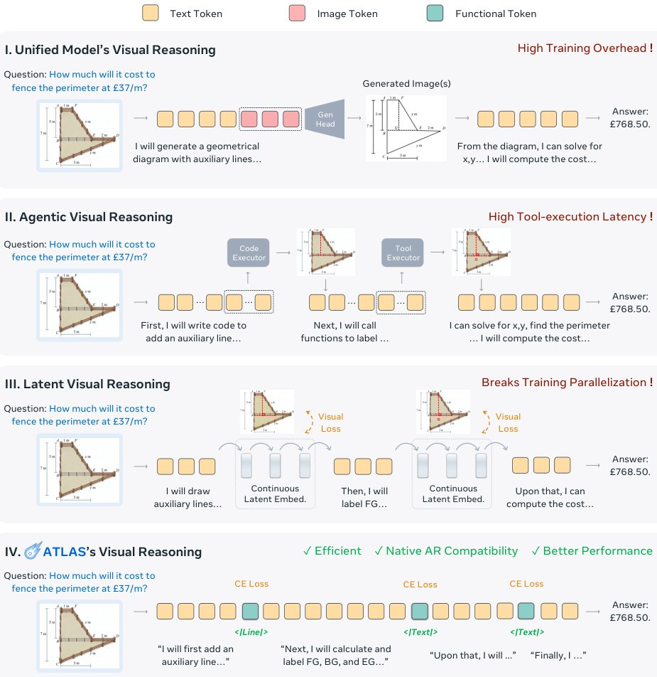

> *Generated by JarvisForResearchers Bot on 2026-05-17*

!!! tip "Why we featured this paper"
    Not yet indexed in S2 — assumed brand-new preprint

## TL;DR
ATLAS unifies agentic and latent visual reasoning by encoding visual operations as discrete functional tokens ($\text{Vfunc}$) within the standard autoregressive sequence. This approach avoids the computational burden of pixel-level generation and the latency of external tool calls, while LA-GRPO mitigates gradient dilution during RL fine-tuning.

## The Problem
Visual reasoning tasks frequently require the agent to interact with or modify a visual state iteratively. Current paradigms face distinct bottlenecks. Models that generate pixel-level images directly suffer from prohibitive computational costs during both training and inference. Agentic frameworks, which rely on external execution environments (e.g., calling code interpreters or APIs), introduce significant context-switching latency. Conversely, latent-based methods, while efficient, often lack robust task generalization and introduce recurrent latent dependencies that fundamentally conflict with the parallelization capabilities of standard autoregressive training regimes.

## Key Contributions
We introduce ATLAS, a framework that represents visual operations as discrete functional tokens within the standard vocabulary. This design choice allows the entire reasoning trajectory to be modeled as a single, continuous autoregressive sequence, thereby circumventing the need for verbose intermediate visual states while maintaining compatibility with scalable autoregressive training pipelines. Furthermore, recognizing that sparse functional tokens suffer from gradient dilution during reinforcement learning, we propose Latent-Anchored GRPO (LA-GRPO), a token-anchored objective designed to stabilize and strengthen the optimization signal for these critical functional tokens. Finally, we demonstrate that ATLAS enables compact, single-token visual reasoning, achieving strong performance on complex benchmarks with substantially reduced operational overhead compared to prior methods.

## How It Works


*Figure 1 Comparison of Visual Reasoning Paradigms. I: Unified models generate intermediate pixel-level images. II: Agentic
methods rely on external code or tool execution. III: Latent methods conduct intermediate reasoning through latent
embeddings. IV: ATLAS briges agentic and latent visual reasoni*

ATLAS achieves the unification of agentic and latent reasoning by fundamentally altering how visual actions are represented. Instead of generating continuous visual representations or invoking external functions, visual operations—such as drawing a line or placing a shape—are mapped to discrete functional tokens ($\text{Vfunc}$). These $\text{Vfunc}$ tokens are integrated directly into the model's standard tokenizer vocabulary ($\text{V} = \text{Vtext} \cup \text{Vspec} \cup \text{Vfunc}$). This architectural decision ensures the entire reasoning process remains confined within the discrete autoregressive sequence.

The training procedure is bifurcated. Initially, the model undergoes Supervised Fine-Tuning (SFT) using the ATLAS-178K dataset to establish a baseline competency in invoking these functional tokens. Following SFT, the model is refined using reinforcement learning. While standard GRPO can be applied, the sparsity of $\text{Vfunc}$ tokens leads to gradient dilution. To counteract this, we employ Latent-Anchored GRPO (LA-GRPO), which augments the sequence-level GRPO objective with a dedicated token-level auxiliary loss ($\mathcal{L}_{\text{token}}$) specifically applied at the positions corresponding to $\text{Vfunc}$, thereby providing a persistent and targeted learning signal.

### Functional Token ($\text{Vfunc}$)
The $\text{Vfunc}$ set comprises a compact vocabulary of discrete tokens, including $\{\text{<|Manip|>}, \text{<|Shape|>}, \text{<|Line|>}, \text{<|Arrow|>}, \text{<|Text|>}\}$. These tokens function as abstract instructions, representing internalized visual operations. Crucially, they are treated identically to standard text or specification tokens within the model's tokenizer vocabulary, allowing the entire sequence to be processed uniformly by the autoregressive decoder.

### ATLAS-178K
ATLAS-178K serves as the foundational dataset for the initial SFT phase. It is a curated collection encompassing over 40 distinct visual reasoning tasks. Its purpose is to provide the model with a robust, pre-trained understanding of when and how to invoke the functional tokens, establishing the necessary cold start for subsequent RL optimization.

### Standard GRPO
The reinforcement learning optimization relies on the standard GRPO algorithm. The objective function is composite, designed to balance multiple objectives: $r(o) = \lambda_{\text{acc}}r_{\text{acc}} + \lambda_{\text{func}}r_{\text{func}} + \lambda_{\text{fmtr}}r_{\text{fmt}} - \lambda_{\text{len}}p_{\text{len}} - \lambda_{\text{spam}}p_{\text{spam}}$. This formulation guides the agent toward high accuracy ($r_{\text{acc}}$), effective use of functional operations ($r_{\text{func}}$), and adherence to formatting constraints ($r_{\text{fmt}}$), while penalizing excessive length ($p_{\text{len}}$) and irrelevant output ($p_{\text{spam}}$).

### Latent-Anchored GRPO (LA-GRPO)
LA-GRPO is the critical enhancement to the standard GRPO framework. It addresses the issue of gradient dilution inherent when optimizing for sparse, high-leverage tokens like $\text{Vfunc}$. LA-GRPO achieves this by introducing a token-level auxiliary loss, $\mathcal{L}_{\text{token}}$. This loss is explicitly anchored to the positions of the functional tokens, ensuring that even when the overall sequence reward is noisy or sparse, the functional tokens receive a consistent, targeted learning signal that strengthens their optimization trajectory.

## Results
| Metric | Value | Baseline | Source |
| :--- | :--- | :--- | :--- |
| Performance | Superior performance | N/A | Extensive experiments and analyses |

## Why This Matters
The ATLAS framework provides a principled mechanism to bridge the gap between symbolic, agentic reasoning and continuous, latent visual processing within a single, scalable autoregressive model. By tokenizing operations, we effectively internalize the "tool-use" capability of agentic systems into the language model's generative capacity, eliminating the overhead associated with external execution environments. Furthermore, the LA-GRPO mechanism offers a concrete solution to a known theoretical challenge—gradient dilution—when applying RL to sparse, critical control tokens, thereby enabling more stable and effective fine-tuning for complex visual tasks.

## Limitations & Open Questions
The current functional token taxonomy is not intended to be exhaustive; the scope of operations represented by $\text{Vfunc}$ is necessarily constrained by the initial design choices. Additionally, while LA-GRPO mitigates gradient dilution, the paper acknowledges that this issue remains a relevant consideration when employing standard GRPO in similar sparse token optimization scenarios.

---

## Citation

**Paper:** [2605.15198](https://arxiv.org/abs/2605.15198)

```bibtex
@article{260515198,
  title   = {ATLAS: Agentic or Latent Visual Reasoning? One Word is Enough for Both},
  author  = {Ziyu Guo and Rain Liu and Xinyan Chen and Pheng-Ann Heng},
  journal = {arXiv preprint arXiv:2605.15198},
  year    = {2026},
  url     = {https://arxiv.org/abs/2605.15198}
}
```
