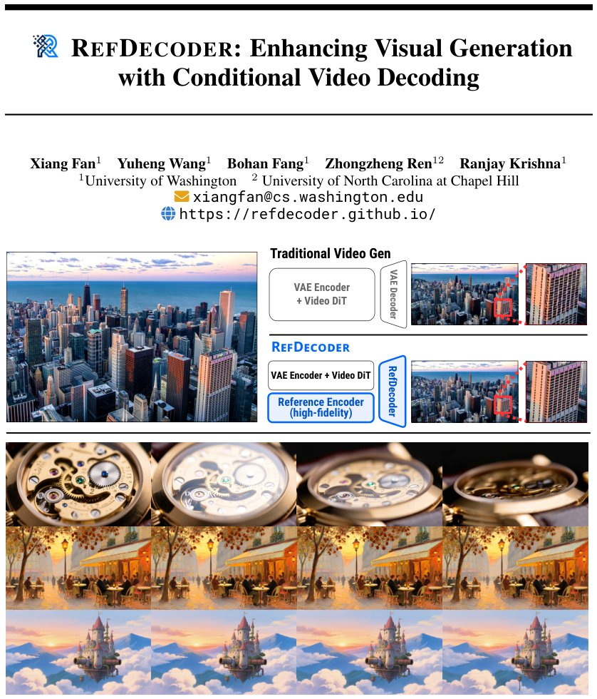

> *Generated by JarvisForResearchers Bot on 2026-05-18*

!!! tip "Why we featured this paper"
    Brand new preprint (2026) — accepted

## TL;DR
REFDECODER addresses the detail loss and temporal inconsistency in video diffusion models by conditioning the VAE decoder on a high-fidelity reference image. It achieves this by injecting reference tokens into the decoder's upsampling stages via reference attention, forcing the decoder to reconstruct fine details even when video latent tokens are intentionally dropped out.

## The Problem
The current paradigm in latent diffusion models exhibits a structural imbalance: the diffusion backbone is heavily conditioned on the input prompt or data, whereas the subsequent VAE decoder often operates unconditionally. This asymmetry results in a critical failure mode during the latent-to-pixel decoding phase. Specifically, the decoder must reconstruct high-fidelity spatial details from a highly compressed latent representation without a strong, explicit anchor. This deficiency manifests as a progressive degradation of fine spatial details and noticeable temporal inconsistencies in the generated video output.

## Key Contributions
We introduce three primary contributions to address these limitations:
1. **REFDECODER:** A novel reference-conditioned video VAE decoder that directly injects high-fidelity signal from a reference image into the decoding process using reference attention mechanisms.
2. **Lightweight Image Encoder:** A minimal encoder designed to map the reference frame into detail-rich, high-dimensional tokens that can be co-processed with the denoised video latent tokens at every decoder up-sampling stage.
3. **Latent Token Dropout Strategy:** The implementation of a specific dropout mechanism applied to the video latent tokens, which compels the decoder to recover necessary spatial information by relying on the injected reference tokens via attention.

## How It Works


*Figure 1: (a) REFDECODER improves video VAE decoders by conditioning on a high-fidelity
reference signal that bypasses the lossy VAE latent round trip. Given the encoded latents, the decoder
injects fine-grained details that are not preserved in the VAE latent space, improving reconstruction
fidelit*

REFDECODER modifies a standard video VAE backbone by inserting specialized Transformer blocks into the existing upsampling stages of the pretrained decoder. The process begins by encoding the reference image, $I_{ref}$, using a minimal reference image encoder to generate a set of reference tokens, $z_{ref}$, residing in a high-dimensional feature space.

At any given decoder stage $s$, the video tokens, $z^{(s)}$, and the corresponding reference tokens, $z_{ref}^{(s)}$, are combined. This combination occurs via **Token Concatenation** along the temporal dimension, resulting in a tensor of shape $R^{C_s} \times (1+T_s) \times H_s \times W_s$. This combined tensor is then fed into a shared **Transformer Block**. This block processes the tokens using self-attention, allowing the video tokens to query the reference tokens. The output is subsequently partitioned back into $\hat{z}_{ref}^{(s)}$ and $\hat{z}^{(s)}$, which are then upsampled independently. To ensure the decoder actively utilizes the reference information, **Latent Token Dropout** is applied to $z$ with a probability $r$, where $r$ is drawn uniformly from $[0, r_{max})$, with $r_{max}$ set to $0.7$ by default.

### Reference Encoder
The **Reference Encoder** is deliberately kept minimal. It consists of a single convolution layer followed by normalization. Its function is to map the input reference image, $I_{ref}$, into a set of reference tokens, $z_{ref}$, structured as $\mathbb{R}^{C \times H_p \times W_p}$. This ensures the reference signal is encoded efficiently without introducing significant computational overhead.

### Conditional Token Decoder
The **Conditional Token Decoder** is the core modification. It involves inserting Transformer blocks directly into the upsampling stages of the original, pretrained decoder. These blocks are engineered to facilitate joint attention between the video tokens and the reference tokens, effectively conditioning the decoding process on the reference image signal.

### Token Concatenation
At decoder stage $s$, the video tokens, $z^{(s)} \in \mathbb{R}^{C_s \times T_s \times H_s \times W_s}$, and the reference tokens, $z_{ref}^{(s)} \in \mathbb{R}^{C_s \times 1 \times H_s \times W_s}$, are concatenated along the temporal dimension. This operation merges the temporal dynamics information from the video latent with the static, high-fidelity spatial information from the reference image into a unified sequence for processing.

### Transformer Block
The **Transformer Block** processes the concatenated tokens. It employs self-attention mechanisms, and critically, the weights of this block are shared across all decoder stages to maintain parameter efficiency. Stage-specific patch embedding layers are utilized to project the varying channel dimensions, $C_s$, encountered at different upsampling stages into a unified transformer hidden dimension, ensuring consistent input dimensionality for the attention mechanism.

### Latent Token Dropout
The **Latent Token Dropout** strategy is a regularization technique applied during training. It randomly zeroes out video latent tokens $z$ at each training step with a probability $r$, where $r$ is sampled uniformly from $[0, r_{max})$. This forces the decoder to learn robust representations capable of recovering lost spatial details by attending to and leveraging the information present in the reference tokens.

## Results
The empirical evaluation demonstrates a measurable improvement in reconstruction quality across standard benchmarks.

| Metric | Value | Baseline | Source |
| :--- | :--- | :--- | :--- |
| PSNR improvement (Inter4K, Wan 2.1) | +1.2 dB | Wan 2.1 VAE [39] | Table 1 |
| PSNR improvement (WebVid, VideoVAE+) | +2.1 dB | VideoVAE+ [48] | Table 1 |
| Total VBench score (Wan 2.1) | 88.2 | Wan 2.1 [39] (87.9) | Table 2 |

## Why This Matters
REFDECODER provides a practical and effective mechanism to bridge the conditioning gap in video diffusion models. A key advantage is its deployment as a drop-in replacement for existing video VAE decoders; it requires no retraining of the upstream diffusion model or freezing of the encoder weights. Furthermore, the method exhibits generalization across different underlying architectures, successfully improving performance on both Wan 2.1 and VideoVAE+ backbones. This capability suggests that reference conditioning in the decoder space is a powerful technique applicable to downstream refinement tasks such as style transfer and video editing.

## Limitations & Open Questions
The current formulation operates under the assumption that the decoder's internal hidden space possesses sufficient representational capacity to encode and utilize the rich information provided by the reference image, exceeding the capacity of the initial VAE latent space. Additionally, while the method is designed to be flexible, the standard inference procedure utilizes the reference image as the first frame. We acknowledge that the training process employs random frame selection for the reference input, which warrants further investigation regarding the optimal balance between training stochasticity and inference determinism.

---

## Citation

**Paper:** [2605.15196](https://arxiv.org/abs/2605.15196)

```bibtex
@article{260515196,
  title   = {RefDecoder: Enhancing Visual Generation with Conditional Video Decoding},
  author  = {Xiang Fan and Yuheng Wang and Bohan Fang and Zhongzheng Ren and Ranjay Krishna},
  journal = {arXiv preprint arXiv:2605.15196},
  year    = {2026},
  url     = {https://arxiv.org/abs/2605.15196}
}
```
