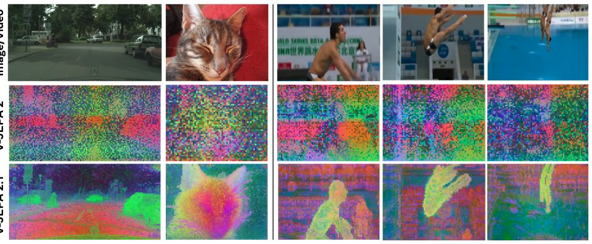

> *Generated by JarvisForResearchers Bot on 2026-05-18*

!!! tip "Why we featured this paper"
    Brand new preprint (2026) — accepted

## TL;DR
V-JEPA 2.1 advances self-supervised learning for dense visual understanding in images and videos by implementing a Dense Predictive Loss across all tokens and integrating Deep Self-Supervision across multiple encoder layers. This framework yields improvements in localization, geometry, and high-level recognition tasks compared to prior methods.

## The Problem
Learning representations that simultaneously preserve dense spatio-temporal structure—which is necessary for tasks like localization, geometry estimation, and tracking—while also capturing the necessary dynamics and supporting global understanding for high-level recognition remains an open challenge in self-supervised learning (SSL) from video. Existing approaches exhibit specific limitations: V-JEPA family representations can sometimes lack the necessary fidelity for fine-grained local spatial structure extraction. Furthermore, while methods like DINO produce high-quality dense features, they are predominantly image-based and do not inherently model temporal dynamics from video data. Critically, the original V-JEPA 2 loss, which was restricted to masked tokens, failed to incentivize the model to encode rich local information within the context tokens.

## Key Contributions
This work introduces three primary contributions:
1. The introduction of V-JEPA 2.1, a unified self-supervised approach designed for learning robust representations across both image and video modalities.
2. The implementation of a Dense Predictive Loss, which extends self-supervision to apply predictive constraints on both masked and unmasked tokens, thereby grounding every token in its spatio-temporal context.
3. The incorporation of Deep Self-Supervision, achieved by applying the predictive loss hierarchically across multiple intermediate encoder layers via a multi-level predictor.

## How It Works


*Figure 1 V-JEPA 2.1 unlocks high-quality dense features. We compute PCA on patch features extracted from the same
image or video and map the top three components to RGB channels for both V-JEPA 2 (ViT-g) and V-JEPA 2.1
(ViT-G). Our novel V-JEPA 2.1 produces dense representations with strong spatial *

V-JEPA 2.1 extends the foundational V-JEPA framework by modifying the loss function to incorporate a Dense Predictive Loss, defined as $L_{\text{dense}} = L_{\text{predict}} + L_{\text{ctx}}$. This loss is applied to both masked and unmasked tokens to ensure that every token is strongly constrained by its spatio-temporal location. Deep Self-Supervision is realized by employing a multi-level predictor that applies the loss hierarchically across several intermediate encoder layers. To maintain unified training across modalities, the architecture utilizes Multi-Modal Tokenizers, which provide modality-specific patch embeddings for both images and videos. The data flow begins with an x-encoder, which processes the input and outputs multi-level embeddings. These embeddings are then fused and concatenated with learnable mask tokens before being passed to the predictor network.

### x-encoder
The x-encoder is responsible for processing the visible tokens from the input data. It is designed to output multi-level embeddings. These embeddings are formed by concatenating the normalized outputs derived from various intermediate encoder blocks, allowing for the extraction of features at different levels of abstraction.

### Multi-level predictor
The Multi-level predictor receives the combined sequence, which consists of the context tokens (from the x-encoder) and the learnable mask tokens. Its function is to generate multi-level predictions specifically targeting the masked tokens. These predictions are applied across several intermediate representation levels, facilitating the hierarchical application of the predictive loss.

### Modality-specific patch embedding
This component handles the initial projection of raw input data. It is responsible for projecting input images or videos into a sequence of embedding vectors, or tokens, prior to any mask corruption occurring in the subsequent stages.

### Context loss (Lctx)
The Context loss ($L_{\text{ctx}}$) is a distance-weighted L1 loss. It is specifically designed to supervise the unmasked regions of the input. This supervision is achieved by leveraging the multi-level outputs generated by the y-encoder, explicitly guiding the model to maintain consistency within the unmasked context tokens.

## Results
The empirical evaluation demonstrates the effectiveness of V-JEPA 2.1 across diverse downstream tasks:

| Metric | Value | Baseline | Source |
| :--- | :--- | :--- | :--- |
| mAP on Ego4D for short-term object-interaction anticipation | 7.71 | N/A | Table 1 |
| Recall@5 on EPIC-KITCHENS for high-level action anticipation | 40.8 | N/A | Table 1 |
| Real-robot grasping success rate improvement | 20% | VJEPA-2 AC | Introduction |
| ATE on Tartan Drive (robot navigation) | 5.687 | N/A | Introduction |
| RMSE on NYUv2 (depth estimation) | 0.307 | N/A | Table 1 |
| Accuracy on Something-Something-V2 (global recognition) | 77.7% | N/A | Table 1 |

## Why This Matters
The findings confirm that extending the predictive loss to cover all tokens, including unmasked ones, is a critical mechanism for enhancing dense feature quality within SSL frameworks. Furthermore, the integration of Deep Self-Supervision, by applying the loss hierarchically, provides consistent and measurable performance gains across both dense localization tasks and broader global recognition objectives. The observed systematic performance improvements when scaling the model size (up to ViT-G) and increasing data diversity (using VisionMix 163M) underscore the robustness of this architectural design.

## Limitations & Open Questions
We note two primary limitations. First, the naive application of the $L_{\text{ctx}}$ loss can sometimes lead to suboptimal performance on tasks requiring high-level semantic reasoning, as the model may converge to trivial solutions within the context tokens. Second, the initial implementation of $L_{\text{ctx}}$ loss was observed to slightly reduce classification performance when evaluated on the Something-Something-V2 dataset. Future work should investigate more sophisticated weighting or regularization schemes for $L_{\text{ctx}}$ to mitigate these observed trade-offs.

---

## Citation

**Paper:** [2603.14482](https://arxiv.org/abs/2603.14482)

```bibtex
@article{260314482,
  title   = {V-JEPA 2.1: Unlocking Dense Features in Video Self-Supervised Learning},
  author  = {Lorenzo Mur-Labadia and Matthew Muckley and Amir Bar and Mido Assran and Koustuv Sinha and Mike Rabbat et al.},
  journal = {arXiv preprint arXiv:2603.14482},
  year    = {2026},
  url     = {https://arxiv.org/abs/2603.14482}
}
```
