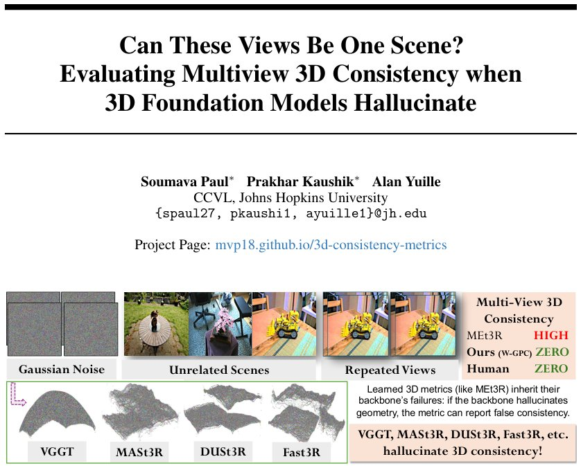

> *Generated by JarvisForResearchers Bot on 2026-05-20*

!!! tip "Why we featured this paper"
    Not yet indexed in S2 — assumed brand-new preprint

## TL;DR
We introduce SysCON3D, a controlled benchmark, and a parametric family of neural metrics to diagnose and improve the robustness of ground-truth-free multiview 3D consistency evaluators against geometric hallucinations. By decomposing metrics into backbone, residual, and aggregation components, we show that distributional aggregation yields variants up to $3\times$ more robust than MEt3R. Furthermore, we present COLMAP-based, failure-aware metrics that achieve up to $4\times$ higher correlation with human judgments than MEt3R.

## The Problem
The prevailing paradigm in multiview 3D evaluation assumes that all input views are observations of a single, static 3D scene. This assumption is frequently violated in practical datasets, where inputs may contain artifacts, outlier frames, repeated views, or noise. When this assumption breaks down, learned consistency metrics—such as MEt3R—can report spuriously high 3D consistency scores, effectively masking underlying geometric inconsistencies.

The gaps in current methodology are threefold: existing reference-based metrics necessitate ground truth, ground-truth-free metrics rely on learned reconstruction backbones whose failure modes are poorly characterized, and standard metrics (e.g., PSNR, SSIM, Chamfer distance) do not inherently quantify the mutual consistency across a generated set of views.

## Key Contributions
This work makes three primary contributions:
1. **SysCON3D:** We introduce SysCON3D, a controlled robustness benchmark specifically designed to test ground-truth-free multiview 3D consistency metrics under various corruption scenarios.
2. **Parametric Neural Metric Family:** We develop a parametric family of neural metrics that systematically decomposes learned evaluators into a reconstruction backbone, a residual function, and an aggregation function. This decomposition allows us to generate variants that demonstrate up to $3\times$ greater robustness compared to MEt3R.
3. **Failure-Aware Classical Metrics:** We propose COLMAP-based metrics that translate observable failures from classical Structure-from-Motion (SfM) and Multi-View Stereo (MVS) pipelines into interpretable 3D consistency scores, achieving up to $4\times$ higher correlation with human judgments than MEt3R.

## How It Works


*Figure 1: Can these views be one scene? Unrelated scenes, repeated views, and Gaussian noise
should be scored as 3D-inconsistent because they do not define a single static scene from multiple
views. However, learned reconstruction backbones such as VGGT, MASt3R, DUSt3R, and Fast3R
can still produce *

The core of our analysis involves dissecting a general neural metric $m(\mathcal{I})$ into the functional form $m(\mathcal{I}) = \mathcal{A}(\rho(B(\mathcal{I}), \phi(\mathcal{I})))$. This structure allows us to isolate and modify specific components to enhance robustness.

### Reconstruction Backbone (B)
The **Reconstruction Backbone (B)** is responsible for inferring the underlying 3D structure and camera poses from the input image set $\mathcal{I}$. It outputs a 3D point cloud $X = \{x_n\}$ and the corresponding camera parameters $\{\Pi_k\}_{k=1}^K$. Examples of backbones studied include MASt3R, Fast3R, and VGGT. The quality and inherent biases of this backbone directly propagate into the final metric score.

### Residual Function ($\rho$)
The **Residual Function ($\rho$)** quantifies the disagreement between views after the backbone has performed its reconstruction. It produces a set of non-negative cross-view feature disagreements, $E = \{e_n\}_{n=1}^N$. We utilize two primary forms for this: Warp-based residuals, which measure cosine dissimilarity $d_{ij}$ between features across views, and Point-consistency (PC) residuals, denoted as $\delta_n$.

### Aggregation Function ($\mathcal{A}$)
The **Aggregation Function ($\mathcal{A}$)** takes the empirical residual distribution $P$ generated by $\rho$ and compares it against an ideal distribution $\delta_0$. The choice of $\mathcal{A}$ is critical for robustness. We compare several options: Mean (used in the baseline MEt3R), Maximum Mean Discrepancy (MMD), Integrated Maximum Mean Discrepancy (IMQ), and Energy distance. The parametric family allows us to systematically test how different aggregation strategies affect metric stability.

### SysCON3D
**SysCON3D** serves as the controlled environment for empirical testing. It is a benchmark designed to systematically corrupt input views to test metric resilience. The corruption types include L1 (single-outlier injection), L2 (controlled mixture of outliers), L3 (random mixture of outliers), Patched Gaussian corruption, and general Gaussian noise.

### COLMAP Metrics
The **COLMAP Metrics** represent a departure from purely learned evaluation. These are classical geometric verification metrics derived from standard SfM/MVS pipelines. They convert observable failures—such as registration errors or dense reconstruction failures—into quantifiable consistency scores. Specific metrics include Per-pixel agreement ($vq_v$), Geometric–Photometric Consistency ($\mathrm{GPC}_v$), Integrated Consistency Mass ($\mathrm{ICM}$), and Coverage-weighted GPC ($\mathrm{GPC}_\omega$).

## Results
The empirical evaluation across SysCON3D demonstrates the efficacy of the proposed architectural modifications.

| Metric | Comparison | Value | Baseline | Source |
| :--- | :--- | :--- | :--- | :--- |
| MASt3R-W-IMQ vs MEt3R | Robustness | up to $3\times$ more robust | MEt3R | Section 3.1 |
| COLMAP-based metrics vs MEt3R | Human Correlation | up to $4\times$ higher correlation with human judgments | MEt3R | Abstract |
| MEt3R vs Ours (W-GPC) | Consistency Score | ZERO | MEt3R | Table 1 |

## Why This Matters
The findings underscore a critical vulnerability in current ground-truth-free 3D evaluation: learned metrics are highly sensitive to the failure modes of their underlying reconstruction backbones. By providing SysCON3D, we offer the community a standardized tool to stress-test these metrics. Furthermore, the decomposition framework provides a clear engineering path for improving these metrics—specifically, replacing simple mean aggregation with distributional measures like IMQ significantly enhances robustness. Finally, the success of COLMAP-based metrics validates the utility of grounding abstract consistency scores in verifiable, classical geometric constraints, leading to evaluations that align more closely with human perceptual judgment.

## Limitations & Open Questions
Two primary limitations must be acknowledged. First, the COLMAP metrics, while powerful for interpretability, inherit the inherent limitations and assumptions of classical SfM/MVS pipelines. Second, the parametric family of neural metrics is predicated on the assumption that any given metric $m(\mathcal{I})$ can be cleanly decomposed into the $B \to \rho \to \mathcal{A}$ structure; metrics that do not conform to this modularity cannot be analyzed using this framework. Future work should investigate metrics that exhibit non-separable functional dependencies.

---

## Citation

**Paper:** [2605.18754](https://arxiv.org/abs/2605.18754)

```bibtex
@article{260518754,
  title   = {Can These Views Be One Scene? Evaluating Multiview 3D Consistency when 3D Foundation Models Hallucinate},
  author  = {Soumava Paul and Prakhar Kaushik and Alan Yuille},
  journal = {arXiv preprint arXiv:2605.18754},
  year    = {2026},
  url     = {https://arxiv.org/abs/2605.18754}
}
```
