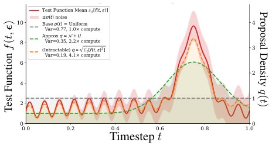

> *Generated by JarvisForResearchers Bot on 2026-05-22*

!!! tip "Why we featured this paper"
    Not yet indexed in S2 — assumed brand-new preprint

## TL;DR
CARV is a compute-aware variance-accounting framework that introduces a hierarchical Monte Carlo estimator by amortizing expensive upstream computations over cheap diffusion-noise resamples, sharpened by timestep importance sampling and stratified-inverse-CDF construction. This allows practitioners to optimize estimator variance relative to computational budget when upstream steps (like rendering) are prohibitively expensive.

## The Problem
When utilizing frozen pretrained diffusion models in downstream pipelines—such as text-to-3D generation or single-step distillation—the resulting gradients are inherently Monte Carlo expectations. These expectations are taken over the noise levels ($t$) and the Gaussian noise samples ($\epsilon$). The critical issue is that the variance of the estimator often dominates the total computational cost because the upstream components (e.g., rendering, complex simulation, or encoding) are computationally expensive.

Current practices suffer from several deficiencies: downstream users often inherit the teacher's timestep distributions and resort to ad hoc averaging, which introduces bias and forces compute tuning without a principled understanding of where the variance originates. Furthermore, there is a lack of a principled framework to identify which specific estimator components contribute most significantly to the overall variance, and consequently, no principled method exists to trade off cheap operations (like noise sampling) against expensive ones (like rendering) under a fixed computational budget.

## Key Contributions
We introduce three primary mechanisms to address these gaps:
1. **Hierarchical Monte Carlo estimator via amortized resampling:** This technique caches expensive upstream computations and then resamples the cheap diffusion noise multiple times to reduce within-render conditional variance.
2. **Timestep importance sampling:** We leverage the explicit teacher weight, $w_{SDS}(t)$, to construct a proposal distribution $q(t) \propto p(t)w_{SDS}(t)$, which guides timestep sampling to reduce variance by tracking gradient norm dependence on $t$.
3. **Stratified-inverse-CDF sampling:** This method combines stratification with importance sampling by sampling in the proposal-quantile space, ensuring balanced coverage across the non-uniform noise levels dictated by the importance sampling proposal.

## How It Works


*Figure 1: Importance sampling for timestep allocation: Left: Toy example showing a test function F,
uniform proposal, oracle optimal proposal from Eq. 24, and a practical approximation adding a Gaussian at the
peak. The oracle variance equals that of spending ∼3−4× the compute of uniform, while the *

CARV operates by conceptually decoupling the expensive upstream operations (e.g., a single forward pass through a renderer or generator) from the cheap, high-frequency noise resampling steps (the choice of timestep $t$ and the Gaussian noise $\epsilon$). The framework then applies three integrated strategies: compute reuse, guided importance sampling, and stratified sampling. These techniques are evaluated using the CARV measurement framework, which quantifies efficiency via the Effective Compute Multiplier (ECM) at iso-variance.

### Amortized Re-noising of Cached States
This component addresses the high cost of the upstream computation, denoted as $g(\theta, q^{(r)})$, where $q^{(r)}$ represents the state derived from the upstream process for a specific render $R$. Instead of recomputing $g(\theta, q^{(r)})$ for every noise sample, we cache this expensive state. We then resample the cheap diffusion noise $(t^{(r,k)}, \epsilon^{(r,k)})$ multiple times ($K$ noisings per render $R$). This amortization strategy directly reduces the conditional variance associated with the fixed, expensive upstream result.

### Timestep Importance Sampling
The variance in diffusion model gradients is often highly dependent on the timestep $t$. To mitigate this, we employ importance sampling. We define a proposal distribution $q(t)$ proportional to the true teacher distribution $p(t)$ weighted by the explicit teacher weight $w_{SDS}(t)$: $q(t) \propto p(t)w_{SDS}(t)$. By using this weighted proposal and applying the necessary likelihood-ratio correction, we steer the sampling towards timesteps where the gradient norm exhibits the most significant variation, thereby reducing overall variance.

### Stratified-Inverse-CDF Sampling
When using importance sampling, the resulting proposal distribution $q(t)$ is non-uniform. Simple sampling from $q(t)$ might lead to poor coverage of the distribution's tails. To counteract this, we implement stratified sampling in the proposal-quantile space. We define the proposal-quantile $u^{(r)}_b = (b-1+\xi^{(r)}_b)/B$, where $B$ is the number of strata and $\xi^{(r)}_b$ is a uniform random variable. We then sample the timestep $t^{(r)}_b$ by inverting the cumulative distribution function (CDF) of the proposal $q$: $t^{(r)}_b = \text{CDF}^{-1}_q(u^{(r)}_b)$. This ensures that each stratum receives a representative sample across the entire range of $q$-quantiles.

### Compute-aware Variance-Accounting Framework (CARV)
CARV provides the necessary meta-framework for evaluating the effectiveness of the variance reduction techniques. It utilizes Welford's online algorithm to estimate the variance of the gradients iteratively. Crucially, it reports efficiency not just by variance reduction, but by the Effective Compute Multiplier (ECM) achieved at a fixed level of variance. This allows for a direct, principled comparison between estimators based on their computational cost versus their variance reduction capability.

## Results
| Metric | Value | Baseline | Source |
| :--- | :--- | :--- | :--- |
| Effective Compute Multipliers (ECM) | 2-3$\times$ | uniform-IID with K = 1 | Abstract |
| Additional Variance Reduction from IS+stratification | $\ge 25\%$ | Amortized reuse alone | Abstract |
| Gradient Variance Reduction (Single-Step Distillation) | an order of magnitude | Standard MC estimator | Abstract |
| Variance Reduction (Importance Sampling) | $\ge 1.2\times$ | Uniform sampling | Table 2 |

## Why This Matters
For researchers operating at the intersection of generative AI and complex simulation (e.g., physics-informed generation or high-fidelity 3D synthesis), the computational bottleneck is rarely the forward pass itself, but the variance reduction required to achieve a stable, low-variance gradient estimate. CARV provides a formal methodology to move beyond heuristic tuning. By quantifying the trade-off between the cost of generating a state (rendering/encoding) and the cost of sampling noise, practitioners can systematically deploy compute reuse, importance sampling, and stratification to achieve target variance levels with the minimum necessary computational expenditure.

## Limitations & Open Questions
One observed limitation is that in the specific context of single-step distillation, the variance reduction achieved by CARV does not translate into a measurable improvement in the downstream FID score, suggesting that the variance reduction might be localized to the gradient estimation process rather than the final sample quality. Furthermore, the theoretically optimal proposal distribution, $q^\star(t)$, which would minimize variance, is practically infeasible to compute because it requires estimating the gradient norms across all possible renders and noise configurations for every timestep.

---

## Citation

**Paper:** [2605.21489](https://arxiv.org/abs/2605.21489)

```bibtex
@article{260521489,
  title   = {Variance Reduction for Expectations with Diffusion Teachers},
  author  = {Jesse Bettencourt and Xindi Wu and Matan Atzmon and James Lucas and Jonathan Lorraine},
  journal = {arXiv preprint arXiv:2605.21489},
  year    = {2026},
  url     = {https://arxiv.org/abs/2605.21489}
}
```
