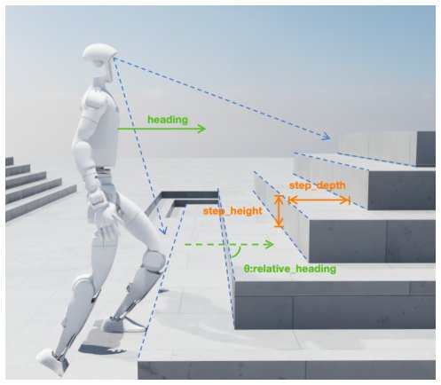

> *Generated by JarvisForResearchers Bot on 2026-05-23*

!!! tip "Why we featured this paper"
    Quality gate skipped (S2 unreachable, manual override)

## TL;DR
We introduce an explicit stair geometry conditioning framework that utilizes interpretable parameters—step height, step depth, and current yaw angle—to condition a PPO-based locomotion policy, resulting in robust humanoid stair climbing across varying geometries.

## The Problem
Robust humanoid stair climbing presents significant challenges stemming from inherent geometric discontinuities, high sensitivity to variations in step height, and uncertainty in real-world perception. Existing learning-based locomotion policies frequently fail to generalize because they rely on either implicit terrain representations or purely blind proprioceptive feedback. Prior work suffers from several limitations: existing policies often rely on implicit terrain representations or blind proprioceptive feedback, limiting generalization across varying stair geometries. Furthermore, perception-aware methods typically encode terrain implicitly as high-dimensional latent features, rendering them sensitive to perception noise and difficult to interpret. Crucially, there is an absence of explicit geometric conditioning in prior work, despite stair traversal fundamentally depending on quantifiable metrics such as step height and step depth.

## Key Contributions
Our work makes three primary contributions. First, we propose an explicit stair geometry conditioning framework that represents the local stair structure using compact and interpretable geometric parameters fed directly into the policy input. Second, we develop a PPO-based humanoid locomotion policy that is directly conditioned on the measured step height, step depth, and current yaw, enabling anticipatory gait modulation during the climbing process. Finally, we demonstrate superior generalization across unseen stair geometries both in simulation and during real-world deployment, successfully traversing 33 consecutive outdoor steps.

## How It Works


*Fig. 1: Explicit stair geometry conditioning for robust
humanoid locomotion. The local stair structure is parame-
terized by step height hstep, step depth dstep, and current yaw
angle θcurrent
yaw
defined relative to the robot heading direction.
These explicit geometric parameters directly condition*

The framework operates by first processing local environmental data to extract structured geometric information, which is then used to modulate a standard reinforcement learning policy. This process involves several distinct architectural components working in sequence.

### BEV-based terrain perception network
The input to this network is a local point cloud, $P = \{p_i\}_{i=1}^N$. This cloud is processed by projecting it onto a fixed-size Bird's Eye View (BEV) grid, specifically $3\text{m} \times 3\text{m}$ with a resolution of $0.05\text{m}$. For each cell in this BEV grid, we compute several Z-axis statistics: $\max(z)$, $\min(z)$, $\text{mean}(z)$, the range ($\max(z) - \min(z)$), the standard deviation ($\text{std}(z)$), and a normalized point density measure. These statistics collectively form the initial BEV feature map.

### BEV Terrain Encoder
This component is a convolutional neural network (CNN) that operates on the BEV feature map generated by the perception network. The CNN processes this map to distill the raw spatial data into a set of high-level spatial features, denoted as $F_{enc} \in \mathbb{R}^{C' \times H' \times W'}$. In our implementation, the configuration used is $C' = 128$ channels with spatial dimensions $H' = W' = 8$.

### Explicit Stair Geometry Representation
The high-level features $F_{enc}$ are utilized by the perception network to predict several critical, interpretable parameters. Specifically, the network outputs the terrain class ($st \in \{\text{flat, stairs-up, stairs-down}\}$), the step height ($h_{step} \in \mathbb{R}$), the step depth ($d_{step} \in \mathbb{R}$), and the agent's current yaw angle ($\theta_t \in (-\pi, \pi)$). These four values are concatenated to form the structured terrain token, $z_t = [st, h_{step}, d_{step}, \theta_t]^T \in \mathbb{R}^4$. This token encapsulates the necessary geometric context for the policy.

### PPO-based actor-critic locomotion policy
The core decision-making module is a PPO-based actor-critic policy, $\pi_\theta(a_t|o_t)$. This policy is optimized via Proximal Policy Optimization to maximize the expected discounted return. Critically, the policy is conditioned on the observation $o_t = \{\text{oprop}_t, z_t\}$, where $\text{oprop}_t$ represents the agent's proprioceptive state and $z_t$ is the structured terrain token derived from the perception pipeline. This conditioning allows the policy to proactively modulate its gait based on the anticipated geometry.

### Privileged terrain teacher
This component is strictly utilized during the simulation training phase. It serves to provide the student encoder with ground-truth terrain classes and the precise geometric parameters ($h_{step}, d_{step}, \theta_t$). This supervision signal is necessary to train the perception network to accurately estimate these parameters before deployment, where this teacher is absent.

## Results
The performance metrics demonstrate the efficacy of the explicit conditioning approach.

| Metric | Value | Baseline | Source |
| :--- | :--- | :--- | :--- |
| MAE($h_{step}$) | 0.6 cm | N/A | TABLE II |
| MAE($d_{step}$) | 0.7 cm | N/A | TABLE II |
| MAE($\theta_{current\_yaw}$) | $1.8^\circ$ | N/A | TABLE II |
| State Acc (%) (Simulation) | 99.1 | N/A | TABLE II |
| Success (%) (Ours vs HeightMap-PPO) | $96 \pm 2$ | $88 \pm 3$ | TABLE I |
| Mreward (Ours vs HeightMap-PPO) | 45.10 | 32.23 | TABLE I |

## Why This Matters
The practitioner takeaways highlight the significance of this approach. Explicitly parameterizing terrain geometry (step height, step depth) provides a more structured and task-relevant information stream compared to relying on implicit latent representations for locomotion control. Conditioning the policy directly on these interpretable geometric features leads to demonstrably faster convergence and superior asymptotic performance when compared to methods that rely solely on raw elevation maps. Furthermore, the framework proves its practical deployability, evidenced by the successful traversal of 33 consecutive steps in challenging outdoor environments.

## Limitations & Open Questions
We acknowledge two primary limitations. First, the reliance on a privileged terrain teacher during simulation training is a necessary artifact of the current training paradigm and must be entirely removed for real-world deployment. Second, while our explicit method mitigates sensitivity to perception noise, the performance of the comparative HeightMap-PPO method remains demonstrably sensitive to perception noise and discretization artifacts. Future work should investigate methods to improve the robustness of the parameter estimation under severe sensor noise conditions.

---

## Citation

**Paper:** [2605.09944](https://arxiv.org/abs/2605.09944)

```bibtex
@article{260509944,
  title   = {Explicit Stair Geometry Conditioning for Robust Humanoid Locomotion},
  author  = {Jianguo Zhang and Wentai Xu and Shusheng Ye and Yuxiang He and Weimin Qi and Qinbo Sun et al.},
  journal = {arXiv preprint arXiv:2605.09944},
  year    = {2026},
  url     = {https://arxiv.org/abs/2605.09944}
}
```
