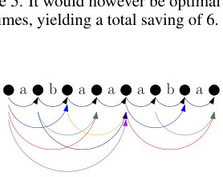

> *Generated by JarvisForResearchers Bot on 2026-05-23*

!!! tip "Why we featured this paper"
    Not yet indexed in S2 — assumed brand-new preprint

## TL;DR
ConvexTok reframes the NP-hard problem of finding a compression-optimal tokeniser as a Linear Program (LP) relaxation of an equivalent Integer Program (IP). This allows for the computation of near-optimal tokenisers and provides a quantifiable lower bound on compression achievable by any tokeniser derived from the LP solution.

## The Problem
The objective of constructing a compression-optimal tokeniser is to minimize the total number of bits required to represent a given corpus, which is equivalent to maximizing the compression ratio. However, finding this globally optimal tokeniser is NP-hard. Existing heuristic approaches, such as Byte Pair Encoding (BPE) or Unigram Language Model tokenizers, operate greedily. They make locally optimal decisions based on immediate frequency gains without considering the global structure of the resulting vocabulary, meaning they cannot guarantee optimality. Prior work has relied on minor modifications to these greedy algorithms, failing to address the fundamental combinatorial complexity of the problem.

## Key Contributions
We introduce three primary contributions to address these limitations:
1. Formulating tokeniser construction as a Linear Program (LP) derived from an equivalent Integer Program (IP).
2. Proposing three distinct rounding schemes—Deterministic (Det), Biased (Bias), and Integral-only (Int)—to discretize the continuous LP solution into a functional tokeniser.
3. Providing users with the ability to certify the theoretical proximity of their resulting tokeniser to the true optimum via a lower bound derived directly from the LP solution.

## How It Works


*Figure 1: Tokenisation graph con-
structed from D = {abaa, aba}.
Black edges represent Ebyte and
others represent Etok.*

ConvexTok operates by translating the tokenisation problem into a graph structure, which is then modeled as an optimization problem.

### Tokenisation Graph $\langle V, E_{all}, C \rangle$
The process begins by constructing a Tokenisation Graph $\langle V, E_{all}, C \rangle$ from the input dataset $D$. The vertex set $V$ comprises nodes representing every possible position boundary between bytes in the corpus. The edge set $E_{all}$ is composed of two types: $E_{byte}$, which connects adjacent vertices within a single byte-string, and $E_{tok}$, which connects non-adjacent vertices, representing potential token boundaries. This graph structure encodes all possible segmentation choices.

### Integer Program (IP) $QIP$
The compression-optimal tokeniser problem is formalized as an Integer Program, denoted $QIP$ (Eq. 5). This formulation utilizes binary decision variables: $f \in \{0, 1\}^F$ indicates whether a specific feature (e.g., a byte sequence) is included in the vocabulary, $p \in \{0, 1\}^P$ relates to prefix constraints, and $c \in \{0, 1\}^C$ represents the selection of specific token candidates. The objective function seeks to minimize $\langle 1, p \rangle + \langle 1, f \rangle$, subject to constraints (5) that enforce valid tokenisation flow and budget limitations.

### Tokenisation Polytope (LP) $Q$
Since $QIP$ is NP-hard, we relax the integer constraints on $f, p,$ and $c$ to allow them to take continuous values within $[0, 1]$. This relaxation yields the Tokenisation Polytope, $Q$ (Eq. 6). By solving this LP using standard solvers, we obtain a fractional solution that defines the convex hull of all feasible tokeniser configurations.

### Rounding Schemes (Det, Bias, Int)
The fractional solution obtained from $Q$ must be converted back into a discrete, functional tokeniser vocabulary. We employ three distinct rounding schemes:
1. **Deterministic (Det):** This scheme selects the top $K$ token candidates based on the continuous values derived from the LP solution.
2. **Biased (Bias):** This method ranks token candidates based on the ratio $c/\text{length}(c)$, providing a weighted selection criterion.
3. **Integral-only (Int):** This scheme enforces a strict threshold, selecting only those token candidates where the continuous value $c$ is greater than or equal to $0.999$.

## Results
The empirical evaluation demonstrates the efficacy of the ConvexTok framework across various metrics:

| Metric | Value | Baseline | Source |
| :--- | :--- | :--- | :--- |
| Lower Bound Accuracy | within 1% of optimal | N/A | Empirical finding |
| Intrinsic Metrics Performance | consistently outperforms all other tokenisers | Other tokenisers | Evaluation using compression rate, vocabulary utilisation, and Rényi entropy |
| Bits-per-Byte (BpB) | consistently performed best | BPE | Downstream language modelling experiments |

## Why This Matters
ConvexTok provides a mathematically rigorous framework for tokeniser design. By framing the problem as an optimization task, we move beyond heuristic search. Crucially, the LP relaxation allows us to quantify the quality of any resulting tokeniser; the solution to the LP provides a verifiable lower bound on the achievable compression. Furthermore, the flexibility in choosing between the Deterministic, Biased, or Integral-only rounding schemes allows practitioners to tune the trade-off between theoretical optimality and practical implementation constraints.

## Limitations & Open Questions
The primary limitation stems from the necessary discretization step. Converting the continuous LP solution back into a discrete tokeniser via rounding inherently introduces approximation error. While ConvexTok shows strong performance on intrinsic metrics, its consistency in improving performance on downstream (CORE) tasks is less robust compared to its superior performance on Bits-per-Byte (BpB) metrics. Future work must investigate rounding schemes that minimize the gap between the LP relaxation and the true integer optimum.

---

## Citation

**Paper:** [2605.22821](https://arxiv.org/abs/2605.22821)

```bibtex
@article{260522821,
  title   = {Tokenisation via Convex Relaxations},
  author  = {Jan Tempus and Philip Whittington and Craig W. Schmidt and Dennis Komm and Tiago Pimentel},
  journal = {arXiv preprint arXiv:2605.22821},
  year    = {2026},
  url     = {https://arxiv.org/abs/2605.22821}
}
```
