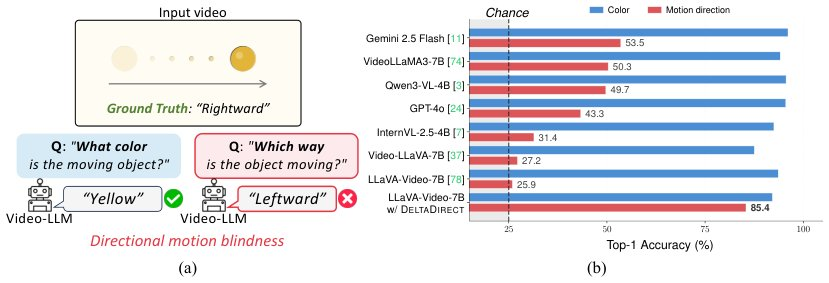

> *Generated by JarvisForResearchers Bot on 2026-05-24*

!!! tip "Why we featured this paper"
    Not yet indexed in S2 — assumed brand-new preprint

## TL;DR
This work introduces MODIRECT and DeltaDirect to address directional motion blindness in Video-LLMs. This blindness arises from a direction binding gap where motion signals are present but fail to reliably map to verbal outputs. DeltaDirect is a projector-level objective that forces the visual features to encode strong, signed 2-D motion vectors, leading to significant performance gains on motion direction tasks.

## The Problem
A critical failure mode observed in many Video-LLMs is directional motion blindness. This manifests as near-chance performance on tasks requiring the perception of signed image-plane motion direction, even when the necessary motion information is linearly accessible throughout the model's processing pipeline.

The limitations of prior work are threefold. First, existing benchmarks often conflate the target motion direction with confounding factors such as camera motion, object identity, scene layout, scale changes, and event semantics. Second, while instruction tuning can successfully close the direction binding gap within the source domain, it fails to instill a robust, domain-invariant motion direction signal, resulting in a significant out-of-domain generalization gap. Crucially, the failure mode is not merely an absence of motion direction geometry, but rather a deficit in the *magnitude* of the motion direction concept vector when generalizing across domains.

## Key Contributions
We make three primary contributions:
1. We formally identify directional motion blindness in Video-LLMs, diagnosing its root cause as a direction binding gap.
2. We demonstrate that while instruction tuning resolves the direction binding gap in the source domain, it fails to produce a sufficiently strong, domain-invariant motion direction signal, leading to an out-of-domain generalization deficit.
3. We introduce MODIRECT, a controlled dataset family designed to isolate motion direction, and DeltaDirect, a training-only projector-level objective that explicitly predicts normalized 2-D motion vectors from adjacent-frame feature deltas.

## How It Works


*Figure 1: Directional motion blindness in Video-LLMs. (a) Given a simple synthetic video of a
yellow circle moving from left to right, recent Video-LLMs correctly identify the object’s color but
answer the wrong motion direction. (b) Across Video-LLMs, appearance recognition is high, yet
signed moti*

The diagnostic process involves tracing motion direction signals through the Video-LLM architecture to pinpoint the 'direction binding gap' at the readout position. To mitigate this, we employ DeltaDirect. This objective supervises the output of the **Projector** by training it to predict normalized 2-D motion vectors. These target vectors are derived directly from the feature deltas between adjacent frames. By imposing this low-level, signed displacement constraint at the projector level, we force the visual features to carry a stronger, more explicit signed displacement signal before they are integrated into the **LLM**.

### Vision Encoder
The **Vision Encoder** processes $T$ sampled frames, outputting visual features $V \in \mathbb{R}^{T \times M \times D_v}$. Here, $M$ denotes the number of patch tokens per frame, and $D_v$ is the embedding dimension.

### Projector
The **Projector** serves as the interface between the vision and language modalities. It maps the high-dimensional visual features into the LLM's embedding space, yielding visual tokens $F \in \mathbb{R}^{T \times N \times D}$, where $N \le M$ reflects any spatial pooling applied, and $D$ is the LLM hidden dimension.

### LLM
The **LLM** is an $L$-layer transformer that processes the sequence of visual tokens $F$ alongside text tokens. It generates an answer by tracking hidden states $z_i^t$ at the visual-token positions.

### Readout Token ($h_\text{out}$)
The **Readout Token** is the hidden state corresponding to the final token position at layer $L$. This state, $h_L$, is subsequently mapped to the output vocabulary logits to facilitate next-token prediction.

### DeltaDirect
**DeltaDirect** is a training-only objective applied at the **Projector** level. It directly supervises the projector's output by requiring it to predict normalized 2-D motion vectors. These target vectors are computed from the feature deltas between adjacent frames, effectively training the projector to encode explicit motion kinematics.

## Results
The efficacy of DeltaDirect is demonstrated across controlled and real-world benchmarks.

| Metric | Value | Baseline | Source |
| :--- | :--- | :--- | :--- |
| Motion direction accuracy (MODIRECT-SYNBENCH) | 85.4% | 25.9% | Table 1 |
| Real-world motion direction accuracy improvement (MODIRECT-REALBENCH) | 21.9 points | vanilla baseline | Abstract |
| Instruction tuning MCQ accuracy (Primitive-on-Syn) | 99.5% | 27.6% | Figure 4 |

## Why This Matters
This work establishes that directional motion blindness is not merely a data scarcity issue but a fundamental representational bottleneck localized at the visual-language interface. By introducing DeltaDirect, we provide a mechanism to explicitly inject low-level, signed motion information into the model's latent space during training. The substantial gains observed on MODIRECT-SYNBENCH (from 25.9% to 85.4%) confirm that strengthening the motion signal magnitude at the projector level is a viable strategy to overcome this binding gap. Furthermore, the improvement on MODIRECT-REALBENCH suggests that this approach yields benefits that extend beyond synthetic, controlled environments.

## Limitations & Open Questions
A key limitation remains the out-of-domain failure mode, which persists even after applying instruction tuning. This strongly suggests that the generalization gap is rooted in an inherent magnitude deficit in the motion direction representations when moving from the source to target domains. Additionally, it must be noted that the auxiliary branch utilized by DeltaDirect is discarded post-training; therefore, the test-time input format remains unchanged from the standard Video-LLM setup. Future work should investigate methods to enforce domain-invariant signal magnitudes rather than relying solely on task-specific supervision.

---

## Citation

**Paper:** [2605.22823](https://arxiv.org/abs/2605.22823)

```bibtex
@article{260522823,
  title   = {Which Way Did It Move? Diagnosing and Overcoming Directional Motion Blindness in Video-LLMs},
  author  = {Jongseo Lee and Hyuntak Lee and Sunghun Kim and Sooa Kim and Jihoon Chung and Jinwoo Choi},
  journal = {arXiv preprint arXiv:2605.22823},
  year    = {2026},
  url     = {https://arxiv.org/abs/2605.22823}
}
```
