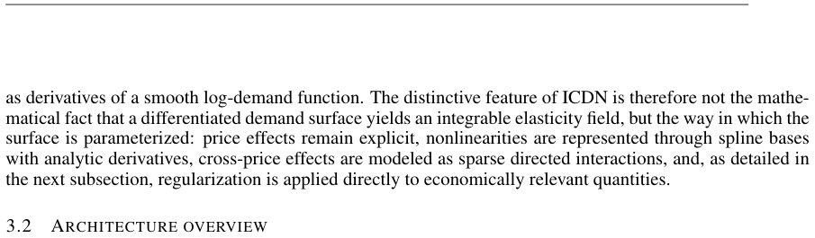

> *Generated by JarvisForResearchers Bot on 2026-05-25*

!!! tip "Why we featured this paper"
    Not yet indexed in S2 — assumed brand-new preprint

## TL;DR
The Integrable Context-Dependent Demand Network (ICDN) reframes multiproduct retail demand estimation as learning a smooth, context-conditioned demand surface. This formulation allows for the exact derivation of elasticities as derivatives of the learned surface, circumventing the instability and computational overhead associated with post-hoc numerical differentiation of complex ML models.

## The Problem
Learning stable and reproducible elasticities at scale in multiproduct retail demand is challenging. The core difficulty arises because minor irregularities in the estimated demand surface can propagate into significant, spurious fluctuations in the calculated elasticities. This instability is particularly pronounced when cross-price effects are weak or when pricing decisions across products are highly correlated. Existing approaches suffer from limitations: simple log-log Ordinary Least Squares (OLS) models impose overly restrictive, globally constant price effects, failing to capture the heterogeneous and state-dependent substitution patterns observed in reality. Furthermore, while some machine learning methods attempt to recover elasticities, they often treat this as a secondary, post-hoc analysis, lacking an explicit, analytically tractable representation of demand as a function of price. Deep learning models that rely on numerical differentiation to extract elasticities are often computationally prohibitive at scale and offer limited direct control over the implied structure of the demand function and its derivatives.

## Key Contributions
We make three primary contributions to this domain:
1. We formulate multiproduct elasticity estimation as a demand-first problem, where log-demand is modeled as a smooth surface, enabling the derivation of integrable elasticities directly as derivatives of this surface.
2. We introduce ICDN, a structured neural demand model designed to decompose price responses into distinct components: linear own-price effects, directed cross-price interactions, and spline-based nonlinear refinements.
3. We leverage the analytic derivatives inherent in product-specific spline bases to compute both own- and cross-price elasticities efficiently, entirely avoiding the need for dense Jacobian or Hessian evaluations.

## How It Works


*Figure 2 summarizes the forward pass of ICDN. The architecture is built around three components. First,
a context branch constructs one contextual token per SKU and maps these tokens into product-specific
latent representations. Second, an attention-based sparse neighbor selector identifies a small *

ICDN models the log-demand as a smooth function of log-prices and various contextual covariates. The structural design ensures that the resulting elasticities are exact derivatives of this underlying surface. The model achieves this by decomposing the price effects across three structural components:

### Shared Encoder
The **Shared Encoder** is responsible for mapping the contextual information associated with each Stock Keeping Unit (SKU) into a product-specific latent representation, denoted $h_i$. This latent vector serves to modulate the parameters of the subsequent demand response structures, allowing the model to capture context-dependent demand behavior.

### Own-price Response Structure
The response to a product's own price is modeled using a combination of two terms. The first is a locally linear log-log term, $\beta_{ii}(x)u_i$, which captures the baseline price sensitivity. This is augmented by a nonlinear spline component, $w_{ii}(x)^\top B_i(u_i)$, where $B_i(u_i)$ is the basis function expansion for product $i$.

### Directed Cross-price Response Structure
The interaction between products $i$ and $j$ is modeled more intricately to capture directional substitution. This structure comprises three parts: a linear component, $\beta_{ij}(x)u_j$, capturing the basic cross-price effect; a nonlinear univariate refinement, $w_{ij}(x)^\top B_j(u_j)$, which refines the effect of $u_j$ on product $i$; and critically, a spline-spline interaction term, $B_i(u_i)^\top U_{(ij)}(x)B_j(u_j)$, which models the joint non-linear influence of both prices.

The overall log-demand surface is constructed by summing these structured components, modulated by the latent representations derived from the **Shared Encoder**. The use of spline bases is key, as it provides the necessary mathematical structure to derive closed-form expressions for the required partial derivatives (elasticities).

## Results
| Metric | Value | Baseline | Source |
| :--- | :--- | :--- | :--- |
| Out-of-sample generalization | Improves over a directed log-log benchmark | Directed log-log benchmark | Abstract |
| Elasticity estimates | More stable, economically plausible | N/A | Abstract |

## Why This Matters
ICDN provides a robust framework for moving beyond simple parametric assumptions in demand modeling. By deriving elasticities exactly from a single, smooth demand surface, it significantly enhances the analytical tractability of the model. Furthermore, the structured approach allows the model to capture heterogeneous and directional cross-price responses by constructing them from ordered product pairs $(h_i, h_j)$ independently. The ability to enforce economic coherence during training via regularization techniques—such as soft penalties on positive own-price elasticities and soft elasticity-band penalties on cross-price responses—makes the model more reliable for practical inference.

## Limitations & Open Questions
It must be noted that the elasticities derived by ICDN should not be interpreted as fully identified causal effects of price interventions, given that the empirical application relies on observational scanner data. Additionally, the model's validity is contingent upon the mathematical coherence requirement: the local price responses must be compatible with a single, globally defined demand surface. Future work should investigate the robustness of the model when this integrability assumption is severely violated by underlying market dynamics.

---

## Citation

**Paper:** [2605.22820](https://arxiv.org/abs/2605.22820)

```bibtex
@article{260522820,
  title   = {Integrable Elasticity via Neural Demand Potentials},
  author  = {Carlos Heredia and Daniel Roncel},
  journal = {arXiv preprint arXiv:2605.22820},
  year    = {2026},
  url     = {https://arxiv.org/abs/2605.22820}
}
```
