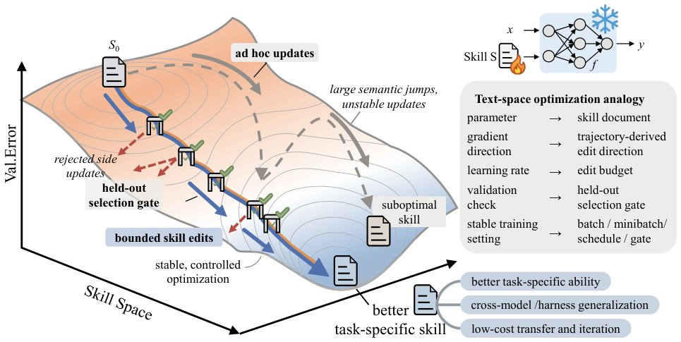

> *Generated by JarvisForResearchers Bot on 2026-05-26*

!!! tip "Why we featured this paper"
    Not yet indexed in S2 — assumed brand-new preprint

## TL;DR
SkillOpt formalizes agent skill refinement as optimization over an external natural-language state, allowing for systematic, deep-learning-style improvement of procedural knowledge for frozen target models. It achieves this via a structured optimization loop involving rollout evidence, reflection minibatches, and a strict held-out validation gate, yielding significant gains across diverse benchmarks.

## The Problem
Current methodologies for equipping autonomous agents with procedural knowledge—such as hand-crafting instructions, generating single-shot prompts, or employing rudimentary self-revision—suffer from inherent fragility. These approaches fail to reliably improve performance under iterative feedback, particularly when the underlying large language model (LLM) serving as the agent is a closed frontier model whose weights cannot be adapted. The gap lies in the lack of a systematic, controllable mechanism to train a compact, reusable domain skill artifact that can surpass its initial state without modifying the frozen target model weights.

## Key Contributions
We introduce SkillOpt, a framework that treats the agent's skill document as an external, optimizable state. This framework incorporates several novel elements: a harness-agnostic optimizer utilizing rollout batches, structured reflection minibatches, and a defined set of edit operations (add/delete/replace). Crucially, we implement textual learning rates and schedules, coupled with a strict held-out acceptance mechanism and a rejected-edit buffer. Furthermore, we integrate an epoch-wise slow/meta update to capture long-horizon regularities. Empirically, SkillOpt demonstrates superior or tied-superior performance across 52 out of 52 tested configurations (six benchmarks, seven target models, three execution harnesses). Finally, we validate the design through ablation studies and demonstrate the portability of the resulting skill artifact across different models and harnesses.

## How It Works


*Figure 1 Overview of SkillOpt. The target model executes tasks with a current skill, an additional
frontier optimizer model converts trajectories into bounded add/delete/replace skill edits, and a held-out
gate accepts only edits that improve validation performance. Accepted edits are exported as a *

SkillOpt operates by decoupling the optimization process from the target model's internal parameters. The **Skill Document ($\mathbf{s}$)** serves as the trainable external state. The process begins by generating **Rollout Batches** by executing tasks from the training set ($\mathcal{D}_{tr}$) using the current skill $\mathbf{s}$ on the **Frozen Target Model ($\mathbf{M}$)**. The **Frontier Optimizer Model** then analyzes these trajectories, partitioning them into **Reflection Minibatches** (successes and failures) to propose structured edits ($\text{add/delete/replace}$) to $\mathbf{s}$. These proposed edits are governed by an **Edit Budget ($\mathbf{L}_t$)**, which acts as the textual learning rate. Before application, every candidate skill resulting from an edit is evaluated by the **Held-out Validation Gate** on the validation set ($\mathcal{D}_{sel}$); only edits that yield a strict improvement in validation score are accepted. Edits that fail validation are logged in the **Rejected-Edit Buffer** for subsequent negative feedback. To prevent catastrophic forgetting and capture durable knowledge, an **Epoch-Wise Slow/Meta Update** summarizes long-term trends into a protected field within $\mathbf{s}$.

### Frozen Target Model (M)
This is the LLM whose operational behavior is being refined. Its weights are fixed throughout the entire optimization lifecycle, ensuring that the optimization process remains external to the model's parameter space.

### Skill Document (s)
This is the core artifact of SkillOpt. It is a portable, natural-language document that encapsulates the agent's procedural knowledge. It functions as the external state that the optimizer manipulates.

### Frontier Optimizer Model
This is a separate, dedicated model responsible for the inference and reasoning over the collected execution data. Its function is to translate raw trajectory evidence from the **Rollout Batch** into discrete, actionable, and structured edits ($\text{add/delete/replace}$) targeting the **Skill Document ($\mathbf{s}$)**.

### Rollout Batch
This constitutes the primary evidence unit. It is generated by running the **Frozen Target Model ($\mathbf{M}$)** on a subset of the training data ($\mathcal{D}_{tr}$) using the current version of the **Skill Document ($\mathbf{s}$)**.

### Reflection Minibatch
These are curated subsets of the trajectories derived from the **Rollout Batch**. They are specifically partitioned to isolate instances of success or failure, providing the **Frontier Optimizer Model** with focused evidence for proposing targeted procedural corrections.

### Edit Budget ($\mathbf{L}_t$)
This parameter functions analogously to a learning rate in gradient descent. It constrains the optimization step size by defining the maximum number of structural edits that can be applied to $\mathbf{s}$ at time step $t$.

### Held-out Validation Gate
This mechanism enforces conservative optimization. It evaluates the performance of any proposed skill modification on a separate, unseen validation set ($\mathcal{D}_{sel}$). Acceptance is conditional on a *strict* improvement in the validation score, preventing the optimization from chasing spurious local optima.

### Rejected-Edit Buffer
This buffer serves as a repository for edits that were proposed but subsequently rejected by the **Held-out Validation Gate**. It allows the **Frontier Optimizer Model** to incorporate negative feedback—i.e., learning what *not* to do—in subsequent reflection steps.

### Epoch-Wise Slow/Meta Update
This process occurs periodically (at the end of an epoch). It is designed to distill high-level, durable insights from the entire epoch's learning into a protected section of the **Skill Document ($\mathbf{s}$)**, providing a stable, long-horizon regularization signal that is distinct from the rapid, step-wise edits.

## Results
| Metric | Value | Baseline | Source |
| :--- | :--- | :--- | :--- |
| Average gain over no skill (GPT-5.5, direct chat) | +23.5 points | no skill | Table 1 |
| Average gain over no skill (GPT-5.5, Codex agentic loop) | +24.8 points | no skill | Table 1 |
| Average gain over no skill (GPT-5.5, Claude Code harness) | +19.1 points | no skill | Table 1 |
| Average gain over strongest per-cell baseline (GPT-5.5) | +5.4 points | human-written, one-shot LLM, Trace2Skill, TextGrad, GEPA, and EvoSkill skills | Table 1 |

## Why This Matters
SkillOpt provides a rigorous, principled framework for enhancing agent capabilities without requiring access to the proprietary or computationally prohibitive weight space of frontier models. By externalizing the procedural knowledge into a structured, optimizable text artifact, we bridge the gap between the high-capacity, static knowledge of LLMs and the need for dynamic, iterative procedural refinement. The demonstrated portability and performance across heterogeneous environments confirm that the skill artifact is not merely a prompt engineering trick but a compact, reusable, and systematically trained piece of domain knowledge.

## Limitations & Open Questions
The current design necessitates the presence of an external **Frontier Optimizer Model**, which introduces a dependency and potential source of error into the overall pipeline. Furthermore, the **Epoch-Wise Slow/Meta Update** is implemented solely within the optimization framework and does not result in any modification to the **Frozen Target Model ($\mathbf{M}$)**, meaning the durable knowledge captured is confined to the skill artifact itself. Future work should investigate methods to distill the meta-knowledge from the skill artifact back into the target model's context window or latent space more effectively.

---

## Citation

**Paper:** [2605.23904](https://arxiv.org/abs/2605.23904)

```bibtex
@article{260523904,
  title   = {SkillOpt: Executive Strategy for Self-Evolving Agent Skills},
  author  = {Yifan Yang and Ziyang Gong and Weiquan Huang and Qihao Yang and Ziwei Zhou and Zisu Huang et al.},
  journal = {arXiv preprint arXiv:2605.23904},
  year    = {2026},
  url     = {https://arxiv.org/abs/2605.23904}
}
```
