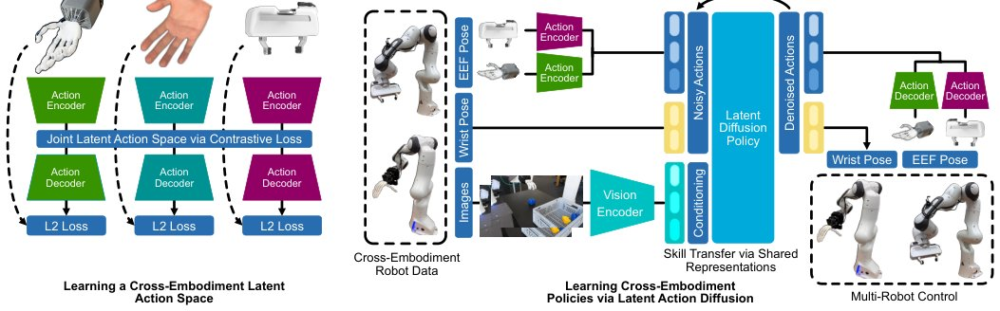

> *Generated by JarvisForResearchers Bot on 2026-05-27*

!!! tip "Why we featured this paper"
    Quality gate skipped (S2 unreachable, manual override)

## TL;DR
Latent Action Diffusion introduces a framework to unify heterogeneous end-effector action spaces into a semantically aligned latent space using contrastive learning. This allows for the training of a single, embodiment-agnostic Diffusion Policy, which can then control multiple robot morphologies via dedicated action decoders, enabling robust cross-embodiment skill transfer.

## The Problem
End-to-end learning in robotic manipulation is fundamentally constrained by two factors: data scarcity and the inherent heterogeneity of action spaces across different robot embodiments. This disparity creates a significant "embodiment gap," which severely impedes the development of policies capable of generalized cross-embodiment learning and effective skill transfer between robots of differing morphologies.

## Key Contributions
We present three primary contributions to address this challenge. First, we introduce a general framework that successfully unifies diverse end-effector action spaces into a single, semantically aligned latent space through the application of contrastive learning. Second, we demonstrate that factorizing the diffusion policy into a latent, embodiment-agnostic policy and corresponding embodiment-specific action decoders is a viable mechanism for achieving multi-robot control across substantially different robot morphologies. Finally, we provide empirical evidence of substantial real-world performance gains, achieving up to a 25.3% success rate improvement when utilizing cross-embodiment co-training compared to single-embodiment diffusion policies.

## How It Works


*Fig. 1: Overview of our approach. Left: We construct a semantically aligned latent action space by training modality-specific
encoders and decoders with a contrastive loss on retargeted end-effector (EEF) pose data from diverse end-effectors (dexterous
hands, parallel gripper). Right: A single diffu*

The overall framework operates by first establishing a common, semantically aligned latent action space. This is achieved by training modality-specific encoders and decoders using a contrastive loss applied to retargeted end-effector (EEF) pose data sourced from various end-effectors. Paired action data is generated using established retargeting functions, such as those derived from keyvectors, to facilitate this alignment.

The learning process for the latent action space proceeds in two distinct stages. Initially, the encoders are trained using a pairwise InfoNCE loss. Subsequently, the decoders are trained to minimize the reconstruction loss ($L_{recon}$). The total objective function governing this alignment is defined as $L_{total} = L_{recon} + \lambda L_{contrastive}$.

Once this shared latent space is established, a Diffusion Policy is trained exclusively within this latent domain. Crucially, during this final policy training phase, the modality-specific encoders and decoders are frozen. This freezing allows a single, embodiment-agnostic policy to govern the control, which then interfaces with multiple robot morphologies via their respective, pre-trained embodiment-specific action decoders.

### Action Encoder
The Action Encoder is responsible for projecting the raw actions originating from each input modality ($x_m$) into the shared, unified latent space ($q_{m,m}$).

### Action Decoder
The Action Decoder is tasked with the inverse mapping: learning to reconstruct the original ground truth actions ($\hat{x}_i$) from the latent representations ($p_{m,m}$) provided by the latent space.

### Joint Latent Action Space via Contrastive Loss
This component enforces the necessary cross-modal alignment within the training batch. It utilizes the pairwise InfoNCE loss ($L_{contrastive}$) to ensure that latent representations corresponding to semantically equivalent actions, even if derived from different physical embodiments, are pulled closer in the latent manifold.

### Diffusion Policy
The Diffusion Policy operates in the shared latent space. Its function is to map shared observational inputs across different datasets to the target latent end-effector actions and any non-latent wrist poses. This policy is trained specifically on the denoised latent actions.

## Results
The efficacy of the cross-embodiment co-training approach was quantified against established baselines.

| Metric | Value | Baseline | Source |
| :--- | :--- | :--- | :--- |
| Manipulation Success Rate Improvement | up to 25.3% | single-embodiment diffusion policies | Fig. 4 |

## Why This Matters
This work provides a principled methodology for mitigating the embodiment gap in robotic skill transfer. By decoupling the policy's decision-making process (the latent policy) from the physical actuation mechanism (the embodiment-specific decoders), we enable the transfer of high-level skills across robots with fundamentally different kinematics and end-effector geometries. The utilization of contrastive learning offers a data-efficient mechanism to bridge these heterogeneous action spaces without requiring exhaustive, embodiment-specific retraining.

## Limitations & Open Questions
A primary limitation of the current methodology is its reliance on predefined retargeting functions to establish the initial alignment between disparate action spaces. The quality of the latent space is thus partially dependent on the fidelity of these retargeting functions. Furthermore, the demonstrated performance gains are currently validated across a specific set of tasks, namely Block Stacking, Block Pick & Place, and Plush Toy Pick & Place. Future work should investigate the robustness of this framework when applied to tasks requiring fine-grained, non-geometric interaction.

---

## Citation

**Paper:** [2506.14608](https://arxiv.org/abs/2506.14608)

```bibtex
@article{250614608,
  title   = {Latent Action Diffusion for Cross-Embodiment Manipulation},
  author  = {Erik Bauer and Elvis Nava and Robert K. Katzschmann},
  journal = {arXiv preprint arXiv:2506.14608},
  year    = {2025},
  url     = {https://arxiv.org/abs/2506.14608}
}
```
