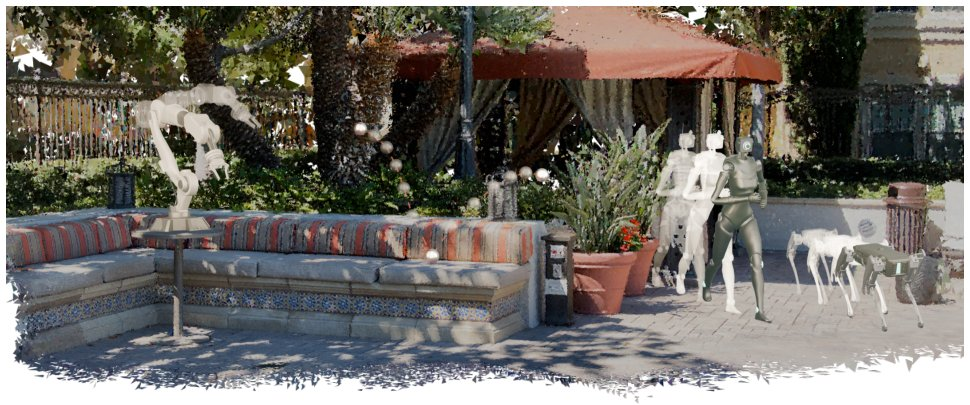

> *Generated by JarvisForResearchers Bot on 2026-05-27*

!!! tip "Why we featured this paper"
    Not yet indexed in S2 — assumed brand-new preprint

## TL;DR
TriSplat is a feed-forward 3D scene reconstruction network that uses oriented triangle primitives to directly export simulation-ready mesh scenes from sparse, unposed images in a single forward pass. This circumvents the need for expensive post-hoc mesh extraction common in Gaussian-based methods.

## The Problem
Existing feed-forward 3D reconstruction methods, particularly those based on Gaussian primitives, expose surfaces only indirectly. This indirect representation necessitates expensive post-hoc steps, such as TSDF fusion or Poisson reconstruction, to extract a usable mesh suitable for downstream simulation or embodied interaction. This reliance on sequential, non-differentiable extraction processes fundamentally breaks the promise of a purely feed-forward pipeline. Furthermore, geometry-aware variants often still depend on per-scene optimization or auxiliary extraction mechanisms for robust mesh recovery.

## Key Contributions
We introduce TriSplat, a novel feed-forward network whose native representation is oriented triangle primitives. This architecture jointly predicts geometry, appearance, and camera poses directly from sparse, unposed images in a single forward pass. We designed a normal-anchored triangle construction pipeline that derives triangle orientation from the predicted point map geometry, subsequently refining this orientation using an image-conditioned head. Training stability is maintained through mono-normal bootstrapping and validity-aware masking. Critically, we demonstrate that this triangle-native representation eliminates the requirement for post-hoc mesh extraction, allowing the rendering output to be directly consumable by physics engines and standard rendering pipelines.

## How It Works


*Figure 1 TriSplat reconstructs simulation-ready 3D scenes from sparse, unposed images. The feed-forward model
predicts a triangle mesh in a single pass, enabling direct use in physics engines for locomotion, dynamics, and
robotic grasping. The teaser is rendered with Blender.*

TriSplat employs a DINOv2 backbone to encode scene priors, which feeds into a custom transformer decoder. This decoder processes the sparse, unposed image inputs to predict three distinct outputs in parallel: dense local 3D point maps, SE(3) camera-to-world poses, and per-pixel triangle attributes. The orientation of the triangles is anchored by first deriving raw geometry normals ($\mathbf{n}_{geo}$) from the dense point map $\mathbf{P}$ using finite differences ($\mathbf{n}_{geo} = \text{normalize}(\partial_x \times \partial_y)$). These raw normals are then refined by a dedicated image-conditioned U-Net, denoted $f_{\theta}$. Training stability is enforced via a mono-normal bootstrap schedule, which blends teacher normals ($\mathbf{n}_{tch}$) with the refined model normals ($\mathbf{n}_{ref}$). Finally, progressive opacity and blur scheduling transition the representation from soft primitives to sharp, mesh-ready oriented triangles, which are rendered via a differentiable triangle rasterizer.

### DINOv2 backbone
The DINOv2 backbone serves as the primary encoder. Its function is to extract rich, high-level scene priors from the input sparse, unposed images, which are subsequently utilized by the custom transformer decoder to guide the prediction of geometric and photometric properties.

### Local-Global Attention decoder blocks
These decoder blocks are structured to facilitate multi-scale reasoning. They alternate between intra-view self-attention, which enables local spatial reasoning within a single image view, and cross-view joint attention, which aggregates information across multiple views to establish multi-view correspondence.

### Point head
The Point head is responsible for predicting a dense local 3D point map $\mathbf{P} \in \mathbb{R}^{H \times W \times 3}$. For every pixel, it outputs three unconstrained scalars $(u, v, z)$, defining the local 3D coordinates.

### Camera head
The Camera head predicts the camera-to-world pose for each view. This is achieved by mean-pooling the relevant decoder tokens and subsequently regressing a translation vector and a $3 \times 3$ matrix. This matrix is projected onto $SO(3)$ via Singular Value Decomposition (SVD) orthogonalization to yield the rotation component.

### Primitive head
The Primitive head predicts the necessary attributes for constructing oriented triangles at the per-pixel level. These attributes include a density logit, three scale logits, a quaternion defining orientation, spherical-harmonic appearance coefficients, and a blur parameter.

### Geometry normals ($\mathbf{n}_{geo}$)
These are the raw surface normals computed directly from the dense point map $\mathbf{P}$. The calculation relies on finite differences across the predicted point map: $\mathbf{n}_{geo} = \text{normalize}(\partial_x \times \partial_y)$.

### Refinement network ($f_{\theta}$)
This lightweight U-Net acts as the geometry normal refinement module. It takes as input the raw/smoothed geometry normals ($\mathbf{n}_{geo}$), the downsampled RGB image $I_v$, the predicted depth map $D_v$, and the validity mask. Its purpose is to refine the initial normal estimates into a more accurate representation.

### Mono-normal bootstrap
This mechanism ensures training stability by managing the transition of normal supervision. It employs a time-varying coefficient $\alpha(t)$ across three distinct phases—takeover, blending, and release—to blend the teacher normals ($\mathbf{n}_{tch}$) with the model-predicted normals ($\mathbf{n}_{ref}$).

### Differentiable triangle rasterizer
This component is responsible for the final rendering step. It takes the predicted oriented triangles and renders them using tile-based sorting and front-to-back alpha compositing. This process outputs differentiable representations of the RGB images, depth maps, and surface normals.

## Results
| Metric | Value | Baseline | Source |
| :--- | :--- | :--- | :--- |
| Mesh-rendering PSNR | 0.51s | TriSplat (Ours) | Figure 2 |

## Why This Matters
The primary implication of TriSplat is the shift from implicit or indirect surface representations to explicit, native surface primitives within a feed-forward framework. For practitioners in robotics and simulation, this means that the output of the reconstruction network is immediately usable by physics engines and standard rendering pipelines without incurring the computational overhead or algorithmic complexity of post-processing steps like Poisson reconstruction. Furthermore, anchoring geometric properties like triangle orientation directly to the predicted local geometry, rather than treating them as unconstrained latent variables, demonstrably improves the fidelity of the reconstructed surfaces.

## Limitations & Open Questions
The current implementation relies on a complex, multi-stage pipeline involving the derivation of geometry normals, their subsequent refinement via $f_{\theta}$, and the stabilization provided by the mono-normal bootstrapping schedule. This complexity introduces potential failure modes if any single component is perturbed. Additionally, the progressive sharpening mechanism, which relies on scheduling opacity and blur parameters, necessitates careful tuning to ensure a smooth and stable transition from soft primitives to sharp, mesh-ready triangles.

---

## Citation

**Paper:** [2605.26115](https://arxiv.org/abs/2605.26115)

```bibtex
@article{260526115,
  title   = {TriSplat: Simulation-Ready Feed-Forward 3D Scene Reconstruction},
  author  = {Weijie Wang and Zimu Li and Jinchuan Shi and Zeyu Zhang and Botao Ye and Marc Pollefeys et al.},
  journal = {arXiv preprint arXiv:2605.26115},
  year    = {2026},
  url     = {https://arxiv.org/abs/2605.26115}
}
```
