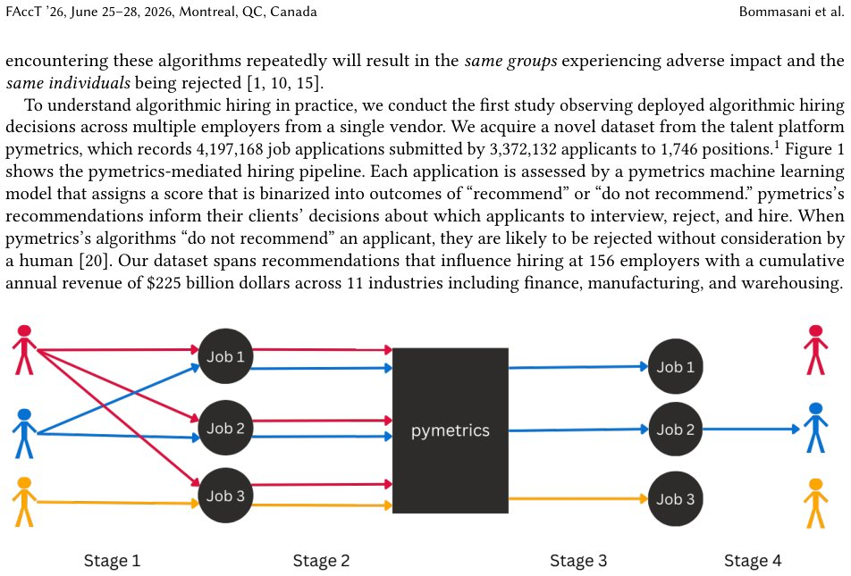

> *Generated by JarvisForResearchers Bot on 2026-05-28*

!!! tip "Why we featured this paper"
    Brand new preprint (2026) — accepted

## TL;DR
This study analyzes a large-scale dataset from the pymetrics vendor to demonstrate that reliance on a single algorithmic hiring system (algorithmic monoculture) results in measurable racial disparities and systemic rejection patterns when evaluated on a per-position basis.

## The Problem
Many organizations utilize hiring algorithms sourced from a limited set of third-party vendors. This reliance establishes an algorithmic monoculture. We hypothesize that this homogeneity in deployed models can lead to homogeneous, and potentially discriminatory, hiring outcomes, disproportionately affecting certain demographic groups. Prior research has shown no significant differences when analyzing aggregate selection rates across all applications from pymetrics. Furthermore, previous studies have been limited by the inability to observe cross-employer rejection patterns or to analyze outcomes as they occur in deployment.

## Key Contributions
This work makes three primary contributions:
1. It presents the first empirical study observing deployed algorithmic hiring decisions across multiple employers utilizing a single vendor.
2. It provides quantitative evidence of systemic rejections occurring at scale due to the operational deployment of these hiring algorithms.
3. It introduces methodological approaches that leverage the deterministic replicability of the underlying algorithms to generate robust counterfactual outcome simulations.

## How It Works


*Fig. 1. The pymetrics process. Stage 1: Applicants apply to positions. Stage 2: Applicants are directed to the pymetrics
platform to play assessment games. Stage 3: pymetrics algorithms use applicant gameplay features to recommend 58.2%
of applicants per position on average. Stage 4: Employers decid*

The analysis utilized a dataset comprising 4,197,168 job applications submitted by 3,372,132 applicants across 1,746 distinct positions, all processed by pymetrics' machine learning model. The model outputs a probabilistic score, $p \in [0, 1]$, which is subsequently binarized at a threshold $t=0.5$ to yield the final recommendation, $y$. To move beyond the limitations of aggregate analysis, the study rigorously re-examined adverse impact metrics on a per-position basis. Crucially, the deterministic nature of the algorithms allowed us to simulate counterfactual scenarios, determining the outcome an applicant would have received if they had applied to every available position.

### pymetrics machine learning model
This component functions as a binary classifier, trained specifically for each client organization. Its input features are derived from the applicants' performance within the Assessment Games. The training process is supervised, where positive examples are defined as the gameplay features exhibited by at least 50 current employees within that specific role.

### Assessment Games
These are 16 proprietary online games developed by pymetrics. Their function is to quantify various cognitive traits in the applicants, including measures of risk propensity, processing speed, trust, altruism, and planning ability. These gameplay metrics serve as the input features for the downstream classification model.

### Probabilistic Score ($p$)
This is the direct output of the trained machine learning model for any given applicant's set of gameplay features. It represents the model's estimated probability, $p \in [0, 1]$, that the applicant meets the criteria for a positive recommendation for the specific role.

### Binary Outcome ($y$)
This is the final, actionable decision. It is derived by applying a fixed threshold, $t=0.5$, to the probabilistic score $p$. If $p \ge 0.5$, the outcome is $y=1$ ('recommend'); otherwise, $y=0$ ('do not recommend').

## Results
The analysis revealed significant disparities when examining outcomes at the granular, per-position level.

| Metric | Value | Baseline | Source |
| :--- | :--- | :--- | :--- |
| Adverse Impact against Black applicants (per position) | 10.62% | N/A | Section 3.1 |
| Percentage of Black applicants applying to at least one adversely impacting position | 30.70% | N/A | Section 3.1 |
| Percentage of all applications submitted by Black applicants to adversely impacting positions | 25.87% | N/A | Section 3.1 |
| Systemic rejection rate (applicants applying to 10 positions rejected from all) | 4% | N/A | Section 3.1 |
| Exponential decay rate for systemic rejection | $R^2 = 0.984$ | Predicted by chance | Section 3.1 |

## Why This Matters
The findings underscore a critical vulnerability in modern talent acquisition pipelines: algorithmic monoculture. The evidence demonstrates that relying on a single vendor's model, even when applied across different client organizations, can lead to systemic rejection. The observation of a $4\%$ systemic rejection rate, coupled with an exponential decay rate of $R^2 = 0.984$, suggests that once an applicant is flagged by the model for a specific set of traits, they face a high probability of rejection across multiple roles evaluated by the same system. This necessitates a shift in focus from aggregate compliance metrics to granular, per-position auditing of vendor-mediated systems.

## Limitations & Open Questions
The current study has two primary limitations. First, it does not provide any assessment regarding the validity or predictive accuracy of the features derived from the Assessment Games themselves. Second, the analysis is constrained by the data provided by pymetrics, which is subject to non-disclosure agreements concerning proprietary information related to the client companies. Future work must address the causal validity of the input features and explore mechanisms for independent, external validation of these vendor systems.

---

## Citation

**Paper:** [2605.27371](https://arxiv.org/abs/2605.27371)

```bibtex
@article{260527371,
  title   = {Algorithmic Monocultures in Hiring},
  author  = {Rishi Bommasani and Sarah H. Bana and Kathleen A. Creel and Dan Jurafsky and Percy Liang},
  journal = {arXiv preprint arXiv:2605.27371},
  year    = {2026},
  url     = {https://arxiv.org/abs/2605.27371}
}
```
