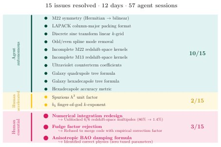

> *Generated by JarvisForResearchers Bot on 2026-05-31*

!!! tip "Why we featured this paper"
    Brand new preprint (2026) — accepted

## TL;DR
This case study documents the supervised construction of a differentiable one-loop perturbation theory module ($\text{CLAX-PT}\S$) by a physicist guiding an AI coding agent over 12 work days and 57 sessions. The primary finding is that the efficacy of the resulting scientific software hinges on the rigor of the supervision protocol—specifically, enforcing diverse parameter testing and prohibiting unphysical numerical fixes—rather than solely on the inherent capabilities of the underlying language models (Claude Code, Sonnet, and Opus).

## The Problem
The validation of scientific software demands a standard of correctness defined by adherence to underlying physical laws, a criterion fundamentally distinct from mere syntactic compilation or the passage of unit tests. Existing automated benchmarks fail to capture this physical correctness. Furthermore, while fully autonomous multi-agent systems are being explored, they currently lack the sustained, domain-specific human oversight necessary to validate complex scientific implementations against established physical principles. A critical gap remains in equipping AI agents to differentiate between a model that is merely predictive (passes tests) and one that is explanatorily correct (derives from sound physics), especially when confronted with structural incompatibilities in physical models.

## Key Contributions
We present a quantified case study ($N=1$) detailing the process of a physicist supervising an AI coding agent to construct $\text{CLAX-PT}\S$. Crucially, we demonstrate that the supervision protocol implemented was the dominant factor determining the trustworthiness of the agent's final output, superseding the raw capability of the models employed. This work formalizes and applies three essential supervision practices: testing the code across a diverse set of parameter points, maintaining a shared, explicit changelog, and enforcing a strict rule against introducing unphysical numerical patches.

## How It Works


*Figure 1. Issue taxonomy for the CLAX-PT v0.1.0 development. Of
15 documented supervision events, 10 were resolved autonomously
by the agent iterating against oracle tests; 2 were accelerated by the
physicist’s domain knowledge (unit-magnitude and dimensional
discrepancies invisible to shape-based c*

The methodology involved adapting a supervision framework, inspired by Anthropic's C-compiler agent project, where the established $\text{CLASS-PT}$ code served as the ground-truth oracle. The AI agent, utilizing Claude Code, Sonnet, and Opus models, iteratively developed $\text{CLAX-PT}\S$ in JAX over 57 discrete sessions. The protocol was structured around four core infrastructure elements designed to manage state and context effectively. Success was heavily reliant on two explicit, high-level rules enforced by the supervisor: the prohibition of "fudge factors" and the requirement to "test at multiple parameter points." While the agent autonomously resolved 10 of the 15 identified issues, the physicist's interventions—specifically an architectural redesign and the rejection of a proposed fudge factor—were indispensable for resolving issues that were undetectable by the oracle testing alone.

### AI Coding Agent
The agent utilized a suite of models—Claude Code, Sonnet, and Opus—to perform the iterative coding and refinement tasks required for building the $\text{CLAX-PT}\S$ module. The selection and deployment of these models constituted the primary computational resource for the software generation process.

### CLAX-PT $\S$
This is the target artifact: a differentiable one-loop perturbation theory module implemented in JAX. Its function is to compute next-to-leading-order predictions relevant to galaxy clustering, requiring high fidelity to established physical theory.

### CLASS-PT
$\text{CLASS-PT}$ functions as the external, authoritative oracle. It is the established C reference code against which the correctness of the AI-generated $\text{CLAX-PT}\S$ was rigorously benchmarked.

### Supervision Protocol
This encompasses the entire scaffolding around the agent. It includes the use of $\text{CLASS-PT}$ as the oracle, the $\text{CHANGELOG}$ as a shared, persistent memory mechanism, a `--fast` flag employed for managing context-window hygiene during long sessions, and the use of parallel agent sessions managed via git worktrees. The protocol's success was gated by the two critical rules mentioned above.

## Results
The evaluation against the established reference code yielded a high degree of fidelity. The agent demonstrated capability in autonomous debugging, though human oversight was required for deeper structural issues.

| Metric | Value | Baseline | Source |
| :--- | :--- | :--- | :--- |
| Accuracy against CLASS-PT | $\ge 1\%$ | CLASS-PT (Chudaykin et al., 2021) | Table 1 |
| Autonomous Issue Resolution | 10/15 | N/A | Figure 1 |
| Sessions spent in wrong architecture | 33 of 57 sessions | N/A | Abstract |

## Why This Matters
This work shifts the focus in AI-driven scientific computation from merely assessing model performance metrics (e.g., perplexity or token generation quality) to rigorously evaluating the *process* of scientific validation. It provides empirical evidence that for high-stakes domains like theoretical physics, the engineering of the supervision loop—the constraints, the oracle, and the human feedback mechanism—is the primary determinant of trustworthy output, not just the size or sophistication of the underlying LLM. The practitioner takeaways underscore that domain-specific constraints must be formalized into the agent's operational rules.

## Limitations & Open Questions
A significant limitation observed is that the agent operated strictly within a prescribed architectural framework; it lacked the capacity to autonomously propose or justify fundamental architectural alternatives to the supervisor. Furthermore, the system, despite its rigorous testing, could not inherently distinguish between a result that was merely predictive (i.e., passed the $\text{CLASS-PT}$ tests) and one that possessed true explanatory correctness derived from first principles. Future work must address how to integrate symbolic reasoning or formal proof checking to bridge this gap between empirical adequacy and theoretical soundness.

---

## Citation

**Paper:** [2605.30353](https://arxiv.org/abs/2605.30353)

```bibtex
@article{260530353,
  title   = {Physics Is All You Need? A Case Study in Physicist-Supervised AI Development of Scientific Software},
  author  = {Nhat-Minh Nguyen},
  journal = {arXiv preprint arXiv:2605.30353},
  year    = {2026},
  url     = {https://arxiv.org/abs/2605.30353}
}
```
