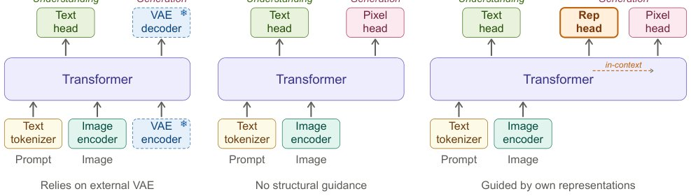

> *Generated by JarvisForResearchers Bot on 2026-06-02*

!!! tip "Why we featured this paper"
    Brand new preprint (2026) — accepted

## TL;DR
Representation Forcing (RF) enables bottleneck-free unified multimodal models by compelling the decoder to autoregressively predict visual representations as intermediate tokens. These predicted tokens then guide pixel diffusion within the shared backbone, allowing high-quality image generation directly in pixel space without relying on a frozen, external VAE.

## The Problem
Existing Unified Multimodal Models (UMMs) face a fundamental structural limitation: they typically rely on a separately pretrained and frozen Variational Autoencoder (VAE) for image generation. This VAE acts as a bottleneck, constraining the model's generative capacity. If one attempts to bypass this VAE and generate directly in pixel space, the resulting quality suffers significantly. This degradation stems from the model needing to simultaneously learn both the high-level semantic structure and the fine-grained, low-level details directly from raw pixel signals, a task that is inherently more complex than operating within a pre-defined latent space. Furthermore, prior representation learning methods have generally been confined to operating within these externally defined, frozen representation spaces.

## Key Contributions
We introduce Representation Forcing (RF), a mechanism that effectively closes the quality gap associated with pixel-space image generation in UMMs, thereby eliminating the necessity for any pretrained VAE. We demonstrate that RF provides synergistic benefits to both image generation and multimodal understanding, irrespective of whether the model operates in pixel space or utilizes a VAE-based latent space. Notably, the pixel-space model augmented with RF achieves generation quality comparable to its VAE-based counterpart while exhibiting superior performance in understanding tasks. This work advocates for the paradigm shift toward UMMs where perception and generation are unified within a single, end-to-end-learned representation space.

## How It Works


*Figure 1 Architectural comparison. (a) Prevailing UMMs rely on a frozen VAE encoder and decoder for image
generation, creating a structural bottleneck. (b) Naively removing the VAE and generating directly in pixel space
eliminates this bottleneck but loses structural guidance, leading to a quality g*

Representation Forcing (RF) operates by grounding the high-level visual representation directly within the decoder itself. This is achieved by training the decoder to autoregressively predict the visual representations that are extracted by the understanding encoder. The objective function mirrors that of language modeling: next-token prediction. These predicted representations then serve as the necessary in-context structural guidance for the pixel-space diffusion process occurring within the shared transformer backbone.

The process involves several integrated components:

### Transformer
The Transformer serves as the shared backbone, processing unified sequences comprising text tokens ($\text{T}$), representation tokens ($\text{R}$), and pixel patches ($\text{P}$). This shared architecture is central to achieving unified representation learning.

### Text head
The $\text{Text head}$ is responsible for calculating the cross-entropy loss ($\mathcal{L}_{LM}$) pertaining to the prediction of the next text token.

### Rep head
The $\text{Rep head}$ is tasked with calculating the cross-entropy loss ($\mathcal{L}_{Rep}$) associated with the prediction of the representation tokens. This is where the core forcing mechanism is implemented.

### Pixel head
The $\text{Pixel head}$ manages the pixel diffusion process. This is executed via flow matching, specifically utilizing the $x$-prediction formulation and associated velocity loss ($\mathcal{L}_{FM}$).

### Image encoder
The $\text{Image encoder}$ is implemented as a DINOv3 ViT-H+/16 [40] augmented with NaViT-style variable-resolution support [9]. Crucially, this encoder is jointly trained alongside the rest of the model, ensuring its features are optimized for the unified task.

### Codebook
The $\text{Codebook}$ consists of $K=16,384$ learnable prototype embeddings. These are employed to perform online vector quantization on the patch-level features extracted by the encoder, providing a discrete representation space. The Sinkhorn–Knopp balancing technique is applied during this quantization step.

During the generation phase, the decoder is conditioned solely on the text prompt to predict the necessary representation tokens. These predicted tokens subsequently condition the pixel generation process through the flow matching mechanism.

## Results
The quantitative evaluation demonstrates the efficacy of the RF approach:

| Metric | Value | Baseline | Source |
| :--- | :--- | :--- | :--- |
| GenEval Overall | 0.84 | BAGEL baseline (0.82) | Table 1 |
| GenEval Overall (with LLM rewriter) | 0.88 | State-of-the-art among unified models | Table 1 |

## Why This Matters
The practitioner takeaways highlight several significant implications. First, RF facilitates the construction of truly end-to-end UMMs by internalizing the latent space, thereby removing the dependency on external, pre-trained VAEs. Second, the model exhibits dual benefits: it improves both understanding and generation capabilities. Furthermore, the empirical evidence suggests that pixel-space generation, when augmented with RF, is more inherently compatible with the unified modeling framework than generation conditioned on a VAE-derived latent space. Finally, the combination of autoregressive prediction for structural guidance (RF) and diffusion for rendering establishes a robust and coherent mechanism for high-fidelity pixel-space generation.

## Limitations & Open Questions
Despite these advancements, the current implementation imposes certain constraints. The method necessitates a specific three-stage training regimen: initial alignment, subsequent joint pre-training, and a final continued training phase. Additionally, the architecture relies on a Mixture-of-Transformers (MoT) structure, specifically utilizing three distinct groups of experts. Future work should investigate the necessity of the MoT structure and explore training strategies that might reduce the required training stages.

---

## Citation

**Paper:** [2605.31604](https://arxiv.org/abs/2605.31604)

```bibtex
@article{260531604,
  title   = {Representation Forcing for Bottleneck-Free Unified Multimodal Models},
  author  = {Yuqing Wang and Zhijie Lin and Ceyuan Yang and Yang Zhao and Fei Xiao and Hao He et al.},
  journal = {arXiv preprint arXiv:2605.31604},
  year    = {2026},
  url     = {https://arxiv.org/abs/2605.31604}
}
```
