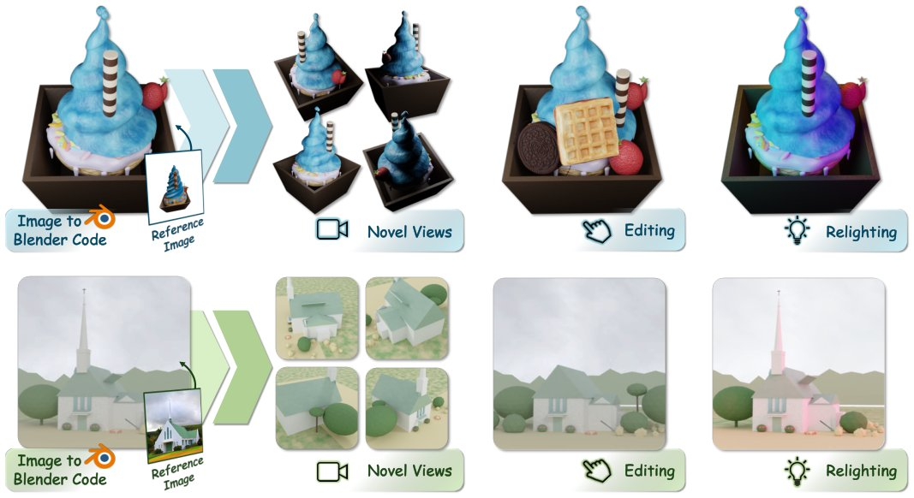

> *Generated by JarvisForResearchers Bot on 2026-06-03*

!!! tip "Why we featured this paper"
    Brand new preprint (2026) — accepted

## TL;DR
SEIG introduces an agentic framework for Staged Executable Inverse Graphics, leveraging a pretrained Vision-Language Model (VLM) to reconstruct editable 3D scenes from a single image. It achieves this by decomposing the inverse graphics problem into sequential stages—Geometry, Material, Composition, and Lighting—each governed by a generator-verifier loop that iteratively refines the scene within an executable Blender environment.

## The Problem
Inverse graphics is fundamentally an ill-posed problem: reconstructing a complex, editable 3D scene from a single 2D observation. The goal is not merely to generate a novel view, but to produce a structured, manipulable scene representation (e.g., in Blender) that accurately reproduces the input image. The primary challenge is achieving this reconstruction using only the inherent priors of a general-purpose pretrained VLM, deliberately avoiding specialized 2D or 3D foundation models, differentiable rendering pipelines, or multi-view supervision.

Existing neural scene representations, such as NeRFs or 3D Gaussian Splatting, encode scene factors within continuous latent spaces. These representations are powerful for rendering but lack the explicit, structured nature required for direct, symbolic editing—they are not inherently executable graphics programs. Furthermore, prior VLM-based approaches have struggled to manage the joint inference of geometry, material properties, composition, and lighting simultaneously within a single, entangled generation step.

## Key Contributions
We introduce SEIG, an agentic framework specifically designed for Staged Executable Inverse Graphics, built atop a pretrained VLM. Our key contributions are threefold:
1. The introduction of SEIG, an agentic framework that orchestrates the reconstruction process using a pretrained VLM as the primary reasoning engine.
2. The decomposition of the monolithic inverse graphics task into a sequence of semantically meaningful stages—Geometry, Material, Composition, and Lighting—mirroring the iterative workflow employed by professional 3D artists.
3. The implementation of a robust generator-verifier loop within each stage, where the verifier enforces convergence by requiring an explicit approval checklist before allowing progression to the next refinement step.

## How It Works


*Fig. 1. From a single reference image (leftmost inset), SEIG reconstructs an editable Blender scene through a staged generator–verifier loop driven entirely by
a pretrained VLM. As the output is a structured Blender program, our approach directly supports novel-view synthesis, editing, and relightin*

SEIG operates as a multi-stage, additive pipeline initiated by a single reference image. The process begins with the VLM interpreting the input image to generate a hierarchical Scene Graph. This graph dictates the initial structure, which is then materialized into a coarse 3D scaffold via the Scene Initialization Stage. The reconstruction then proceeds sequentially through the defined refinement stages: Geometry Refinement, Material Refinement, Composition Refinement, and Lighting Refinement.

The core mechanism driving refinement within each stage is the Generator-Verifier Loop. In this loop, the VLM acts as the generator, producing executable Blender code to modify the current scene state. The verifier then executes the resulting render and compares it against the original reference image. Progression to the next iteration or stage is contingent upon the verifier returning an explicit approval checklist, ensuring that the modifications made are demonstrably improving the match to the target image. This staged disentanglement effectively reduces the complexity of the coupled inverse graphics problem, allowing the VLM to build a fully editable Blender scene incrementally.

### Pretrained Vision-Language Model (VLM)
The VLM serves as the central reasoning agent. Its function is to interpret the visual semantics of the input image, reason about the necessary scene structure, and translate these high-level concepts into concrete, executable commands targeted at the Blender environment via tool calls.

### Scene Graph
The Scene Graph provides the structured intermediate representation of the scene. It is hierarchical, encompassing all discernible objects. For each node, it stores descriptive metadata, including visual attributes, an approximation of its geometry, its material appearance, its spatial relationships to other objects, and a defined strategy for how it should be reconstructed within Blender.

### Scene Initialization Stage
This stage is responsible for translating the abstract Scene Graph into a tangible, albeit coarse, 3D model. It instantiates the initial Blender scaffold. The process employs a rollout sampling strategy guided by a rollout selector to select the most plausible and complete initial configuration based on the scene graph's directives.

### Geometry Stage
This stage focuses exclusively on refining the shape of the objects. Refinements are achieved through local shape edits, applying geometric transformations, or performing structural modifications to the mesh representations. The VLM utilizes interaction tools to inspect and iteratively edit the geometry until the shape aligns with the visual evidence.

### Material Stage
Once the geometry is sufficiently defined, the Material Stage addresses surface appearance. It replaces the initial coarse textures with detailed, physically based rendering (PBR) materials within Blender. This involves targeted edits to surface properties such as base color, roughness, specular intensity, metallic values, alpha transparency, and the application of bump or normal maps.

### Composition Stage
This stage handles the spatial arrangement of the finalized objects. The objective is to match the layout of the reference image by adjusting the object transforms—specifically scale, position, and rotation—while strictly preserving the geometry and material properties established in the preceding stages.

### Lighting Stage
As the final refinement step, the Lighting Stage optimizes the scene's illumination. The VLM adjusts various lighting parameters, including light type (e.g., area, point), its precise position and direction, energy output, color temperature, size, softness, and the contribution of ambient lighting, to achieve a photorealistic match to the reference image.

### Generator-Verifier Loop
This mechanism is the engine of iterative refinement within any given stage. The generator (VLM) proposes a change by writing a segment of Blender code. The verifier then executes this code, renders the resulting scene, and compares the output against the reference image. Crucially, the verifier does not simply return a pass/fail; it returns an explicit, actionable checklist detailing necessary modifications for the generator to address, thereby guiding the refinement process toward convergence.

## Results
No quantitative results were provided in the outline.

## Why This Matters
The SEIG framework demonstrates that general-purpose VLMs, when structured within a disciplined, staged, and executable pipeline, can tackle highly complex, underconstrained inverse graphics problems without requiring specialized, domain-specific 3D foundation models. The decomposition strategy proves that breaking down the problem into sequential, semantically coherent steps (geometry $\rightarrow$ material $\rightarrow$ composition $\rightarrow$ lighting) is a viable pathway for enabling general-purpose AI to perform structured 3D scene reconstruction. Furthermore, the resulting output is not just a rendered image, but a fully editable Blender scene, enabling immediate downstream applications such as relighting, scene manipulation, and physics simulation.

## Limitations & Open Questions
The current framework operates on a staged, greedy paradigm. This sequential nature implies that the solution found at any stage is locally optimal relative to the previous stages, and there is no guarantee that this greedy path leads to the globally optimal scene configuration. Additionally, if the stage-specific maximum round budget is exhausted before the verifier's checklist is satisfied, the framework must rely on the verifier selecting the best attempt made within that budget, which introduces a potential sub-optimality ceiling. Future work must address the potential for non-monotonic improvements across stages.

---

## Citation

**Paper:** [2606.02580](https://arxiv.org/abs/2606.02580)

```bibtex
@article{260602580,
  title   = {Thinking in Blender: Staged Executable Inverse Graphics with Vision-Language Models},
  author  = {Guangzhao He and Rundong Luo and Wei-Chiu Ma and Hadar Averbuch-Elor},
  journal = {arXiv preprint arXiv:2606.02580},
  year    = {2026},
  url     = {https://arxiv.org/abs/2606.02580}
}
```
