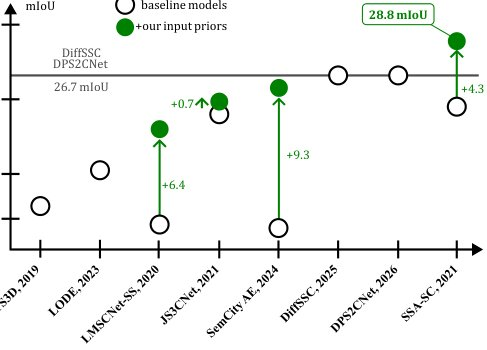

> *Generated by JarvisForResearchers Bot on 2026-06-04*

!!! tip "Why we featured this paper"
    Brand new preprint (2026) — accepted

## TL;DR
We introduce a plug-and-play recipe that significantly boosts Lidar Semantic Scene Completion (SSC) performance by augmenting input point clouds with semantic pseudo-labels and visibility information derived from off-the-shelf techniques. This demonstrates that simple, external priors can substantially improve the performance of existing SSC architectures.

## The Problem
Lidar Semantic Scene Completion (SSC) from a single lidar scan is challenging because lidar provides accurate but sparse geometry and lacks dense colorimetric information, which is a major cue for semantic estimation. The inherent sparsity and lack of rich feature data limit the ability of standard SSC networks to accurately infer the complete semantic structure of the scene.

The prior art exhibits several gaps:
1. The impact of various additional priors (semantic or visibility) on SSC performance has not been systematically evaluated.
2. The contribution of different priors to the final SSC performance is unclear.
3. Existing methods often derive priors concurrently or rely on specific, unquantified prior types.

## Key Contributions
Our work makes three primary contributions:
1. We demonstrate that endowing input point clouds with semantic pseudo-labels from off-the-shelf segmentors significantly improves SSC performance.
2. We equip the input lidar scan with visibility information to distinguish between empty and unknown spaces, providing a secondary performance boost.
3. We show that combining semantic and visibility priors is complementary, boosting performance even further across tested architectures.

## How It Works


*Fig. 1. Impact of input priors. We compare the baseline
models against their versions endowed with our recipe. It
yields consistent gains across all backbones, propelling SSA-
SC [6] to 28.8 mIoU.*

The core methodology involves augmenting the input 3D volume tensor $V \in \{0, 1\}^{X \times Y \times Z \times (C+2)}$ provided to existing SSC networks. This augmentation process introduces two distinct types of priors: the semantic prior and the visibility prior. These priors are then combined and applied to four established SSC architectures: LMSCNet-SS [4], SemCity-AE [12], SSA-SC [6], and JS3C-Net [7].

### Input Tensor V
The input tensor $V$ is a 4D tensor constructed on a grid of voxels. It encodes information using one-hot vectors, indicating whether a voxel is empty, unknown, or occupied (and, if occupied, what its assigned semantic pseudo-label is). This structure allows the augmented information to be integrated directly into the network's input representation.

### Semantic Prior
The semantic prior is derived from external, off-the-shelf point cloud segmentors. For each voxel, the semantic label is determined by majority voting among all points contained within that voxel. This process effectively injects semantic context into the geometric representation where raw lidar data is ambiguous.

### Visibility Prior
The visibility prior addresses the ambiguity between empty and unknown spaces. This is achieved by ray casting from the lidar center $o$ to sample points $q_i$ at regular intervals, specifically $\delta = 20 \text{ cm}$, along each ray. Voxels containing such sampled points are explicitly labeled as empty. Furthermore, a safety volume surrounding occupied voxels is utilized to assign the unknown label to neighboring voxels, refining the boundary delineation.

### LMSCNet-SS [4]
This network serves as a baseline SSC architecture. To incorporate our augmented input, LMSCNet-SS [4] was adapted by modifying its initial network layer. This modification ensures the input layer can correctly process the augmented tensor $V$, which now possesses $(C+2) \cdot Z$ channels.

### SemCity-AE [12]
SemCity-AE [12], a lightweight autoencoder, was repurposed for SSC. It accepts the augmented sparse tensor $V$ as its input. The necessary adaptation involved modifying the embedding layer size to accommodate the richer feature set provided by the augmented input.

### SSA-SC [6]
In the SSA-SC [6] architecture, the input width of the BEV U-Net required modification. It was changed from the original $32+32$ to $(C+2) \cdot 32 + 32$. This adjustment allows the network to ingest the one-hot encoded semantics alongside the empty and unknown class indicators.

### JS3C-Net [7]
JS3C-Net [7] required two specific updates to integrate the priors. First, one-hot encoded semantic pseudo-labels were concatenated to the per-point input features used for semantic segmentation. Second, the input to the SSC module itself was enhanced to explicitly incorporate the visibility information derived from the ray casting process.

## Results
The empirical evaluation across various architectures demonstrates the efficacy of this augmentation strategy.

| Metric | Value | Baseline | Source |
| :--- | :--- | :--- | :--- |
| mIoU | 28.8 mIoU | DiffSSC [5] and DPS2CNet [24] (both at 26.7 mIoU) | Table 3 |
| mIoU | 33.5 mIoU | SemCity-AE [12] $\checkmark$WI-TTA $\text{+25.7 mIoU}$ | Table 3 |
| mIoU | 40.1 mIoU | SSA-SC [6] $\checkmark$Oracle $\text{+28.8 mIoU}$ | Table 3 |
| mIoU | +13.8 mIoU pts | LMSCNet-SS [4] (without GT semantic input) | Table 1 |
| IoU | +2.4 points | SemCity-AE [12] (without visibility prior) | Table 2 |

## Why This Matters
The practitioner takeaways from this work are significant for applied robotics and AI engineering. First, this research establishes that relatively simple input augmentations—namely semantic pseudo-labels and visibility information—can elevate the performance of established SSC models to levels competitive with more complex, state-of-the-art systems. Second, it underscores that the quality of the semantic segmentation prior is a critical bottleneck; leveraging advances in off-the-shelf point semantic segmentation directly translates to substantial gains in scene completion. Finally, the visibility information provides a measurable, "free" boost to occupancy estimation by explicitly resolving the ambiguity between empty and unknown voxels.

## Limitations & Open Questions
It is important to note that this study is fundamentally an empirical investigation focused on demonstrating the efficacy of input augmentation rather than proposing a novel, end-to-end architectural paradigm. Furthermore, the reproducibility of some state-of-the-art methods cited in the literature is hampered by them being closed-source, non-reproducible, or relying on multi-frame test-time optimization procedures, which limits a direct, apples-to-apples comparison in all scenarios.

---

## Citation

**Paper:** [2606.03992](https://arxiv.org/abs/2606.03992)

```bibtex
@article{260603992,
  title   = {Exploring Easy Boosts for Lidar Semantic Scene Completion},
  author  = {Tetiana Martyniuk and Jonathan Seele and Alexandre Boulch and Gilles Puy and Renaud Marlet and Raoul de Charette},
  journal = {arXiv preprint arXiv:2606.03992},
  year    = {2026},
  url     = {https://arxiv.org/abs/2606.03992}
}
```
