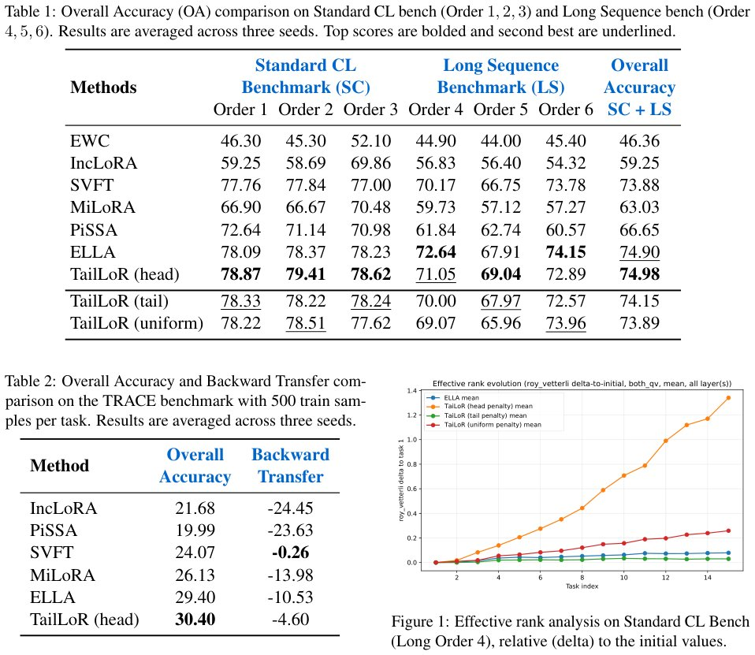

> *Generated by JarvisForResearchers Bot on 2026-06-06*

!!! tip "Why we featured this paper"
    Not yet indexed in S2 — assumed brand-new preprint

## TL;DR
TailLoR is a geometrically aware low-rank adaptation method that uses a soft spectral penalty to protect the dominant singular components of pre-trained weights, thereby routing new task adaptations into the underutilized spectral 'tail' to mitigate interference in continual learning.

## The Problem
Adapting Large Language Models (LLMs) to new domains or tasks is computationally expensive. Existing Parameter-Efficient Fine-Tuning (PEFT) methods, particularly Low-Rank Adaptation (LoRA), often suffer from interference between overlapping update directions in continual learning. This interference is particularly problematic because modifications to the dominant singular values of the weight matrix disproportionately degrade prior knowledge acquired during previous tasks.

## Key Contributions
We introduce TailLoR, a low-rank adaptation method operating over the singular values of a weight matrix, coupled with a soft regularization that steers updates toward the spectral 'tail', protecting the top singular values. Furthermore, TailLoR requires no access to adapters from prior tasks, enabling sequential adaptation by different users while preserving the privacy of each user’s task-specific parameters and training data. Finally, we demonstrate that TailLoR matches state-of-the-art methods while increasing the stable rank of the weight matrix.

## How It Works


*Figure 1 illustrates the evolution of Reff for each
regularization strategy relative to its initial value.
We observe that our head penalty induces a con-
sistent, significant increase in effective rank as the
model sequentially learns new tasks. This empir-
ically validates our core hypothesis: str*

TailLoR parameterizes weight updates within the spectral basis derived from the pre-trained weight matrix $W = U\Sigma V^T$. The updated weight is formulated as $W' = U(\Sigma + AB)V^T$, where $A$ and $B$ define the low-rank adaptation. To prevent catastrophic forgetting, we construct a spatial penalty matrix $\Omega \in \mathbb{R}^{d_{out} \times d_{in}}$. This penalty, governed by the normalized singular values $\tilde{\sigma}$, applies distinct gradient resistance to different singular subspaces. Specifically, the Head Penalty concentrates regularization pressure on the top principal components, forcing task-specific adaptation into the underutilized, long-tail spectral coordinates via the loss term $L_{reg} = \lambda \sqrt{\frac{1}{k^2} \sum_{i=1}^k \sum_{j=1}^k \tilde{\Omega}_{i,j}(AB)_{i,j}^2 + \epsilon}$.

### Pre-trained Weight Matrix $W$
The initial weight matrix $W$ is decomposed via Singular Value Decomposition (SVD): $W = U\Sigma V^T$. Here, $U \in \mathbb{R}^{d_{out} \times d_{out}}$ and $V \in \mathbb{R}^{d_{in} \times d_{in}}$ are orthogonal matrices, and $\Sigma \in \mathbb{R}^{d_{out} \times d_{in}}$ contains the singular values $\sigma_i$. This decomposition establishes the spectral basis upon which the adaptation is structured.

### Low-Rank Adapter
The adaptation is introduced via a low-rank update defined by the product of two matrices, $B \in \mathbb{R}^{d_{out} \times r}$ and $A \in \mathbb{R}^{r \times d_{in}}$, where $r \ll \min(d_{out}, d_{in})$. The resulting updated weight matrix is $W' = U(\Sigma + AB)V^T$. The parameterization ensures that the adaptation is constrained to a low-dimensional subspace relative to the original weight structure.

### Spatial Penalty Matrix $\Omega$
The spatial penalty matrix $\Omega \in \mathbb{R}^{d_{out} \times d_{in}}$ is engineered to impose differential resistance based on the singular values. It is calculated using $\Omega_{i,j} = \max(\tilde{\sigma}_i, \tilde{\sigma}_j)\gamma$. This matrix dictates how much gradient pressure is applied to the components corresponding to the $i$-th and $j$-th singular vectors, effectively distinguishing between the high-energy (dominant) and low-energy (tail) subspaces.

### Normalized Penalty Matrix $\tilde{\Omega}$
The final structured penalty matrix, $\tilde{\Omega}$, is derived from $\Omega$ through mass normalization: $\tilde{\Omega} = \frac{\Omega}{k^2} \text{diag}(\Omega_{i,j})$. This normalization step ensures that the regularization term $L_{reg}$ applies a consistent, scaled pressure across the spectral dimensions, allowing the soft penalty to effectively guide the low-rank update $AB$ away from the dominant singular components.

## Results
| Metric | Value | Baseline | Source |
| :--- | :--- | :--- | :--- |
| Overall Accuracy (OA) on Standard CL Benchmark (Order 1) | 78.87 | ELLA (78.09) | Table 1 |
| Overall Accuracy (OA) on Long Sequence Benchmark (Order 4) | 71.05 | ELLA (72.64) | Table 1 |
| Overall Accuracy on TRACE benchmark | 30.40 | ELLA (29.40) | Table 2 |

## Why This Matters
The practitioner takeaways highlight that structurally guiding updates based on the singular value decomposition (SVD) of the base weights is significantly more effective than employing uniform or simple subspace constraints when applying PEFT in continual learning. By actively protecting the dominant singular vectors (the 'head'), TailLoR forces the model to utilize latent capacity residing in the lower-rank 'tail' for new task learning, which results in a higher effective rank for the adapted weights. TailLoR provides a robust, geometry-aware mechanism that bypasses the need for task-specific hyperparameter tuning or the complex gradient projections required by some contemporary state-of-the-art methods.

## Limitations & Open Questions
One limitation is that extending the spectral routing analysis to modern causal, decoder-only LLMs remains an active area of ongoing work. Furthermore, the evaluation on the TRACE benchmark utilized a 500-sample subset per task, and future work will scale these evaluations to the full dataset.

---

## Citation

**Paper:** [2606.06494](https://arxiv.org/abs/2606.06494)

```bibtex
@article{260606494,
  title   = {TailLoR: Protecting Principal Components in Parameter-Efficient Continual Learning},
  author  = {Marius Dragoi and Ioana Pintilie and Alexandra Dragomir and Antonio Barbalau and Florin Brad},
  journal = {arXiv preprint arXiv:2606.06494},
  year    = {2026},
  url     = {https://arxiv.org/abs/2606.06494}
}
```
