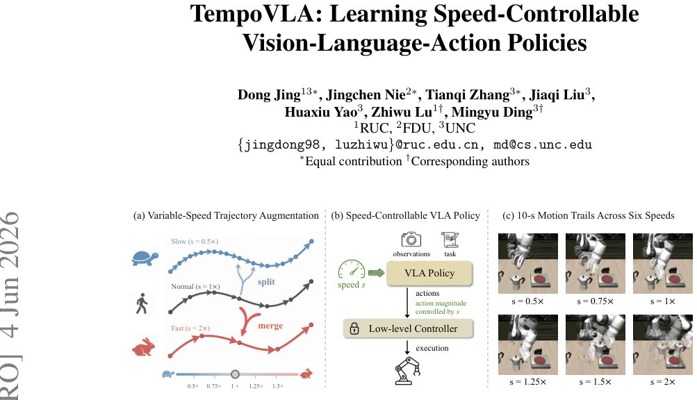

> *Generated by JarvisForResearchers Bot on 2026-06-07*

!!! tip "Why we featured this paper"
    Brand new preprint (2026) — accepted

## TL;DR
TempoVLA introduces a framework to give existing Vision-Language-Action (VLA) models explicit, bidirectional control over execution speed by combining Variable-Speed Trajectory Augmentation (VSTA) on the data side and speed conditioning on the model side. This allows existing VLAs to handle tasks requiring both rapid transit and slow, precise manipulation without requiring full retraining.

## The Problem
Existing Vision-Language-Action models (VLAs) inherently operate at a single, fixed execution speed dictated by the distribution of their training demonstrations. This uniformity is fundamentally inadequate for complex, real-world manipulation tasks. Such tasks necessitate dynamic temporal behavior, requiring the agent to transition fluidly between high-speed transit phases—where efficiency is paramount—and low-speed, high-precision contact stages, such as delicate insertion or fragile object handover.

## Key Contributions
We make three primary contributions to this domain:
1. We propose VSTA alongside speed conditioning, a lightweight data-and-model pair that equips existing VLAs with bidirectional speed control without necessitating new data collection.
2. We demonstrate that variable-speed training functions as an effective augmentation, consistently elevating the default 1x success rate both in simulation and in the physical world.
3. We show that this design generalizes to VLM-driven dynamic speed scheduling, effectively transforming execution speed into a novel control channel usable by higher-level reasoning modules.

## How It Works


*Figure 1: TempoVLA: a speed-controllable VLA framework. (a) VSTA re-times any demon-
stration to a target speed by selectively merging consecutive actions to speed up or splitting them to
slow down, while preserving motion semantics. (b) The policy takes a scalar speed s as an explicit
conditioning *

TempoVLA addresses the challenge of speed control through the coupling of two distinct mechanisms. On the data side, **Variable-Speed Trajectory Augmentation (VSTA)** re-times any existing demonstration to an arbitrary target speed $s \in \mathbb{R}^+$. This is achieved by either merging consecutive actions to accelerate the trajectory ($q>p$) or by splitting actions to decelerate ($q<p$), all while rigorously preserving the underlying motion semantics. On the model side, the scalar speed $s$ is explicitly injected into the policy $\pi_\theta(o_t, s)$ through one of three proposed, lightweight conditioning schemes: textual prefix, speed-modulated RMSNorm, or soft prompt with speed anchors. Crucially, the low-level controller remains unmodified. This architecture enables the policy to scale its predicted action magnitudes proportionally to $s$, thereby facilitating flexible speed control in both acceleration and deceleration regimes.

### Variable-Speed Trajectory Augmentation (VSTA)
VSTA is an online data augmentation strategy. It takes a trajectory recorded at an original speed $p$ and transforms it to a target speed $s$. The process involves motion-consistent segmentation of the trajectory, followed by a chunk-level speed transform. This transformation ensures that the kinematic and dynamic relationships between consecutive actions are maintained, even when the temporal spacing between them is altered.

### Speed-Conditioned Policy $\pi_\theta(o_t, s)$
This is the core VLA policy that has been trained on the augmented dataset $e_D$. It is designed to accept the scalar speed $s$ as an explicit conditioning input alongside the observation $o_t$. The policy learns to map the state and the desired speed to the appropriate action distribution.

### Textual prefix
This is one of the three injection methods. It involves prepending a short, descriptive phrase, such as 'Perform the task at $\langle s \rangle$x speed,' directly to the original natural language instruction $\ell$ before it enters the VLA encoder.

### Speed-modulated RMSNorm
This scheme introduces a small two-layer MLP, $\phi_{mod}(s)$, which embeds the scalar speed $s$. The output of this MLP is then used to modulate the Root Mean Square Normalization (RMSNorm) applied within each expert layer of the policy. The modulation is defined as $\text{adaRMSNorm}(\cdot) = \gamma(\sigma_{ts} + \phi_{mod}(s)) \odot x / \|x\|_{\text{RMS}}$.

### Soft prompt with speed anchors
This method utilizes a learnable tensor, $P \in \mathbb{R}^{K \times P \times d_{emb}}$, which stores embedding tokens corresponding to $K$ predefined training-speed anchors $s_k \in S$. These tokens are inserted at the input layer of the VLA encoder, allowing the model to condition on the desired speed via these learned representations.

### VLM Scheduler
This component operates at the deployment level, above the core VLA. It is a high-level Vision-Language Model (VLM) tasked with observing the current scene state and predicting the appropriate speed $s_t$ for the subsequent sequence of action chunks. This enables the system to execute dynamic speed scheduling based on environmental context.

## Results
| Metric | Value | Baseline | Source |
| :--- | :--- | :--- | :--- |
| Replay success rate (SR) at 1x | 97.6% | — | Table 1 |
| Motion Err. at 1.25x | 1.1E-8 | — | Table 1 |
| Overall SR (Textual Prefix) | 96.8 | N/A | Table 2 |
| Peak success rate (7-speed range) | 97.4 | 96.7 (single-speed baseline) | Table 3 |

## Why This Matters
The ability to decouple execution speed from the core policy weights is a significant engineering advance for embodied AI. As demonstrated by the comparable performance across the three speed injection schemes, speed control can be integrated into existing, pre-trained VLAs with minimal architectural overhead. Furthermore, the textual prefix method offers the most straightforward deployment path, requiring no modification to the model's internal structure or the maintenance of fixed anchor sets. Beyond enabling speed control, the VSTA process itself acts as a robust data augmentation technique, consistently improving baseline performance. Finally, the integration with a VLM Scheduler opens the door for truly adaptive, context-aware robotic behavior where speed is managed as a strategic control variable.

## Limitations & Open Questions
The implementation of VSTA is constrained by the reliance on motion-consistent segmentation, which is predicated on specific thresholds ($\tau_{dir}$). Furthermore, this segmentation assumes that the underlying actions are closed under addition, such as Cartesian translations in $\mathbb{R}^3$ or axis-angle vectors in $\text{so}(3)$. For the soft prompt scheme, inference requires selecting the nearest anchor $k^\star = \arg \min_k |s - s_k|$, which inherently introduces a quantization error relative to the continuous target speed $s$. Future work should investigate more robust segmentation methods for non-additive action spaces and explore continuous interpolation techniques for the soft prompt conditioning to mitigate quantization artifacts.

---

## Citation

**Paper:** [2606.06491](https://arxiv.org/abs/2606.06491)

```bibtex
@article{260606491,
  title   = {TempoVLA: Learning Speed-Controllable Vision-Language-Action Policies},
  author  = {Dong Jing and Jingchen Nie and Tianqi Zhang and Jiaqi Liu and Huaxiu Yao and Zhiwu Lu et al.},
  journal = {arXiv preprint arXiv:2606.06491},
  year    = {2026},
  url     = {https://arxiv.org/abs/2606.06491}
}
```
