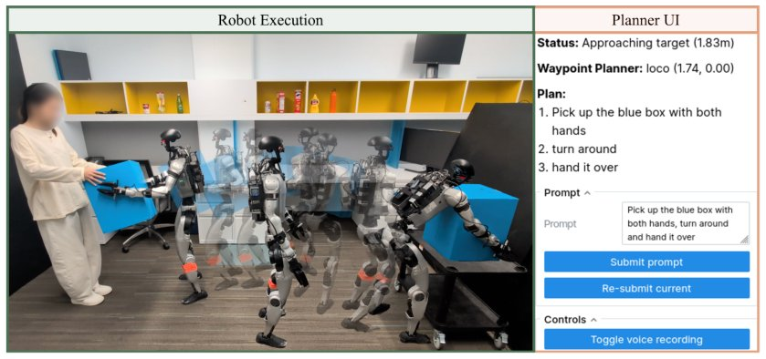

> *Generated by JarvisForResearchers Bot on 2026-06-08*

!!! tip "Why we featured this paper"
    Brand new preprint (2026) — accepted

## TL;DR
HANDOFF introduces a unified, task-space whole-body humanoid controller that accepts a compact 10-D command. It achieves this by distilling knowledge from three specialized teachers—motion tracking, locomotion, and fall-recovery—using a context-conditioned Mixture-of-Experts architecture. This design allows high-level, semantic planners (like VLM-driven agents) to control complex dynamics without needing to synthesize dense kinematic references.

## The Problem
Current state-of-the-art whole-body controllers often necessitate dense kinematic or spatial references as input. This requirement imposes a significant bottleneck on high-level task planners, forcing them to operate as mere data-replay engines tied to specific, pre-recorded demonstrations. The existing architectural paradigms present specific limitations: motion-tracking expressiveness typically demands controller-specific, dense interfaces; split-architecture controllers offer compact locomotion commands but require explicit per-joint arm references; and latent-action interfaces sacrifice the modularity required for robust planner design.

## Key Contributions
We introduce HANDOFF, a novel single humanoid whole-body controller designed to accept a compact, explicit 10-D planner-facing command. Our primary technical contribution is the distillation process, where we fuse the knowledge of three complementary specialists—a motion tracking teacher, a locomotion teacher, and a fall-recovery teacher—via multi-teacher KL distillation governed by a context-conditioned gating scheme. Furthermore, we demonstrate the hardware feasibility of this approach by successfully integrating it with a VLM-driven agentic planner without requiring any task-specific data or fine-tuning of the controller itself.

## How It Works


*Figure 1: HANDOFF is a whole-body controller distilled from multiple teachers that accepts a
compact, explicit 10-D planner-facing command. We demonstrate its effectiveness using a VLM-
powered agentic planner that does not need extensive demonstration collection or model fine-tuning.*

HANDOFF operates as a Mixture-of-Experts (MoE) student policy. This student policy ingests the 10-D command $\mathbf{c}_t = [v_x, v_y, \omega_z, z, pP_L, pP_R]$ alongside an 11-frame proprioception history. The policy outputs 29-DoF actions, which are decomposed into a body slice action $\mathbf{a}_B$ and an arm slice action $\mathbf{a}_A$.

The supervision signal is managed by the Context Signal $\mathbf{x}_t = (\|\mathbf{cvel}_t\|, recover_t)$. This signal dictates the blending of supervisory signals: a continuous gate $\alpha$ modulates the supervision between the Whole-Body Motion-Tracking Teacher and the Locomotion Teacher for the body slice $\mathbf{a}_B$, while a binary mask routes the supervision to the Fall-Recovery Teacher.

### Whole-Body Motion-Tracking Teacher
This specialist is a 29-DoF policy trained using asymmetric actor-critic PPO. Its training data consists of retargeted human motion clips, and its stability is enforced by correcting the policy output using a closed-form Control Barrier Function (CBF) projection applied to the static Center of Pressure (CoP) margin.

### Locomotion Teacher
This teacher is a 15-DoF policy focused exclusively on the body slice (legs and waist). It was trained specifically on flat terrain data, with a design constraint ensuring robustness against CoM shifts induced by arm movements.

### Fall-Recovery Teacher
This 29-DoF teacher was trained on a curated dataset comprising both standard locomotion sequences and paired fall-and-recovery trajectories. The training utilized an Adversarial Motion Prior (AMP) to enhance the robustness of the recovery maneuvers.

### Student Policy (Mixture-of-Experts)
The core of HANDOFF is the MoE head. This head maps the input state ($\mathbf{c}_t$ and proprioception history) to the final 29-DoF action. It employs one expert corresponding to each of the three teachers. The context signal $\mathbf{x}_t$ dynamically weights the contribution of these experts during the distillation phase, allowing the student to synthesize a coherent action from the specialized knowledge bases.

### Context Signal $\mathbf{x}_t$
The regime signal $\mathbf{x}_t$ is defined as the tuple $(|\mathbf{cvel}_t|, recover_t)$. This signal acts as the runtime switch: the continuous gate $\alpha$ uses this signal to interpolate between the motion-tracking and locomotion supervision for $\mathbf{a}_B$, while the binary mask determines if the fall-recovery teacher's supervision is active.

### Agentic Planner
This component is external to the controller but critical for demonstration. It is a modular stack comprising a regex parser, an LLM fallback mechanism, a Vision-Language Model (VLM), a waypoint tracker, and a skill selector. Its sole function is to interpret high-level goals and emit the required, compact 10-D command $\mathbf{c}_t$ to HANDOFF.

## Results
The performance metrics against the FALCON baseline demonstrate competitive performance across key dynamic tasks:

| Metric | Value | Baseline | Source |
| :--- | :--- | :--- | :--- |
| $|\Delta v_x|$ | 0.06 | FALCON [17] | Table 2(b) |
| $|\Delta v_y|$ | 0.18 | FALCON [17] | Table 2(b) |
| $|\Delta \omega_z|$ | 0.06 | FALCON [17] | Table 2(b) |
| Robust WS ($\text{m}^3$) | 0.31 | FALCON [17] | Table 2(b) |

## Why This Matters
The introduction of HANDOFF shifts the interface paradigm from demanding dense kinematic trajectories to accepting a compact, explicit 10-D command. This abstraction is crucial because it decouples the high-level reasoning capabilities of modern AI planners (such as those based on VLMs) from the low-level, high-dimensional control requirements of the physical robot. By distilling specialized skills into a generalist controller, we create a robust system where the planner can focus on *what* to do, and the controller handles *how* to do it across diverse dynamic regimes.

## Limitations & Open Questions
One observed limitation is that the Locomotion Teacher's behavior is inherently anchored to the specific motion data it was trained on, which limits its reliability when tasked as a pure velocity tracker in isolation. Furthermore, the Adversarial Motion Prior (AMP) teacher, while crucial for fall recovery, was not modified or fine-tuned during the distillation process, suggesting its training regime remains fixed and potentially suboptimal for novel recovery scenarios. Future work should investigate methods for dynamically updating or fine-tuning the teacher models during the distillation process.

---

## Citation

**Paper:** [2606.06493](https://arxiv.org/abs/2606.06493)

```bibtex
@article{260606493,
  title   = {HANDOFF: Humanoid Agentic Task-Space Whole-Body Control via Distilled Complementary Teachers},
  author  = {Lizhi Yang and Junheng Li and Nehar Poddar and Yiling Hou and Gio Huh and Robert Griffin et al.},
  journal = {arXiv preprint arXiv:2606.06493},
  year    = {2026},
  url     = {https://arxiv.org/abs/2606.06493}
}
```
