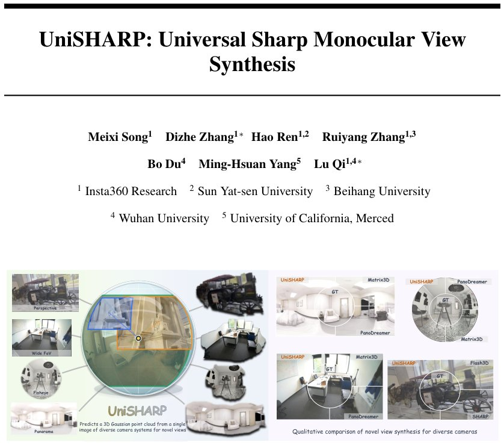

> *Generated by JarvisForResearchers Bot on 2026-06-09*

!!! tip "Why we featured this paper"
    Brand new preprint (2026) — accepted

## TL;DR
UniSHARP generalizes monocular novel view synthesis beyond narrow-FoV perspective inputs by unifying image representations into an omnidirectional latent space. It reformulates Gaussian prediction in ray-distance space, enabling robust rendering across perspective, wide-FoV, fisheye, and panoramic cameras via a feature-space residual refinement pipeline.

## The Problem
Monocular view synthesis inherently suffers from ill-posedness due to the loss of depth and spatial information during projection. Existing methods, exemplified by SHARP, are fundamentally constrained by pinhole camera assumptions. This constraint severely limits their applicability, as fine-tuning these models on data captured by non-pinhole systems—such as wide-FoV, fisheye, or panoramic cameras—results in poor generalization. The core gap is the inability of pinhole-centric models to accurately predict scene geometry when the input projection deviates significantly from the standard pinhole model, especially when constrained to a single-image, feedforward inference paradigm.

## Key Contributions
We introduce UniSHARP, a universal-camera feedforward 3DGS framework designed for monocular novel view synthesis across standard perspective, wide-FoV, fisheye, and panoramic inputs. This is achieved by reformulating the SHARP-style Gaussian prediction process within a ray-distance space. We develop a feature-space Gaussian prediction pipeline that effectively fuses 2D semantic encodings with 3D spatial features, allocating Gaussians directly at the native input resolution. Furthermore, we incorporate panoramic-specific adaptations, including spherical Gaussian initialization and distortion-aware probabilistic dropout, to stabilize Gaussian distributions under the severe projection artifacts of equirectangular representations.

## How It Works


*Figure 1: UniSHARP performs monocular novel view synthesis across diverse camera types. Given a
single image from a perspective, wide-FoV, fisheye, or panoramic camera, UniSHARP predicts a 3D
Gaussian point cloud and renders high-quality novel views.*

UniSHARP addresses the limitations of pinhole assumptions by enforcing a unified representation across all input modalities. This is accomplished by aligning the input images into a shared, omnidirectional latent space, facilitating implicit alignment in both the feature domain and the Gaussian representation domain. The scene structure is modeled using a ray-based universal representation, where Gaussian primitives are parameterized by a predicted unit ray direction ($\mathbf{r}_p \in S^2$) and a radial distance ($d_p > 0$). This decoupling of viewing direction from scene range allows the model to operate independently of the specific camera projection model.

### Ray-based universal representation
This component establishes the foundational coordinate system for UniSHARP. Instead of relying on pixel coordinates tied to a specific camera projection, Gaussian attributes are defined consistently across diverse camera models. This is achieved by predicting a per-pixel unit ray field, $\mathbf{r}_p \in S^2$, and an associated radial distance, $d_p > 0$. This structure ensures that the geometric primitives are defined relative to a canonical, omnidirectional view, irrespective of whether the input was captured by a perspective, fisheye, or panoramic lens.

### Geometry Anchored Gaussians ($B_{p,\ell}$)
The scene representation is initialized using Geometry Anchored Gaussians ($B_{p,\ell}$). These are two-layer Gaussians constructed directly upon a native ray grid derived from the input image. The first layer is tasked with approximating the primary visible surface geometry, while the second layer is dedicated to modeling occlusions and capturing high-frequency surface details. This anchoring provides a camera-unified initialization point for the scene structure.

### Feature Conditioned Gaussian Residuals ($\Delta_{p,\ell}$)
To refine the initial geometry provided by the anchors, we employ Feature Conditioned Gaussian Residuals ($\Delta_{p,\ell}$). These residuals are predicted by a dedicated Gaussian decoder. This decoder performs a critical fusion operation, combining high-dimensional 2D semantic image features extracted from the input with the 3D ray-based geometric features derived from the anchor Gaussians. This fusion allows the model to incorporate rich semantic context into the geometric refinement process.

### Depth Head 1 and Depth Head 2
These components serve as specialized output heads within the architecture. They are responsible for predicting the necessary distance hypotheses for the second radial layer of the Geometry Anchored Gaussians ($B_{p,\ell}$). By providing separate heads, the model gains the capacity to model complex depth distributions required for accurate representation, particularly in areas of high geometric complexity or occlusion.

### Distortion Adaptation Dropout ($p_y$)
For inputs captured using equirectangular projections (panoramas), the inherent oversampling in the polar regions can destabilize the Gaussian distribution fitting. To mitigate this, we introduce Distortion Adaptation Dropout ($p_y$). This mechanism applies a probabilistic dropout specifically dependent on the latitude ($y$) of the ray, effectively regularizing the second Gaussian layer during training to prevent overfitting to the high-density sampling artifacts near the poles.

## Results
The performance of UniSHARP demonstrates superior generalization across different camera domains compared to prior work.

| Metric | Value | Baseline | Source |
| :--- | :--- | :--- | :--- |
| PSNR | 21.556 | SHARP [12] | Table 2 |
| SSIM | 0.674 | SHARP [12] | Table 2 |
| LPIPS | 0.143 | SHARP [12] | Table 2 |
| PSNR | 29.244 | Matrix3D [61] | Table 3 |
| SSIM | 0.895 | Matrix3D [61] | Table 3 |
| LPIPS | 0.065 | Matrix3D [61] | Table 3 |

## Why This Matters
The introduction of UniSHARP shifts the paradigm for monocular 3D reconstruction from being camera-specific to being representation-agnostic. The practitioner takeaways highlight three critical shifts: first, the necessity of moving from image-plane coordinates to a ray-distance space for universal handling of heterogeneous cameras. Second, the efficacy of fusing 2D semantic context with 3D geometric residuals enables high-fidelity reconstruction without requiring input image resizing or domain-specific preprocessing. Finally, the framework supports pose-free inference by implicitly recovering camera geometry from the predicted ray field, which is a significant advantage for real-world deployment with uncalibrated capture devices.

## Limitations & Open Questions
The current implementation necessitates a mixed-camera training strategy, which inherently requires the construction and curation of a comprehensive, FoV-stratified benchmark dataset to ensure robust generalization. Furthermore, while the model is designed to be pose-free, the practical deployment of the pose-free model still relies on fitting specific camera intrinsics—either pinhole or Fisheye parameters—from the predicted ray field to achieve accurate rendering for specific camera types.

---

## Citation

**Paper:** [2606.07514](https://arxiv.org/abs/2606.07514)

```bibtex
@article{260607514,
  title   = {UniSHARP: Universal Sharp Monocular View Synthesis},
  author  = {Meixi Song and Dizhe Zhang and Hao Ren and Ruiyang Zhang and Bo Du and Ming-Hsuan Yang et al.},
  journal = {arXiv preprint arXiv:2606.07514},
  year    = {2026},
  url     = {https://arxiv.org/abs/2606.07514}
}
```
