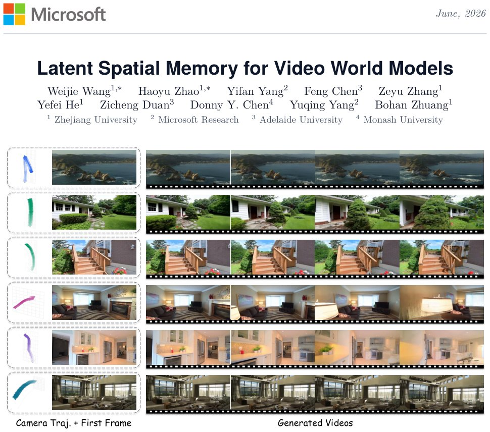

> *Generated by JarvisForResearchers Bot on 2026-06-10*

!!! tip "Why we featured this paper"
    Not yet indexed in S2 — assumed brand-new preprint

## TL;DR
Mirage introduces latent spatial memory, a persistent 3D cache storing scene information directly in the diffusion latent space, to enable geometrically consistent video world models while avoiding the computational and representational bottlenecks of traditional RGB point-cloud memories.

## The Problem
Video world models that maintain 3D spatial consistency typically rely on explicit point cloud memory constructed in RGB space. This approach suffers from significant drawbacks. First, it is computationally expensive because it necessitates repeated rendering and VAE encoding at every generation step. Second, it is inherently lossy. The required round trip through pixel space discards rich feature information contained within the learned latent representation. Prior world-generation systems maintain an explicit point cloud in RGB space, requiring repeated rendering and re-encoding at every step. Furthermore, the RGB detour in prior methods does not preserve the model’s native latent conditioning features, leading to distortion from VAE reconstruction error, rasterization artifacts, and distribution mismatch. Existing spatial memory designs operate entirely in RGB pixel space, which is both computation-intensive and vulnerable to accumulated errors in repeated encoding-decoding operations.

## Key Contributions
We introduce three primary contributions. First, we propose the introduction of latent spatial memory, a 3D memory structure for video world models that operates entirely in latent space, thereby circumventing the need for pixel-space conversion. Second, we present Mirage, a video world model architected around this latent spatial memory. Mirage incorporates depth-guided back-projection for memory construction, occlusion-aware readout performed at latent resolution, and iterative refinement facilitated by dynamic object exclusion. Finally, Mirage achieves state-of-the-art world generation on WorldScore and demonstrates competitive novel view synthesis performance on RealEstate10K, realizing up to $10.57\times$ in end-to-end speedup and $55\times$ in memory reduction compared to RGB-based methods.

## How It Works


*Figure 1 Geometrically consistent videos generated by Mirage with latent spatial memory. Given a single input image and a
user-specified camera trajectory (left), Mirage preserves spatial consistency by caching 3D information directly in the latent
space, rather than as an RGB-colored point cloud. T*

Mirage utilizes a persistent latent cache $M$, which is represented as a collection of latent-attributed 3D points: $M = \{(p_i, f_i)\}$, where $p_i$ is a world-space coordinate and $f_i$ is a latent feature vector. The initialization phase involves encoding the initial frame $I_0$ and subsequently lifting its latent tokens into 3D space via depth-guided back-projection. For subsequent video generation, the cache $M$ is queried by projecting all stored memory points onto the target camera grid at the latent resolution. The frontmost point is retrieved using a z-buffering mechanism to construct the target-view latent feature tensors, denoted $\hat{z}_t$. These tensors are then injected into the diffusion backbone via a ControlNet-style side branch. Following the generation of a new frame chunk, the resulting frames are re-encoded and back-projected to update $M$. This update process explicitly excludes dynamic objects and sky regions to preserve overall geometric coherence.

### Latent Spatial Memory (M)
$M$ functions as the persistent 3D cache. It stores scene information not as pixel data, but as latent-attributed 3D points, $M = \{(p_i, f_i)\}$, where $p_i \in \mathbb{R}^3$ defines the world-space location and $f_i \in \mathbb{R}^C$ is the associated latent feature vector.

### Depth-guided back-projection
This mechanism is employed during the memory construction phase. It takes 2D latent tokens derived from an image and lifts them into accurate 3D world space coordinates, leveraging depth information to establish the $p_i$ component of the memory entry.

### Latent-space Memory Readout
To generate a view at a target camera pose, we query $M$. This involves projecting every point $(p_i, f_i) \in M$ onto the target camera grid at the latent resolution. A z-buffer is then employed to select only the frontmost projected point for each pixel location, yielding the target-view latent feature tensors $\hat{z}_t$.

### ControlNet-style side branch
This component serves as the interface between the memory and the generative model. The latent memory readouts ($\hat{z}_t$) and corresponding visibility masks ($m_t$) are injected into the video diffusion backbone through a structure analogous to a ControlNet, conditioning the generation process on the stored scene geometry.

### Autoregressive 3D Cache Update
After a new frame chunk is generated, the process updates $M$. This involves re-encoding the generated frames, estimating their depth, and back-projecting the resulting latent tokens into $M$. Crucially, this update step incorporates filtering to exclude content identified as dynamic objects or sky regions, which is necessary to maintain long-term geometric coherence.

## Results
| Metric | Value | Baseline | Source |
| :--- | :--- | :--- | :--- |
| Average Score (WorldScore) | 70.36 | N/A | Table 1 |
| End-to-end video generation speedup | $10.57\times$ faster | RGB point-cloud readout | Abstract |
| GPU memory reduction | $55\times$ lower | RGB point-cloud readout | Abstract |
| PSNR (RealEstate10K) | N/A | SEVA [49] | Table 2 |

## Why This Matters
The shift from RGB-based memory to latent-space memory is a critical advancement for scalable 3D generative modeling. By operating entirely in the latent domain, Mirage bypasses the computational overhead associated with repeated rasterization and VAE encoding/decoding cycles inherent in RGB-cache methods. This results in substantial gains in both speed and memory efficiency. Furthermore, by preserving the rich feature representations within the latent space, the model avoids the geometric and feature degradation caused by the pixel-space detour, leading to more faithful and geometrically consistent world models.

## Limitations & Open Questions
The current implementation relies on a feed-forward reconstructor for estimating depth and camera parameters during the cache update phase, which represents a dependency. Additionally, the cache update procedure necessitates filtering out transient or geometrically unreliable content, specifically dynamic objects and sky regions, which requires robust external segmentation and entity extraction capabilities.

---

## Citation

**Paper:** [2606.09828](https://arxiv.org/abs/2606.09828)

```bibtex
@article{260609828,
  title   = {Latent Spatial Memory for Video World Models},
  author  = {Weijie Wang and Haoyu Zhao and Yifan Yang and Feng Chen and Zeyu Zhang and Yefei He et al.},
  journal = {arXiv preprint arXiv:2606.09828},
  year    = {2026},
  url     = {https://arxiv.org/abs/2606.09828}
}
```
