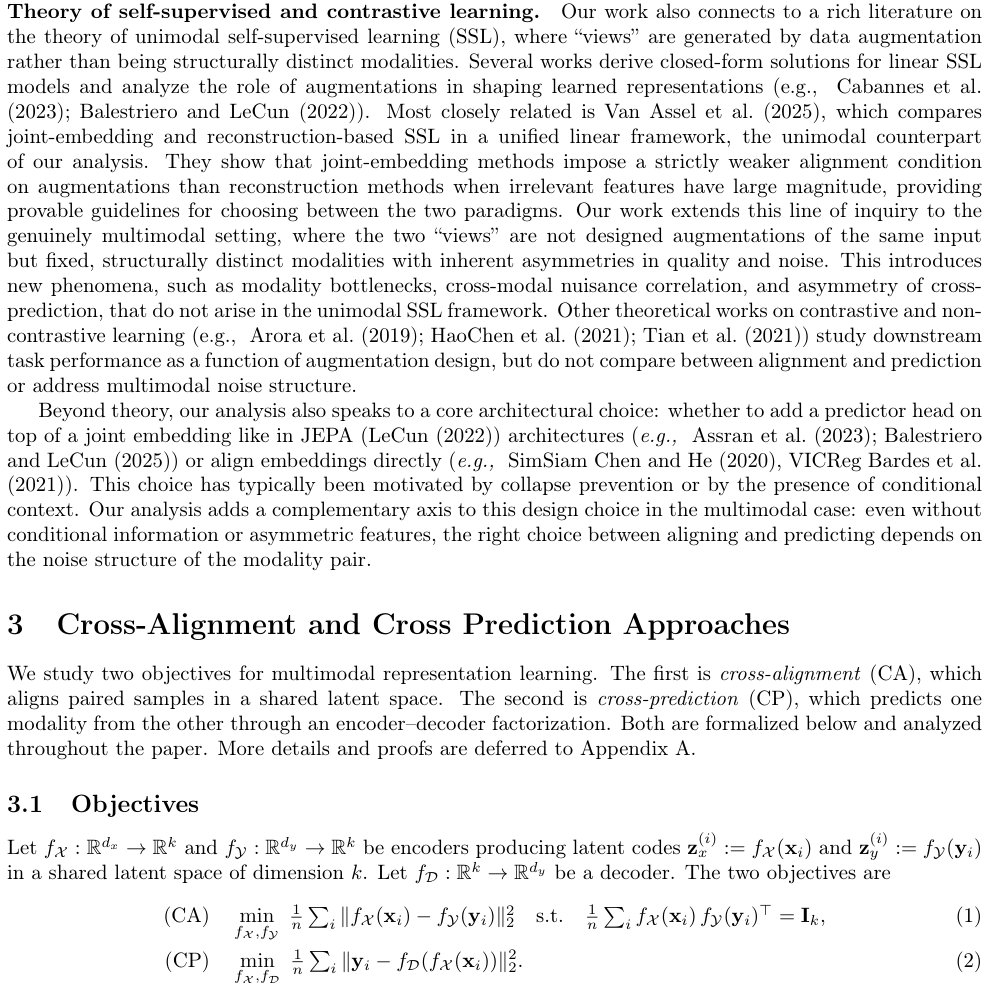

> *Generated by JarvisForResearchers Bot on 2026-06-11*

!!! tip "Why we featured this paper"
    Brand new preprint (2026) — accepted

## TL;DR
We introduce a unified linear framework and phase diagram to systematically delineate the conditions under which Cross-modal Alignment (CA) or Cross-modal Prediction (CP) succeeds or fails in multimodal representation learning. By analyzing these objectives under a spiked signal-plus-noise model incorporating structured cross-modal nuisance correlation, we derive separation ratios ($\Delta_{CA}, \Delta_{CP}$) that partition the problem space into four distinct regimes: Both, CA only, CP only, and Neither. This allows for a diagnostic procedure to select the appropriate cross-modal objective prior to training.

## The Problem
The utility of cross-modal learning paradigms—specifically Cross-modal Alignment (CA) and Cross-modal Prediction (CP)—remains largely empirical. There is a significant gap in the theoretical understanding regarding the precise conditions under which these methods succeed, fail, or when the introduction of cross-modal supervision is detrimental. In complex, heterogeneous scientific domains, practitioners lack a systematic diagnostic tool to ascertain why standard multimodal methods underperform, especially when facing modality-specific noise, nuisance features, or rank deficiencies inherent in real-world data.

## Key Contributions
Our primary contributions are threefold:
1. We provide a unified linear analysis of CA and CP, deriving the separation ratios $\Delta_{CA}$ and $\Delta_{CP}$ within the context of a spiked signal-plus-noise model that explicitly accounts for cross-modal nuisance correlation.
2. We construct a phase diagram that partitions the space of multimodal problems into four mutually exclusive regimes: Both, CA only, CP only, and Neither.
3. We propose a data-driven procedure that enables practitioners to locate a real-world dataset within this phase diagram using only a small labeled sub-sample, prior to initiating any cross-modal training.

## How It Works


*Figure 1 illustrates the two paradigms.*

The framework operates by mapping the optimization objectives of CA and CP onto established linear algebraic problems—Canonical Correlation Analysis (CCA) for CA, and truncated Reduced-Rank Regression (RRR) for CP—under a specific structured noise model.

### Cross-alignment (CA)
The CA objective, defined as $\min_{f_X, f_Y} \frac{1}{nP} \sum_i \|f_X(x_i) - f_Y(y_i)\|^2$ subject to $\frac{1}{nP} \sum_i f_X(x_i) f_Y(y_i)^\top = I_k$, aims to find a common embedding space for paired samples. In the linear regime, this is equivalent to projecting data onto the leading singular directions of the cross-covariance matrix $C = S_x^{-1/2} S_{xy} S_y^{-1/2}$. The success of this alignment is quantified by the separation ratio $\Delta_{CA} = \min \rho_i / \max_j \nu_j$.

### Cross-prediction (CP)
The CP objective, $\min_{f_X, f_D} \frac{1}{nP} \sum_i \|y_i - f_D(f_X(x_i))\|^2$, seeks to reconstruct one modality ($y$) from the representation of the other ($x$) via an encoder-decoder factorization. This is equivalent to finding the leading singular directions of the matrix $A = S_{yx} S_x^{-1/2}$. The recovery condition for CP is governed by the separation ratio $\Delta_{CP} = \min \tau_i / \max_j \xi_j$.

### Spiked Model Covariances
We model the data covariance structure using a spiked signal-plus-noise framework. The covariances are block diagonal: $S_{xx} = \text{diag}(\kappa_i^2 + \Gamma(s)_x, \Gamma(n)_x)$, $S_{yy} = \text{diag}(\kappa_i^2 + \Gamma(s)_y, \Gamma(n)_y)$, and $S_{xy} = \text{diag}(\kappa_i^2, \Gamma_{xy})$. Crucially, $\Gamma_{xy} = \text{diag}(\eta_1, \dots, \eta_{d-k})$ explicitly encodes the structured cross-modal nuisance correlation, allowing us to analyze how this correlation affects the recovery conditions for both CA and CP.

## Results
The analysis yields distinct performance characteristics for the two objectives under varying noise and correlation structures.

| Metric | Value | Baseline | Source |
| :--- | :--- | :--- | :--- |
| Subspace distance (CP failure) | $\nu \approx 0.15$ | N/A | Figure 3 |
| Subspace distance (CA robustness) | $\nu \approx 0.75$ | N/A | Figure 3 |
| Theoretical separation ratio threshold ($\Delta=1$) | $\Delta_{CP}$ crosses threshold at noise correlation roughly $5\times$ lower than $\Delta_{CA}$ | N/A | Figure 3 |

## Why This Matters
This work moves the field beyond heuristic application. The derived phase diagram provides a rigorous, quantitative tool for practitioners. Specifically, if nuisance correlation is moderate and modality-specific noise is high, CA is theoretically favored. Conversely, if the underlying signal is strong and the target modality noise is low, CP may be superior, provided the source-target orientation is correct. Most importantly, the framework identifies the 'Neither' regime, where applying cross-modal supervision actively degrades performance, allowing researchers to avoid wasted computational effort.

## Limitations & Open Questions
The current analysis is strictly confined to the linear regime. While we observe that the derived theoretical predictions transfer reasonably well to nonlinear experimental settings, a full characterization of the nonlinear recovery boundaries remains an open problem. Furthermore, the proposed data-driven procedure necessitates the acquisition of a small labeled subsample to accurately estimate the separation ratios, which introduces a practical dependency on initial labeling effort.

---

## Citation

**Paper:** [2606.11190](https://arxiv.org/abs/2606.11190)

```bibtex
@article{260611190,
  title   = {When to Align, When to Predict: A Phase Diagram for Multimodal Learning},
  author  = {Ilay Kamai and Hugues Van Assel and Aviv Regev and Hagai B. Perets and Randall Balestriero},
  journal = {arXiv preprint arXiv:2606.11190},
  year    = {2026},
  url     = {https://arxiv.org/abs/2606.11190}
}
```
