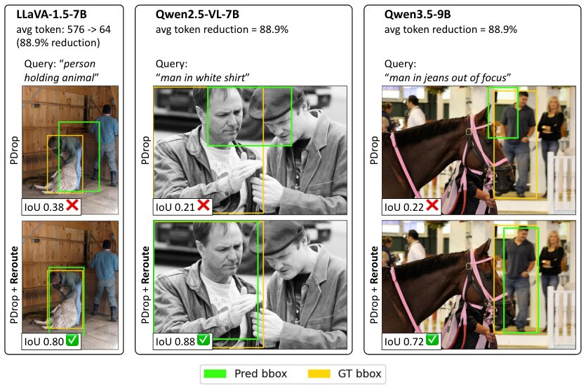

> *Generated by JarvisForResearchers Bot on 2026-06-12*

!!! tip "Why we featured this paper"
    Not yet indexed in S2 — assumed brand-new preprint

## TL;DR
Reroute introduces a training-free plug-in that replaces irreversible visual token removal in Vision-Language Models (VLMs) with recoverable routing. This allows tokens temporarily pruned by attention-based selection to re-enter the candidate pool at subsequent decoder stages, mitigating the fragility of rank-and-remove paradigms where token importance evolves across decoder depth.

## The Problem
VLMs ingest high-dimensional visual data, projecting it into hundreds or thousands of visual tokens. This token count imposes significant computational overhead during decoder inference, primarily due to the quadratic complexity of attention mechanisms and the associated memory footprint of the KV-cache. Existing approaches to reduce this token count typically employ a rank-and-remove paradigm, where tokens deemed least important are permanently discarded. This approach suffers from a critical flaw: it assumes that the relative importance of a visual token remains static throughout the entire depth of the decoder. In practice, the relevance of a token often changes as the model processes sequential textual context, rendering irreversible pruning suboptimal. Furthermore, most existing decoder-side pruning methods result in the permanent deletion of deferred tokens, losing potentially valuable visual evidence.

## Key Contributions
We present three primary contributions:
1. A recoverable routing formulation that recasts token pruning as a stage-wise routing mechanism with a deferred-token bypass. This enables a training-free, attention-driven realization of a mixture-of-depth strategy specifically for VLM visual tokens.
2. A plug-in mechanism designed for matched theoretical efficiency. Reroute reuses existing token scoring mechanisms and pruning schedules without introducing any new trainable parameters, thereby preserving the computational budget (FLOPs and KV-cache size) of the augmented pruning scheme.
3. Demonstration of consistent performance gains across various VLM architectures and pruning baselines. Reroute improves matched-budget pruning baselines on grounding benchmarks while maintaining competitive general Visual Question Answering (VQA) performance.

## How It Works


*Figure 1: Reroute, don’t remove. Under aggressive 88.9% visual token reduction (576→64 visual
tokens), conventional pruning permanently discards visual evidence and grounding collapses (top
rows, IoU < 0.4). Replacing irreversible removal with our recoverable routing, using the same scorer
(PDrop) a*

Reroute functions as a training-free augmentation layer that can be inserted into existing token pruning pipelines, such as those based on FastV or PDrop. The core mechanism involves partitioning the decoder into $S$ sequential stages, with each stage $\ell_i$ governed by a specific keep ratio $r_i$.

### Stage-wise selection
The decoder is segmented into $S$ discrete stages. At the entry point of stage $i$, the system utilizes the $\text{Scorer}$ to evaluate the current set of candidate vision tokens, $C_i$. Based on the predefined keep ratio $r_i$, a subset of tokens is selected to proceed through the full computational block, while the remainder is deferred.

### Scorer
The token ranking mechanism is typically implemented using the text-to-vision attention scores generated within the VLM architecture. This score provides a quantitative measure of the current relevance of each visual token relative to the evolving textual context at that specific decoder layer.

### Selected tokens ($V_{sel}^i$)
The top $K_i$ tokens, where $K_i = \lfloor r_i|V| \rfloor$, are designated as $V_{sel}^i$. These tokens are allowed to traverse the complete decoder block, executing both the attention and feed-forward network (Attn+FFN) operations for stage $i$.

### Deferred tokens ($V_{def}^i$)
The remaining tokens, $V_{def}^i$, are not discarded. Instead, they bypass the current stage's full computation via a residual path. This deferral mechanism is the critical departure from traditional pruning, as these tokens remain active and eligible for re-evaluation in subsequent stages.

### Candidate set transition
The transition between stages defines the recoverability. In standard pruning, the candidate set for the next stage, $C_{prune}^{i+1}$, is restricted to $V_{sel}^i$. In Reroute, the candidate set is restored to the full set of original visual tokens, $C_{reroute}^{i+1}=V$. This restoration ensures that tokens deferred in stage $i$ can be re-selected in stage $i+1$ if their importance increases due to subsequent contextual processing.

## Results
The efficacy of Reroute is demonstrated across various VLM backbones under aggressive token reduction regimes.

| Metric | Value | Baseline | Source |
| :--- | :--- | :--- | :--- |
| IoU (LLaVA-1.5-7B, 88.9% reduction) | 0.80 $\checkmark$ | PDrop (IoU 0.38 $\times$) | Figure 1 |
| IoU (Qwen2.5-VL-7B, 88.9% reduction) | 0.88 $\checkmark$ | PDrop (IoU 0.21 $\times$) | Figure 1 |
| IoU (Qwen3.5-9B, 88.9% reduction) | 0.72 $\checkmark$ | PDrop (IoU 0.22 $\times$) | Figure 1 |
| RefCOCO (Avg Token 192, HuggingFace format) | 59.2% | FastV (45.5%) | Table 1 (b) |
| RefCOCO (Avg Token 192, HuggingFace format) | 82.3% | PDrop (71.3%) | Table 1 (b) |
| RefCOCO (Avg Token 64, HuggingFace format) | 34.0% | PDrop (22.2%) | Table 1 (b) |

## Why This Matters
The ability to recover pruned visual tokens addresses a fundamental limitation in current efficient VLM inference. By transforming irreversible deletion into recoverable deferral, Reroute allows the model to dynamically adjust its reliance on visual evidence as the textual prompt is processed. This is particularly impactful under aggressive token reduction, where the risk of discarding a critical token early in the decoding process is high. Since Reroute is a training-free plug-in, it offers a low-cost path to significantly improving the performance of existing, large-scale VLM deployments without requiring costly fine-tuning.

## Limitations & Open Questions
The current implementation of Reroute is not a general-purpose Mixture-of-Depth (MoD) architecture; rather, it is a specialized instantiation tailored for the visual-token pruning problem within VLMs. Furthermore, the practical inference latency still carries overhead associated with the necessary gather/scatter operations required to manage the dynamic candidate sets and the underlying KV-cache management across stages. Future work should investigate the optimal scheduling of $r_i$ across different VLM architectures to further optimize the trade-off between computational savings and information retention.

---

## Citation

**Paper:** [2606.12412](https://arxiv.org/abs/2606.12412)

```bibtex
@article{260612412,
  title   = {Reroute, Don't Remove: Recoverable Visual Token Routing for Vision-Language Models},
  author  = {Cheng-Yu Yang and Shao-Yuan Lo and Yu-Lun Liu},
  journal = {arXiv preprint arXiv:2606.12412},
  year    = {2026},
  url     = {https://arxiv.org/abs/2606.12412}
}
```
