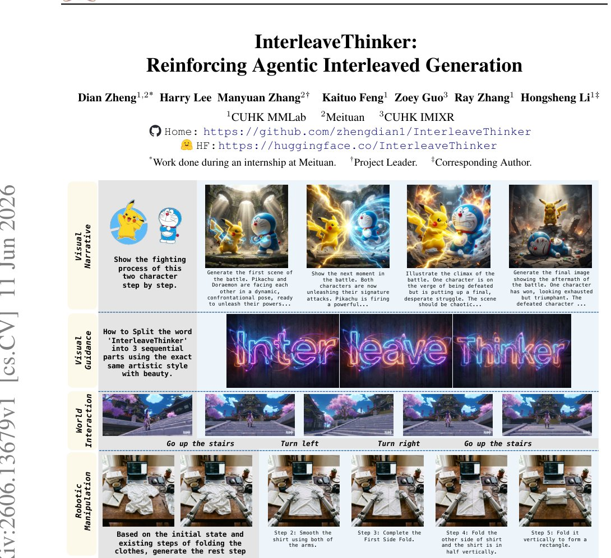

> *Generated by JarvisForResearchers Bot on 2026-06-13*

!!! tip "Why we featured this paper"
    Brand new preprint (2026) — accepted

## TL;DR
InterleaveThinker is a novel multi-agent pipeline that endows any existing image generator with strong interleaved generation capabilities by employing a Planner agent to sequence instructions and a Critic agent to enforce step-wise correction. This framework addresses the limitations of single-shot image generation and the error accumulation inherent in standard Unified Multimodal Models (UMMs) during sequential tasks.

## The Problem
Existing image generators are fundamentally constrained to single-image generation or editing tasks. This architecture prevents them from natively supporting interleaved generation—the generation of a coherent text-image sequence. Such sequential capability is critical for applications requiring visual narratives, guided procedural generation, or embodied manipulation where the output must evolve over time. Furthermore, when UMMs are applied to long-horizon tasks, they exhibit two primary deficiencies: visual over-reliance, where the model prematurely converges on an intermediate state that superficially resembles the final goal, and step-wise error accumulation, stemming from a lack of a stable mechanism for self-correction during the generation process.

## Key Contributions
We introduce InterleaveThinker, the first multi-agent framework designed to retrofit any fixed image generator with robust interleaved generation capabilities via a Planner-Gen-Critic workflow. To support this, we constructed three high-quality datasets: Interleave-Planner-SFT-80k, Interleave-Critic-SFT-112k, and Interleave-Critic-RL-13k. Finally, we designed a novel dual-reward strategy, combining an accuracy reward and a step-wise reward, which enables trajectory-level alignment through efficient single-step Reinforcement Learning (RL) utilizing GRPO.

## How It Works


*Figure 1: Capabilities of InterleaveThinker, consisting of interleaved generation with various types inputs, real-world action
interaction, and robotic manipulation. Gray: inputs, blue: outputs.*

InterleaveThinker functions as a closed-loop, multi-agent pipeline comprising a Planner, a Generator, and a Critic. The process begins when the Planner analyzes the input sequence $S$ and decomposes it into an $N$-step execution plan. For each step $i$, the Planner outputs a specific instruction $u_i$, an initial prompt $p_i$, and auxiliary text $a_i$. The Generator then synthesizes the image $I_t^i$, conditioned on the current refined prompt $r_t^i$ and the preceding image $I_{i-1}$. Subsequently, the Critic Agent evaluates the transition from $I_{i-1}$ to $I_t^i$ against the target $p_i$. The Critic outputs a binary judgment $j_t^i$, a refined prompt $r_{t+1}^i$ for the next iteration, and a detailed reasoning process $R_t^i$. This generation-evaluation loop continues iteratively until the Critic yields a positive judgment or the maximum iteration count $T_{max}$ is reached, thereby enforcing strict adherence to the global plan.

### Planner Agent
The Planner Agent is responsible for the high-level decomposition of the input sequence $S$. Its function is to translate the abstract sequence into a concrete, actionable $N$-step execution plan. For each step $i$ in the plan, it generates the requisite tuple $(u_i, p_i, a_i)$, effectively providing the necessary scaffolding for the subsequent generation and evaluation steps.

### Generator
The Generator component is the core image synthesis module. It operates iteratively, taking two primary inputs: the current refined prompt $r_t^i$ and the image state from the previous step, $I_{i-1}$. Its output is the newly generated image $I_t^i$, which represents the state after the application of the instruction $u_i$.

### Critic Agent
The Critic Agent serves as the supervisory and refinement mechanism. It evaluates the transition from $I_{i-1}$ to $I_t^i$ by comparing it against the step-specific target $p_i$ and the current prompt $r_t^i$. Its output is multifaceted: a binary judgment $j_t^i$ indicating success or failure for that step, a refined prompt $r_{t+1}^i$ designed to steer the Generator toward correction, and a reasoning process $R_t^i$ detailing the evaluation.

## Results
| Metric | Value | Baseline | Source |
| :--- | :--- | :--- | :--- |
| WISE | 0.73 | 0.47 | Abstract |
| RISE | 28.9 | 13.3 | Abstract |

## Why This Matters
The findings demonstrate that multi-agent frameworks can effectively retrofit existing, frozen image generators to handle complex sequential tasks, such as generating visual narratives. By decoupling the planning function (handled by the Planner) from the execution and evaluation functions (handled by the Generator and Critic), we establish a robust strategy to mitigate the known issues of visual over-reliance and error accumulation in long-horizon generation tasks common to UMMs. Furthermore, the implementation of a dual-reward strategy—combining accuracy and step-wise rewards—provides a computationally efficient pathway to guide long trajectories using single-step Reinforcement Learning (RL).

## Limitations & Open Questions
A significant limitation is the computational cost associated with optimizing the entire interleaved generation trajectory end-to-end, particularly as trajectories can involve over 25 generator calls. Additionally, the current framework's reliance on constructing high-quality training data necessitates the use of advanced proprietary models, specifically Gemini 2.5 Pro and Nano Banana Pro. Future work must address the scalability of the data generation pipeline and explore more efficient trajectory optimization methods.

---

## Citation

**Paper:** [2606.13679](https://arxiv.org/abs/2606.13679)

```bibtex
@article{260613679,
  title   = {InterleaveThinker: Reinforcing Agentic Interleaved Generation},
  author  = {Dian Zheng and Harry Lee and Manyuan Zhang and Kaituo Feng and Zoey Guo and Ray Zhang et al.},
  journal = {arXiv preprint arXiv:2606.13679},
  year    = {2026},
  url     = {https://arxiv.org/abs/2606.13679}
}
```
