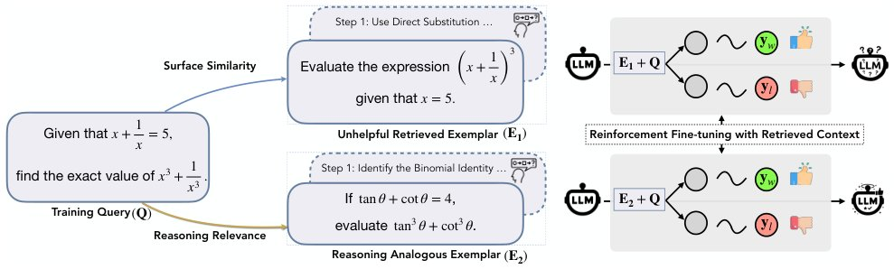

> *Generated by JarvisForResearchers Bot on 2026-06-14*

!!! tip "Why we featured this paper"
    Brand new preprint (2026) — accepted

## TL;DR
RA-RFT is a post-training framework that enhances language model reasoning by using gold-relevance distillation to train a retriever that selects reasoning-analogous examples, which are then used to fine-tune the policy model via reinforcement learning.

## The Problem
Conventional retrieval methods based on lexical or semantic similarity are poorly suited for complex reasoning tasks. The fundamental issue is that semantic similarity does not guarantee functional similarity in problem-solving. Specifically, a problem that is semantically similar to the query may necessitate an entirely different solution strategy, whereas a problem that is superficially different might share the exact underlying reasoning pattern required for a successful solution.

## Key Contributions
We present three primary contributions:
1. Proposing Retrieval-Augmented Reinforcement Fine-Tuning (RA-RFT), a post-training framework designed to teach language models to reason by analogy.
2. Utilizing gold-relevance distillation to train a retriever that ranks contexts based on expected reasoning benefit rather than mere semantic overlap.
3. Fine-tuning the policy model via reinforcement fine-tuning methods, incorporating retrieved analogous demonstrations under verifiable outcome rewards.

## How It Works


*Figure 1 Motivation of RA-RFT. Left: A training query may be retrieved with a surface-similar but reasoning-irrelevant
exemplar (E1, which could be easily solved by direct substitution) or a superficially different but reasoning-analogous
exemplar (E2, which shares the same binomial identity strateg*

RA-RFT operates through a three-stage pipeline. The first stage involves gold-relevance distillation, where a judge model assigns binary relevance labels ($y_{i,c} \in \{0, 1\}$) to query-context pairs. This label indicates whether the trace exhibits a transferable reasoning pattern relevant to the query. Second, a dense retriever, $R_\theta$, is trained using these utility-based annotations via contrastive learning. This allows $R_\theta$ to surface problems that are structurally analogous. Third, the target model, $M_\phi$, is fine-tuned using reinforcement fine-tuning. During this phase, the retrieved reasoning traces $\\{c_1, \dots, c_k\\}$ condition the sampling of responses $\hat{a}_g \sim M_\phi(\cdot | q, \\{c_j\\})$, enabling the policy to learn to exploit these retrieved analogies while optimizing against outcome rewards.

### Training Set $D$
The training set $D$ comprises the set of reasoning problems $D = \{(q_i, a_i)\\}_{i=1}^N$, where each problem $q_i$ is paired with a verifiable correct answer $a_i$.

### Corpus $C$
The external corpus $C$ consists of $C = \{(p_j, t_j)\\}_{j=1}^M$, which is a collection of problems $p_j$ paired with detailed reasoning traces $t_j$ generated by a high-capability teacher model.

### Judge Model $M_{judge}$
The Judge Model, $M_{judge}$, is a strong, pre-existing model (such as GPT-4o). Its role is critical in the distillation phase: it directly assesses the reasoning relevance of candidate traces for a given query, assigning the binary relevance label $y_{i,c}$.

### Reasoning-Aware Retriever $R_\theta$
This dense retriever, $R_\theta$, is trained using contrastive learning. Its objective is to rank candidate traces based on their inferred reasoning utility, optimizing the InfoNCE objective $L_{retrieval}$ derived from the gold-relevance labels provided by $M_{judge}$.

### Target Model $M_\phi$
The Target Model, $M_\phi$, is the language model under investigation. It is fine-tuned using reinforcement learning. Crucially, during the policy update phase, the sampling of actions is conditioned on the set of retrieved reasoning traces $\\{c_1, \dots, c_k\\}$, allowing the policy to learn from external expertise.

## Results
The performance gains observed across various benchmarks are summarized below.

| Metric | Value | Baseline | Source |
| :--- | :--- | :--- | :--- |
| AIME 2025 average@32 accuracy | 7.1 points | GRPO | Table 1 |
| AIME 2025 average@32 accuracy | 2.8 points | GRPO | Table 1 |
| Overall average gain across all four benchmarks | 4.1 and 2.6 points | N/A | Section 4.2 |

## Why This Matters
The RA-RFT framework provides a principled method for injecting external, high-quality reasoning expertise into language models during the fine-tuning phase. The practitioner takeaways highlight that for complex reasoning tasks, grounding retrieval in 'reasoning utility'—analogical fit—is demonstrably more effective than relying on surface-level semantic similarity. Furthermore, RA-RFT demonstrates that retrieval augmentation can serve as an orthogonal axis of improvement to existing reward design or training curricula in Reinforcement Learning from Human Feedback (RLHF) variants. By conditioning the policy on retrieved traces, the framework facilitates a denser and more informative reward signal during exploration.

## Limitations & Open Questions
Two primary limitations must be acknowledged. First, the precise computation of true reasoning relevance is intractable in practice; therefore, we must approximate this concept using the judgment of a strong, external model, $M_{judge}$. Second, the entire methodology is contingent upon the availability of a sufficiently large and high-quality corpus $C$ containing problems paired with detailed, step-by-step reasoning traces. Future work must address the scalability and robustness of the judge model approximation.

---

## Citation

**Paper:** [2606.13680](https://arxiv.org/abs/2606.13680)

```bibtex
@article{260613680,
  title   = {Learning to Reason by Analogy via Retrieval-Augmented Reinforcement Fine-Tuning},
  author  = {Zilin Xiao and Qi Ma and Chun-cheng Jason Chen and Xintao Chen and Avinash Atreya and Hanjie Chen et al.},
  journal = {arXiv preprint arXiv:2606.13680},
  year    = {2026},
  url     = {https://arxiv.org/abs/2606.13680}
}
```
