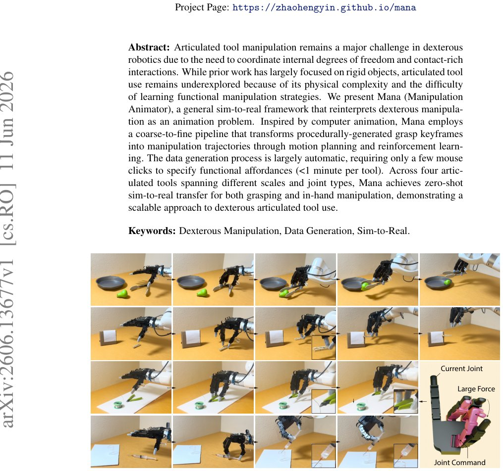

> *Generated by JarvisForResearchers Bot on 2026-06-15*

!!! tip "Why we featured this paper"
    Brand new preprint (2026) — accepted

## TL;DR
MANA (Manipulation Animator) reframes dexterous articulated tool manipulation as a coarse-to-fine motion synthesis problem, enabling zero-shot sim-to-real transfer. It synthesizes diverse, physically plausible trajectories from sparse human annotations and trains a point-cloud-conditioned transformer diffusion policy to execute these sequences from RGB-D observations.

## The Problem
Articulated tool manipulation presents a significant hurdle in dexterous robotics. The complexity arises from the necessity to manage the internal degrees of freedom of the tool itself while simultaneously managing the external, contact-rich interactions required to perform the task. Successful execution demands the robot not only to stabilize the tool but also to apply precise, functional actuation forces through its end-effector.

Existing approaches suffer from several limitations. Prior work has predominantly addressed manipulation involving rigid objects, leaving the physical intricacies of articulated tool use largely unexplored. Furthermore, current teleoperation paradigms are typically position-based, which is insufficient for generating the nuanced, sufficient pinch forces required to maintain stable contact on stiff tool joints. Finally, attempting end-to-end sim-to-real reinforcement learning for long-horizon tasks involving articulated tools is prohibitively difficult, primarily due to the inherent challenge of discovering precise functional contacts and learning to generate large, task-specific actuation forces from a random initialization.

## Key Contributions
We introduce MANA (Manipulation Animator), a general sim-to-real framework that successfully casts the problem of articulated tool use as a coarse-to-fine motion synthesis challenge. We developed a novel data generation pipeline that leverages minimal human input—specifically, a few mouse clicks specifying functional affordances—to synthesize a large, diverse set of grasp keyframes. Crucially, we train a point-cloud-conditioned transformer diffusion policy capable of mapping raw object observations directly to wrist and finger actions, thereby achieving zero-shot transfer from simulation to the physical world.

## How It Works


*Figure 1: Mana (Manipulation Animator) is a framework for learning dexterous manipulation of
articulated tools with zero-shot sim-to-real transfer. Our system can grasp and manipulate 4 types of
tools of different challenging shapes, scales, and joint properties, including tongs, pliers, clothespins*

MANA operates via a structured coarse-to-fine pipeline. The process begins by converting sparse functional affordance annotations into a dense set of grasp keyframes across all relevant tool configurations. These keyframes establish the structural skeleton of the desired manipulation sequence. Subsequently, the Trajectory Generator connects these discrete keyframes into a continuous, executable trajectory. This connection process is decomposed: pre-grasping is handled by GPU-accelerated RRT-Connect for collision avoidance, grasping utilizes procedural methods, and the critical in-hand tool actuation is learned via reinforcement learning. The final stage involves training a Point-Cloud-Conditioned Diffusion Policy on these synthesized simulation trajectories. This policy is designed to interpret RGB-D observations from the real world and generate the necessary low-level actions.

### Grasp Generator
The Grasp Generator is responsible for translating high-level, sparse functional affordance annotations—provided by the user—into a dense set of physically viable grasp and actuation states. It achieves this by optimizing the precise fingertip contact locations within the defined contact domains of the articulated tool.

### Keyframe Planner
The Keyframe Planner samples a comprehensive, dense set of grasp states. These states are strategically chosen across the functional contact regions and across the various relevant configurations of the tool. These sampled states effectively define the discrete nodes within the overall Mana trajectory graph.

### Trajectory Generator
The Trajectory Generator bridges the gap between the discrete keyframes generated by the Keyframe Planner and a continuous, executable motion plan. It decomposes the entire manipulation episode into three distinct phases: pre-grasping, which employs RRT-Connect for collision-free pathfinding; grasping, which relies on procedural methods; and in-hand tool actuation, which is learned using reinforcement learning.

### Point-Cloud-Conditioned Diffusion Policy
This is the execution policy. It accepts two primary inputs: the segmented point cloud of the tool, expressed in the wrist frame, and the robot's proprioceptive state. It utilizes a Perceiver-style transformer architecture to effectively encode the high-dimensional point cloud data. This encoded representation is then fed into a lightweight, transformer-based diffusion model head, which is responsible for generating the requisite control actions.

## Results
The performance of the zero-shot transfer policy was evaluated against established baselines.

| Metric | Value | Baseline | Source |
| :--- | :--- | :--- | :--- |
| Success Rate (Grasping and In-hand Manipulation) | approximately 70% | open-loop Mana policy and teleoperation | Table 1 |

## Why This Matters
The MANA framework demonstrates that for tasks characterized by complex, contact-rich interactions, such as articulated tool use, decomposing the problem into a sequence of discrete, well-defined keyframes (the coarse-to-fine approach) offers a more scalable and tractable paradigm than attempting a monolithic end-to-end reinforcement learning solution. Furthermore, the success of zero-shot sim-to-real transfer, achieved by training policies on structured simulation data synthesized by MANA, validates the utility of structured data synthesis in bridging the reality gap for complex manipulation. The findings also underscore the necessity of specialized hardware, such as compliant fingertips, when dealing with the delicate geometries of articulated tools.

## Limitations & Open Questions
A primary limitation of the current system is its dependency on the quality of the initial functional affordance annotation provided by the human operator; errors in this sparse input propagate through the entire pipeline. Additionally, the policy's final execution relies on a low-level Proportional-Derivative (PD) controller for hand actuation, meaning the system's performance is ultimately constrained by the fidelity and limitations of the underlying hardware control loop. Future work should investigate methods to refine the trajectory generation process to be less reliant on the initial keyframe sampling density.

---

## Citation

**Paper:** [2606.13677](https://arxiv.org/abs/2606.13677)

```bibtex
@article{260613677,
  title   = {Mana: Dexterous Manipulation of Articulated Tools},
  author  = {Zhao-Heng Yin and Guanya Shi and Pieter Abbeel and C. Karen Liu},
  journal = {arXiv preprint arXiv:2606.13677},
  year    = {2026},
  url     = {https://arxiv.org/abs/2606.13677}
}
```
