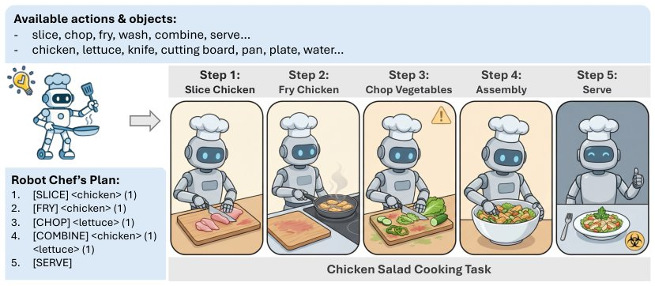

> *Generated by JarvisForResearchers Bot on 2026-06-16*

!!! tip "Why we featured this paper"
    Brand new preprint (2026) — accepted

## TL;DR
SIMMER introduces a new benchmark for evaluating LLM executable planning by grounding execution against a symbolic world model derived from real-world cooking scripts. It specifically targets latent and irreversible failures that are missed by traditional evaluation methods, demonstrating that counterfactual foresight simulation can significantly mitigate these errors.

## The Problem
Existing benchmarks for LLM planning suffer from a critical deficiency: they either employ overly simplified virtual environments incapable of modeling implicit state changes—such as contamination or chemical transformations—or they rely on surface-level semantic similarity for evaluation. Both approaches fail to capture latent failures, which are errors that silently compromise goal achievement despite the plan appearing superficially correct. Furthermore, traditional plan-execute-replan paradigms incorrectly assume that all failures manifest as immediate precondition violations or are inherently recoverable, a premise that is false when dealing with latent and irreversible failures.

## Key Contributions
We present SIMMER, a benchmark designed to evaluate LLM planning by enforcing execution against a rigorous symbolic world model. We introduce a detailed failure taxonomy that differentiates between immediate failures, latent failures, and further distinguishes latent failures into reversible and irreversible categories. Finally, we demonstrate that incorporating counterfactual foresight simulation into the planning process can reduce latent failures by up to 72% and irreversible cases by up to 75% through the enforcement of explicit state reasoning.

## How It Works


*Figure 1: A latent and irreversible failure demonstration in cooking. The cutting board be-
comes contaminated in Step 1 and is reused in Step 3, transferring bacteria to the vegetables.
The failure propagates silently until the unsafe dish is served (Step 5). Moreover, once the
contamination occurs*

SIMMER integrates three core components: a symbolic world model, a failure taxonomy, and a state machine plan executor. The world model is specifically grounded in the kitchen domain, providing a rich environment with 77 actions and 262 objects, supporting approximately 46,800 semantically realistic interactions. The state machine executor simulates the plan execution sequentially, meticulously tracking both the world state ($S$) and the agent state ($\Sigma$). Failure detection operates in two distinct phases: Phase 1 checks for immediate failures by verifying preconditions at each step, while Phase 2 conducts a post-execution audit to identify latent failures stemming from implicit state propagation, such as the spread of contamination. To enhance robustness, we propose counterfactual foresight simulation as a prompting strategy intended to compel the LLM to perform explicit state reasoning during the plan generation phase.

### Symbolic World Model
This component formalizes the domain using the PDDL paradigm. It defines the operational space, comprising 77 Actions and 262 Objects. This structure allows for the simulation of approximately 46,800 semantically realistic interactions, providing the necessary fidelity to model complex, real-world procedural constraints inherent in the kitchen domain.

### Failure Taxonomy
This taxonomy provides the necessary granularity for failure analysis. It moves beyond simple success/failure metrics by distinguishing between Immediate Failures (those resulting from a direct violation of a precondition during execution) and Latent Failures (those that propagate silently through the execution trace). Latent Failures are further categorized into reversible and irreversible cases, allowing for a nuanced assessment of the severity of the planning error.

### State Machine Plan Executor
This executor is responsible for the ground-truth simulation. It advances the simulation step-by-step, maintaining the precise world state $S$ and agent state $\Sigma$. Failure detection is bifurcated: Phase 1 performs real-time checks against preconditions before each action, while Phase 2 executes a comprehensive post-execution audit to uncover latent failures that only become apparent after the entire sequence has run, such as the undetected spread of contamination.

## Results
The evaluation of LLMs against SIMMER reveals significant challenges in achieving reliable planning.

| Metric | Value | Baseline | Source |
| :--- | :--- | :--- | :--- |
| Error-free plans (Max) | 17% | N/A | Abstract |
| Plans containing latent failures (Max) | 56% | N/A | Abstract |
| Reduction in latent failures (Counterfactual Foresight) | up to 72% | N/A | Abstract |
| Reduction in irreversible cases (Counterfactual Foresight) | up to 75% | N/A | Abstract |

## Why This Matters
The findings underscore a critical shift required in the evaluation of AI agents tasked with safety-critical, procedural reasoning. Focusing solely on task completion rates is insufficient; the focus must pivot to the detection of silent, state-dependent failures. The efficacy of counterfactual foresight simulation demonstrates that explicitly forcing the LLM to reason about potential future states is a highly effective mechanism for improving planning reliability. Moreover, the necessity of a richly modeled, domain-specific environment like SIMMER confirms that abstract predicate logic is inadequate for capturing the nuanced safety requirements present in real-world applications.

## Limitations & Open Questions
Currently, the SIMMER benchmark is strictly grounded within the kitchen domain, which limits the immediate generalizability of the results. Additionally, the current description of the State Machine Plan Executor does not detail the complete algorithmic scope of its latent failure detection logic beyond the specific example of contamination spread. Future work should address domain generalization and provide a more exhaustive formalization of the Phase 2 audit mechanism.

---

## Citation

**Paper:** [2606.14574](https://arxiv.org/abs/2606.14574)

```bibtex
@article{260614574,
  title   = {SIMMER: Benchmarking Latent Failures in LLM Executable Planning with a World Model},
  author  = {Xiaoxin Lu and Ranran Haoran Zhang and Rui Zhang},
  journal = {arXiv preprint arXiv:2606.14574},
  year    = {2026},
  url     = {https://arxiv.org/abs/2606.14574}
}
```
