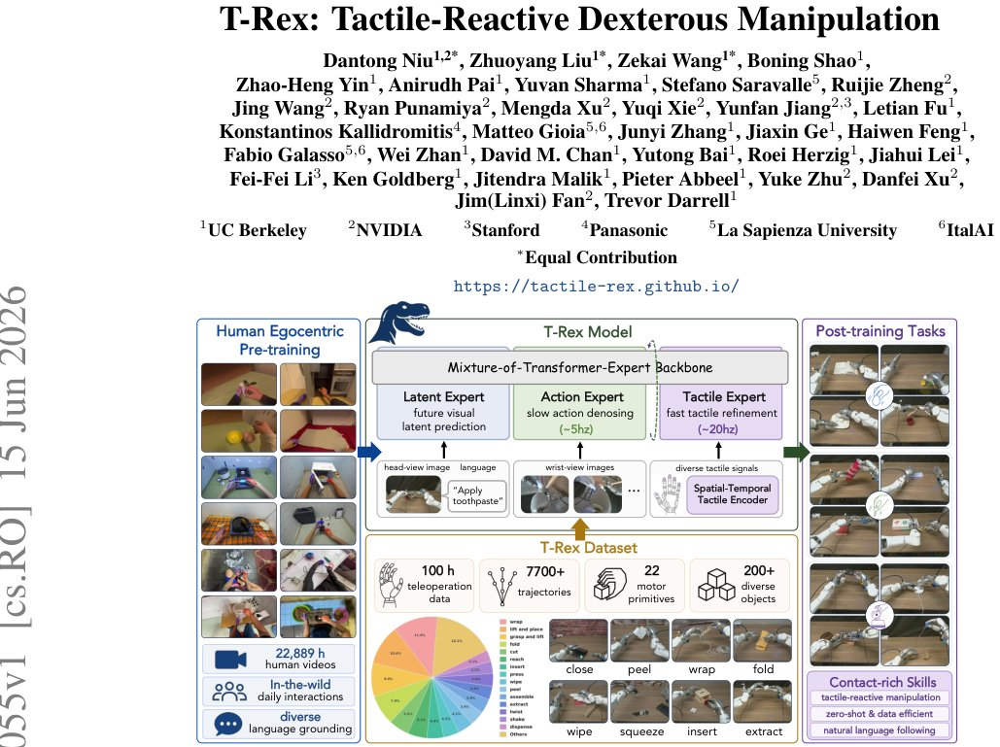

> *Generated by JarvisForResearchers Bot on 2026-06-17*

!!! tip "Why we featured this paper"
    Not yet indexed in S2 — assumed brand-new preprint

## TL;DR
T-Rex is a tactile-reactive dexterous manipulation framework utilizing a variable-rate Mixture-of-Transformer-Experts (MoT) architecture, trained on a 100-hour tactile-rich dataset, to achieve high success rates in contact-rich tasks.

## The Problem
Contemporary learning-based Vision-Language-Action (VLA) models for robotic manipulation exhibit significant limitations when deployed in contact-rich environments. These limitations stem from several interconnected issues: the neglect or insufficient integration of the tactile modality; reliance on encoders that process static cues; the scarcity of large-scale, diverse training data that captures fine-grained contact dynamics; the lack of standardized evaluation protocols for tactile-reactive performance; and inherent architectural constraints that often force VLA backbones to operate at frequencies incompatible with the high-bandwidth requirements of tactile feedback.

## Key Contributions
We introduce three primary contributions to address these gaps. First, we present the T-Rex Dataset, an open-source resource comprising 100 hours of tactile-synchronized teleoperation data, meticulously organized around distinct motor primitives and object interaction events. Second, we propose the T-Rex Model, which employs a variable-rate Mixture-of-Transformer (MoT) architecture augmented with a spatio-temporal tactile VQ-VAE. This model is trained using a novel mid-training recipe specifically designed to facilitate high-frequency, closed-loop control. Third, we establish a real-world evaluation benchmark for tactile-reactive dexterous manipulation, on which T-Rex demonstrates a robust and strong baseline performance for subsequent research.

## How It Works


*Figure 1: Overview. T-Rex is a tactile-reactive dexterous manipulation framework that combines
large-scale human egocentric pre-training with tactile-grounded robot mid-training.
Built on a
Mixture-of-Transformer-Experts (MoT) architecture, the T-Rex Model integrates low-frequency vi-
suomotor plann*

T-Rex operates by leveraging a Mixture-of-Transformer-Experts (MoT) backbone to manage the disparate temporal requirements of visual prediction, low-frequency action planning, and high-frequency tactile refinement. The core mechanism relies on Asynchronous Tactile-Reactive Cascaded Flow Matching, which partitions the trajectory generation process at a critical time step, $\tau_{split}$.

### Mixture-of-Transformer-Experts (MoT) Backbone
The MoT Backbone serves as the central computational unit, orchestrating the specialized roles of three distinct experts: the Latent Expert, the Action Expert, and the Tactile Expert. This modularity allows the system to handle different temporal scales of information processing simultaneously.

### Latent Expert
The Latent Expert is responsible for processing the high-level visual and language observations. Its function is to predict future visual representations, thereby providing the system with temporally grounded context necessary for long-horizon planning, independent of immediate contact events.

### Action Expert
The Action Expert operates at a lower frequency, approximately 5Hz. Its primary role is to generate an initial, low-frequency action plan. This is achieved by denoising an action trajectory from pure noise up to the intermediate timestep, $\tau_{split}$.

### Tactile Expert
The Tactile Expert is responsible for the high-frequency refinement of the action. It operates asynchronously, continuing the denoising process from $\tau_{split}$ down to $\tau = 0$. Crucially, it reuses the cached visual-language context provided by the Latent Expert while integrating real-time tactile observations to make fine-grained adjustments to the action trajectory.

### Spatial-Temporal Tactile Encoder
Raw tactile feedback, which includes both the recent force history ($f_{t-15:t}$) and the current deformation map ($d_t$), is processed by this encoder. It utilizes a per-finger Variational Quantized-Variational AutoEncoder (VQ-VAE) to compress the high-dimensional, time-series force data. Concurrently, a convolutional encoder processes the instantaneous deformation map. The output of this process is a compact sequence of tactile tokens, denoted as $z^t_{\tau}$, which are then fed into the Tactile Expert.

## Results
The empirical evaluation demonstrates the efficacy of the integrated tactile approach.

| Metric | Value | Baseline | Source |
| :--- | :--- | :--- | :--- |
| Average Success Rate | 65 | Strongest baseline (EgoScale) | Table 1 |
| Average Success Rate Improvement | over 30% | Strongest baseline | Abstract |
| Average Success Rate (Full Model) | 65 | N/A | Table 2 |
| Average Success Rate (w/o Tactile) | 42 | Full Model (Ours) | Table 2 |

## Why This Matters
The findings confirm that for tasks requiring fine motor control and interaction with physical objects, the integration of high-frequency tactile feedback is not merely beneficial but essential for achieving high success rates. The T-Rex framework demonstrates that by decoupling the planning (Action Expert) from the reactive refinement (Tactile Expert) and employing specialized encoders, one can effectively bridge the gap between general visuomotor priors learned from large datasets and the specific, high-bandwidth dynamics encountered during physical contact. This provides a viable architectural blueprint for next-generation dexterous robotic systems.

## Limitations & Open Questions
Current limitations include the dependency on a fixed-base bimanual Dexmate Vega-1 robot platform for the reported real-world experiments, which restricts generalizability across diverse hardware. Furthermore, the asynchronous cascading flow matching mechanism introduces significant complexity in implementation and debugging. Future work must address the generalization of this asynchronous control loop to varying robot kinematics and explore methods to reduce the computational overhead associated with the variable-rate expert switching.

---

## Citation

**Paper:** [2606.17055](https://arxiv.org/abs/2606.17055)

```bibtex
@article{260617055,
  title   = {T-Rex: Tactile-Reactive Dexterous Manipulation},
  author  = {Dantong Niu and Zhuoyang Liu and Zekai Wang and Boning Shao and Zhao-Heng Yin and Anirudh Pai et al.},
  journal = {arXiv preprint arXiv:2606.17055},
  year    = {2026},
  url     = {https://arxiv.org/abs/2606.17055}
}
```
