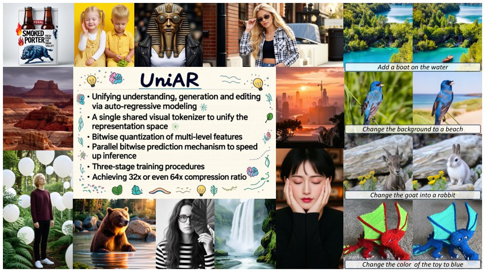

> *Generated by JarvisForResearchers Bot on 2026-06-18*

!!! tip "Why we featured this paper"
    Not yet indexed in S2 — assumed brand-new preprint

## TL;DR
UniAR introduces a unified autoregressive framework that resolves the representation split inherent in existing Unified Multimodal Models (UMMs). It achieves this via a single discrete visual tokenizer, leveraging Binary Spherical Quantization (BSQ) for implicit vocabulary scaling, and integrates this stream into a unified autoregressive model that employs parallel bitwise prediction. This architecture, coupled with a DiT-based decoder, enables high-fidelity image generation within a shared context.

## The Problem
Existing Unified Multimodal Models (UMMs) suffer from a fundamental architectural impedance mismatch: they typically employ two disparate visual tokenizers. This separation forces the representation space for visual understanding and visual generation to be distinct. Consequently, when an image needs to be interpreted by the understanding component, the generated image must first be re-encoded by the understanding tokenizer. This necessary re-encoding step fundamentally violates the goal of maintaining a truly 'shared context' across the multimodal pipeline.

The gaps in prior art are threefold:
1. Most existing works rely on two separate visual tokenizers, thereby segmenting the representation space for understanding and generation.
2. Unified tokenizer approaches face significant engineering hurdles in designing tokens that simultaneously satisfy the requirements of both generation and understanding, while also managing the cost associated with scaling the tokenizer vocabulary.
3. Previous attempts at unified models often lack the necessary architectural synergy between their understanding and generation components, or they rely on training objectives that are inherently divergent.

## Key Contributions
We introduce UniAR, a unified autoregressive framework designed around a single discrete visual tokenizer to achieve genuine unified modeling, augmented by multi-level feature fusion and lookup-free bitwise quantization. Furthermore, we present a unified autoregressive modeling paradigm that utilizes parallel bitwise prediction alongside a DiT-based decoder equipped with resolution upsampling, facilitating efficient high-resolution generation from compact visual sequences. Finally, we validate UniAR's efficacy, demonstrating state-of-the-art image generation performance while maintaining competitiveness on standard multimodal understanding benchmarks.

## How It Works


*Figure 1 Visual content generated by UniAR. UniAR produces high-fidelity visual content with demonstrated efficacy
in instruction-following and text rendering, alongside versatile image editing capabilities.*

UniAR operates by establishing a single, shared discrete representation for visual information. This is achieved by adapting continuous features extracted from a pre-trained vision encoder using Binary Spherical Quantization (BSQ) with a parameter setting of $dBSQ = 64$. This quantization scheme implicitly defines a vocabulary of $2^{64}$ tokens. To enrich the representation quality, multi-level feature fusion is implemented, incorporating three intermediate layers alongside the final layer output. This resulting discrete token stream is fed into a unified autoregressive model. This model jointly models text and visual tokens via a next-token prediction paradigm, specifically utilizing parallel bitwise prediction (LAR). The final stage involves a DiT-based visual decoder, which reconstructs high-fidelity images from the predicted tokens, conditioned exclusively on the visual signal $f_v$ and employing resolution upsampling.

### Unified Visual Tokenizer
This component is responsible for mapping continuous visual features into a discrete, shared token space. It operates by applying Binary Spherical Quantization (BSQ) to the feature maps derived from a pre-trained Large Multimodal Model's (LMM) vision encoder. Crucially, it incorporates multi-level feature fusion across multiple intermediate layers of the encoder, ensuring that the resulting tokens are semantically rich and capture information from various scales within the input image.

### Unified Auto-Regressive Model
Built upon a pre-trained Large Language Model (LLM) backbone, this model serves as the central predictor. It jointly models the sequence of visual and text tokens using a standard next-token prediction framework. A key innovation here is the implementation of parallel bitwise prediction, which allows the model to predict the discrete visual tokens in parallel with the text tokens, significantly improving efficiency compared to sequential prediction.

### DiT-based Visual Decoder
This component is responsible for the final pixel-space reconstruction. It utilizes a Diffusion Transformer (DiT) architecture. The decoding process is governed by Conditional Flow Matching (CFM) and is conditioned *solely* on the visual conditioning signal $f_v$. To achieve high-resolution output efficiently, the decoder incorporates resolution upsampling mechanisms.

## Results
| Metric | Value | Baseline | Source |
| :--- | :--- | :--- | :--- |
| Overall (GenEval) | 0.85 | N/A | Table 1 |
| Single (GenEval) | 1.00 | N/A | Table 1 |
| Two (GenEval) | 0.95 | N/A | Table 1 |

## Why This Matters
The core implication of UniAR is the realization of a true shared context in multimodal AI. By enforcing a single discrete token representation for both visual understanding and generation, we eliminate the representational bottleneck and the computational overhead associated with re-encoding between separate visual spaces. The use of lookup-free bitwise quantization provides a scalable mechanism to expand the effective vocabulary size without incurring the memory or computational cost of maintaining large, explicit codebooks. Furthermore, the parallel bitwise prediction mechanism in the autoregressive model directly addresses the sequential bottleneck in generative modeling, leading to accelerated inference.

## Limitations & Open Questions
We must note two specific limitations of the current implementation. First, the visual decoder is only introduced during the reinforcement learning phase to facilitate the acquisition of reward signals during the initial training stages; it is not necessarily part of the inference path in its full capacity. Second, the visual decoder is strictly conditioned only on the visual signal $f_v$ and does not incorporate any textual prompt information during the reconstruction process. Future work should investigate methods to integrate textual conditioning into the decoder while maintaining the benefits of the unified token stream.

---

## Citation

**Paper:** [2606.18249](https://arxiv.org/abs/2606.18249)

```bibtex
@article{260618249,
  title   = {Unified Multimodal Autoregressive Modeling with Shared Context-Visual Tokenizer is Key to Unification},
  author  = {Wujian Peng and Lingchen Meng and Yuxuan Cai and Xianwei Zhuang and Yuhuan Yang and Rongyao Fang et al.},
  journal = {arXiv preprint arXiv:2606.18249},
  year    = {2026},
  url     = {https://arxiv.org/abs/2606.18249}
}
```
