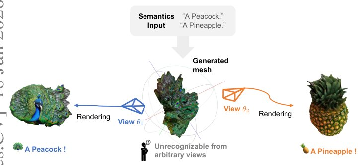

> *Generated by JarvisForResearchers Bot on 2026-06-20*

!!! tip "Why we featured this paper"
    Not yet indexed in S2 — assumed brand-new preprint

## TL;DR
JanusMesh provides a training-free framework for generating text-driven 3D visual illusions. It achieves this by separating the generation into two stages: a cross-space dual-branch denoising stage for geometry, which uses SDF blending for seamless fusion, and a view-conditioned texture synthesis stage for appearance, which ensures dual-semantic coherency.

## The Problem
Creating 3D visual illusions—a single 3D mesh that presents entirely different semantics depending on the viewing angle—is inherently difficult. Existing methodologies present distinct limitations. Optimization-based approaches, such as Shape From Semantics, are computationally prohibitive, requiring approximately 40 minutes per shape and frequently resulting in severe color over-saturation. Conversely, naive stitching methods, which combine separately generated objects, introduce unnatural geometric seams and visible semantic leakage. Furthermore, many current techniques assume fixed viewpoints, failing to adequately handle the significant orientation differences required when synthesizing multi-view illusions.

## Key Contributions
We introduce several key advancements:
1. A zero-shot framework that extends the concept of generative multi-view illusions from 2D representations to fully textured 3D meshes.
2. A training-free, two-stage architecture. This architecture incorporates dual-branch denoising with SDF blending and CLIP-guided alignment to maintain geometric integrity, coupled with view-conditioned texturing to ensure dual-semantic coherency.
3. A rigorous evaluation protocol that integrates CLIP, GPT-4.1-mini, FID/KID, and a novel Object Detection metric. Experiments validate the superiority of our method over existing baselines and demonstrate scalability to three-object illusions.

## How It Works


*Fig. 1: Zero-shot 3D Visual Illusion Generation. Given two different text
prompts, our method creates a single 3D mesh that embodies a dual-semantic visual
illusion. The generated shape appears unrecognizable from arbitrary viewpoints, but
it perfectly reveals the two target semantics (e.g., a peaco*

JanusMesh operates sequentially across two distinct stages.

Stage 1 focuses on geometry synthesis and fusion. This stage utilizes a cross-space dual-branch denoising process, built upon the Rectified Flow framework of TRELLIS. Two independent branches are conditioned on the respective semantic prompts, $y_1$ and $y_2$. These branches estimate clean latent representations, which are subsequently decoded into voxel space. Geometric fusion is managed by converting these voxels into Signed Distance Fields (SDFs). The fusion is performed via element-wise averaging of the SDFs, followed by binarization using a threshold $\tau$ to yield the blended geometry, $\hat{x}_{1|t}$.

Stage 2 addresses appearance synthesis. This stage employs view-conditioned texturing. We leverage a depth-conditioned ControlNet (based on Stable Diffusion) to predict clean images, $\hat{x}_{1|t}$, corresponding to the target viewpoints $\theta_1$ and $\theta_2$. These synthesized images are then aggregated onto the fused mesh from Stage 1 using cosine-weighted blending.

### TRELLIS
TRELLIS serves as the foundational 3D generator, implemented as a two-stage Rectified Flow [73] generator. Crucially, the geometric blending operation is integrated directly into this initial structural generation stage.

### Dual-Branch Denoising
This component consists of two independent denoising branches. Each branch is conditioned on a distinct semantic input, $y_1$ or $y_2$. Both branches initiate their denoising process from a shared initial noise vector, $z_t$.

### SDF Blending
To ensure seamless geometric fusion, the voxel representations from the two branches are first converted into Signed Distance Fields (SDFs). The fusion mechanism involves performing an element-wise average across the corresponding SDFs, which is then binarized using the threshold $\tau$. This procedure guarantees geometric continuity during the merging of divergent semantic structures.

### CLIP-guided Orientation Search
This mechanism addresses the alignment problem in multi-object setups. It employs CLIP text-image similarity to adaptively search for the optimal fusion orientation, $\theta^*_2$. This selection is made by matching the silhouette derived from the second object's latent representation, $\hat{v}_2$, against the representative view, $I_1$, of the first object's latent representation, $\hat{v}_1$.

### View-conditioned Texture Synthesis
This constitutes Stage 2. A depth-conditioned ControlNet is utilized to predict the clean target images, $\hat{x}_{1|t}$, corresponding to the specified viewpoints $\theta_1$ and $\theta_2$. These predicted images are subsequently aggregated onto the geometry produced in Stage 1 via a Mesh Texture Aggregation process.

### Noise Blending Guidance
When scaling to more complex scenarios, such as three-object illusions, this strategy is employed. It dictates that the initial denoising latent, $z_{\text{init}}$, is constructed as a weighted sum between the encoder output derived from a designated guidance voxel, $v_{\text{guide}}$, and pure Gaussian noise. The weighting factor is controlled by the parameter $\alpha$.

### Space Control Guidance
This is another strategy used for scaling complexity. It involves interpolating the latent representation between the guidance latent, $\text{Encoder}(v_{\text{guide}})$, and pure noise at a specific, predetermined timestep $t_0$.

## Results
| Metric | Value | Baseline | Source |
| :--- | :--- | :--- | :--- |
| Runtime (Case 1 & 2) | ~3 min | N/A | Table 1 |
| Runtime (Case 3 w/ CLIP search) | ~5 min | N/A | Table 1 |

## Why This Matters
The decoupling strategy employed by JanusMesh—separating geometry synthesis via cross-space denoising from appearance synthesis via view-conditioned diffusion—is critical for achieving coherent 3D illusions. Furthermore, the use of SDF blending, as opposed to simpler occupancy grid averaging, is necessary to maintain strict geometric continuity when fusing objects with conflicting semantic definitions. Finally, the integration of CLIP-guided orientation search automates the complex alignment problem, thereby preventing the geometric mismatches that typically lead to SDF fusion failures in multi-object constructions.

## Limitations & Open Questions
The current implementation necessitates the use of specific guidance strategies, namely Noise Blending or Space Control, when the system is scaled to three-object illusions due to the increased potential for geometric conflicts. Additionally, the texture synthesis stage is inherently dependent on the ability to render the fused Stage 1 mesh from the target viewpoints $\theta_1$ and $\theta_2$ to provide the necessary depth conditioning for the ControlNet.

---

## Citation

**Paper:** [2606.20563](https://arxiv.org/abs/2606.20563)

```bibtex
@article{260620563,
  title   = {JanusMesh: Fast and Zero-Shot 3D Visual Illusion Generation via Cross-Space Denoising},
  author  = {Siang-Ling Zhang and Huai-Hsun Cheng and Tsung-Ju Yang and Yu-Lun Liu},
  journal = {arXiv preprint arXiv:2606.20563},
  year    = {2026},
  url     = {https://arxiv.org/abs/2606.20563}
}
```
