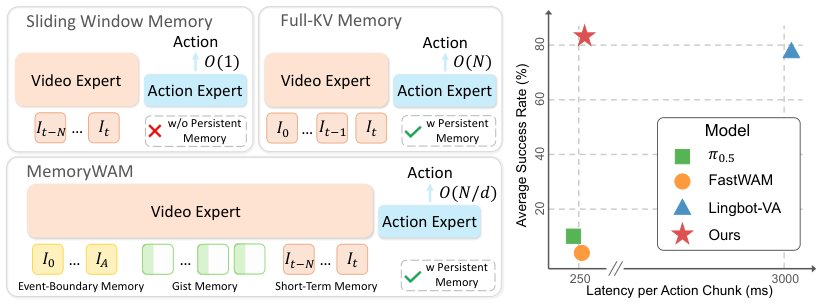

> *Generated by JarvisForResearchers Bot on 2026-06-21*

!!! tip "Why we featured this paper"
    Not yet indexed in S2 — assumed brand-new preprint

## TL;DR
MemoryWAM introduces a hybrid memory mechanism combining sliding-window context, event-boundary anchor frames, and compact gist tokens to enable efficient persistent memory in World Action Models, reducing complexity from $O(N)$ to $O(N/d)$.

## The Problem
Existing World Action Models (WAMs) face a fundamental trade-off: efficient methods use only a bounded window of recent observations, struggling in non-Markovian environments, while methods preserving long histories incur time and space costs that grow substantially with sequence length. Specifically, prior art shows that efficient WAMs condition on a fixed-size window of recent observations, which is insufficient for non-Markovian tasks. Conversely, autoregressive WAMs that preserve all historical frames suffer from inference latency and memory consumption growing substantially with sequence length. Prior methods lack a hybrid memory design that balances high-fidelity short-term context with compact long-range history.

## Key Contributions
We propose MemoryWAM, a world action model with efficient hybrid memory integrating sliding-window context, gist tokens, and anchor frames to retain persistent history while substantially reducing GPU memory consumption and inference latency. We present a systematic study of memory mechanisms for world action models, analyzing trade-offs among inference latency, GPU memory cost, and policy performance. Furthermore, we demonstrate that MemoryWAM consistently outperforms strong VLA and WAM baselines on long-horizon, memory-dependent manipulation tasks in both simulation and the real world.

## How It Works


*Figure 1: Overview. Prior WAMs typically face a memory-efficiency trade-off: sliding-window
memory is efficient but forgets long-range context, while full-history KV caching preserves context
but scales linearly with trajectory length N. MemoryWAM instead introduces hybrid memory:
recent frames for *

MemoryWAM employs a hybrid memory design within a Mixture-of-Transformers (MoT) architecture, utilizing a video DiT ($\Phi_v$) and an action DiT ($\Phi_a$). The model encodes observations $o_t$ into a video latent $z_t$ via a causal video VAE. During inference, the video DiT updates the video-side key-value (KV) cache $C_v^t$ using a hybrid memory structure: $C_v^{\le t} = C_v^{short} \cup C_v^{anchor} \cup C_v^{gist}$. Short-term memory uses a sliding-window cache over recent frames. Event-boundary memory preserves full visual tokens from anchor frames at task onset. Long-range history is compressed into $M$ learnable gist tokens per frame, reducing the long-term cache size from $O(NL)$ to $O(NL/d)$, where $d$ is the compression ratio. The action DiT then predicts actions by attending to this unified hybrid video cache.

### Video DiT ($\Phi_v$)
The Video DiT ($\Phi_v$) processes the video latent $z_t$ to extract dynamics-aware features and maintain the video-side KV cache $C_v^t$. This component is responsible for integrating the information from the various memory components into a coherent representation suitable for downstream action prediction.

### Action DiT ($\Phi_a$)
The Action DiT ($\Phi_a$) predicts the action chunk $a_{t:t+h-1}$ by denoising action tokens while attending to the cached video representations $C_v^{\le t}$. It leverages the unified hybrid video cache to inform its action generation process based on both immediate and distant context.

### Causal Video VAE
The Causal Video VAE encodes the observation $o_t$ into a compact video latent $z_t$ for computational efficiency. This initial encoding step ensures that the subsequent transformer components operate on a reduced-dimensionality representation of the raw visual input.

### Short-term memory
The Short-term memory is implemented as a sliding-window cache over the most recent $N_{recent}$ video frames. This mechanism is specifically designed to handle immediate closed-loop control requirements by providing high-fidelity, recent context.

### Event-boundary memory
The Event-boundary memory preserves a small set of anchor frames at task onset with full visual tokens to ground key information. This mechanism is crucial for establishing a stable, high-fidelity representation of the initial state or critical transition points in the task sequence.

### Gist memory
The Gist memory attaches $M$ learnable gist tokens to each frame to compress long-range history. This allows subsequent tokens to attend to $g_i$ instead of the full frame $f_i$, effectively reducing the long-term cache size by a factor related to the compression ratio $d$.

## Results
| Metric | Value | Baseline | Source |
| :--- | :--- | :--- | :--- |
| Average Success Rate (%) | 70 percentage points higher than methods that rely only on the current observation or short-term memory | Methods relying only on current observation or short-term memory | Section 1 |
| Inference Latency | Substantially lower | Previous WAMs with persistent memory | Section 1 |
| Long-term cache size complexity | $O(N/d)$ | $O(N)$ | Section 3.3 |

## Why This Matters
The practitioner takeaways highlight that hybrid memory structures (short-term window + long-term compression) are effective for balancing context retention and computational cost in sequential decision-making. Specifically, the compression ratio $d = L/M$ directly dictates the reduction in sequence-length-dependent storage and attention cost. For long-horizon tasks, explicitly modeling memory components, such as anchor frames, can provide crucial task-onset grounding, which is vital for robust performance in complex, memory-dependent manipulation tasks.

## Limitations & Open Questions
The method relies on a compression ratio $d$ derived from $L$ (latent visual tokens) and $M$ (gist tokens per frame). Furthermore, the performance presented is evaluated on RMBench [1], a specific long-horizon, memory-dependent manipulation benchmark, suggesting potential domain specificity in the reported gains.

---

## Citation

**Paper:** [2606.20562](https://arxiv.org/abs/2606.20562)

```bibtex
@article{260620562,
  title   = {MemoryWAM: Efficient World Action Modeling with Persistent Memory},
  author  = {Sizhe Yang and Juncheng Mu and Tianming Wei and Chenhao Lu and Xiaofan Li and Linning Xu et al.},
  journal = {arXiv preprint arXiv:2606.20562},
  year    = {2026},
  url     = {https://arxiv.org/abs/2606.20562}
}
```
