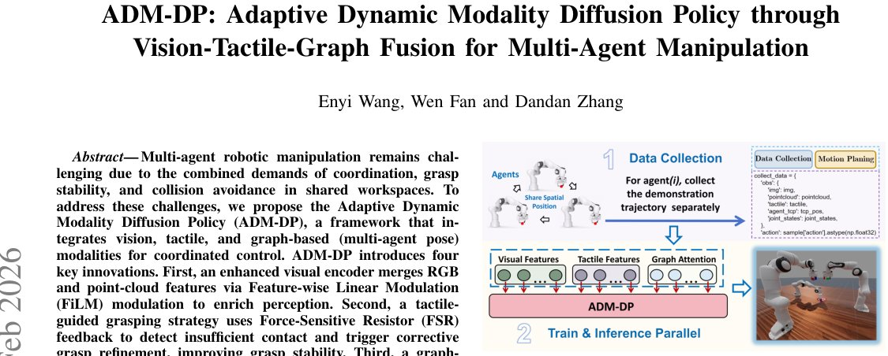

> *Generated by JarvisForResearchers Bot on 2026-06-22*

!!! tip "Why we featured this paper"
    Brand new preprint (2026) — accepted

## TL;DR
ADM-DP is a framework that integrates vision, tactile, and graph-based modalities using an Adaptive Modality Attention Mechanism (AMAM) to achieve coordinated control in multi-agent robotic manipulation.

## The Problem
Multi-agent robotic manipulation presents significant challenges stemming from the simultaneous requirements of achieving coordinated action, ensuring grasp stability, and maintaining collision avoidance within a shared operational workspace. These difficulties are compounded by the inherent limitations of traditional static multi-modal fusion strategies. Specifically, vision-centric methods are largely confined to single-agent scenarios, failing to address the complexities of multi-agent coordination or robust multi-sensory integration. Furthermore, centralized multi-agent control schemes are computationally intractable due to the exponential growth of the state space. Finally, most existing multi-modal approaches utilize static fusion, applying uniform weights across modalities irrespective of the current task phase, which results in both computational inefficiency and the introduction of noise into the decision-making process.

## Key Contributions
This work introduces three primary contributions to address these gaps. First, we propose a tactile-guided grasping strategy that utilizes Force Sensing Resistor (FSR) feedback to enable policies to detect insufficient contact and subsequently execute corrective grasp refinement. Second, we develop Multi-modal Encoding for Complementary Sensing, which employs FiLM modulation to effectively merge RGB and point-cloud features, while simultaneously using a Graph Attention Network (GAT) to process shared TCP positions specifically for collision avoidance. Third, we introduce Dynamic Modality Fusion via AMAM, which dynamically re-weights the importance of each modality based on the immediate task context using learnable importance weights, further stabilized by entropy regularization.

## How It Works


*Fig. 1. The overview pipline of our method framework.*

ADM-DP operates under a decoupled training paradigm where $n$ agents learn independent policies, $\pi_i: O_i \rightarrow A_i$. The observation $O_i$ for each agent aggregates local sensory data ($I_i, P_i, T_i, q_i, L_i$) alongside shared TCP positions ($O_{shared}$). Specialized encoders process these heterogeneous inputs into modality-specific feature vectors: $\\{f_v, f_t, f_g\\}$. The Adaptive Modality Attention Mechanism (AMAM) then computes context-dependent importance weights $\alpha$, fusing these features into a unified representation $f_{vtg}$. This fused representation is subsequently conditioned on the language instruction $L_i$ via FiLM modulation to produce $f_{cond}$, which serves as the input guiding a Diffusion Probabilistic Model (DDPM) for trajectory generation.

### Vision Encoding
This component handles the processing of visual data. RGB images $I_i \in \mathbb{R}^{H \times W \times 3}$ are passed through a ResNet architecture to yield a feature vector $f_{img} \in \mathbb{R}^{512}$. Concurrently, point clouds $P_i \in \mathbb{R}^{N \times 6}$ are processed by a modified PointNet to produce $f_{pc} \in \mathbb{R}^{1024}$. These two features are then integrated using FiLM modulation to produce the final vision feature representation, $f_v \in \mathbb{R}^{512}$.

### Tactile Encoding
The tactile readings $T_i \in \mathbb{R}^{32}$, derived from a $4 \times 4$ array of FSR sensors, are processed by incorporating positional encoding followed by 1D convolutions. The resulting convolutional features are then fused with explicit contact dynamics information (specifically, resultant and differential force measurements) to yield the tactile feature vector, $f_t \in \mathbb{R}^{64}$.

### Graph-based Collision Encoding
To manage inter-agent spatial relationships, this component utilizes a Graph Attention Network (GAT). The input is the set of shared TCP positions, $O_{shared} = \{p_{tcp}^1, \dots, p_{tcp}^n\}$. Edge weights $e_{ij}$ are defined based on the inverse squared distance between agents: $e_{ij} = 1 / (\|p_{tcp}^i - p_{tcp}^j\|^2 + \epsilon)$. The GAT processes these positions and edge weights to generate a concise graph feature representation, $f_g \in \mathbb{R}^{64}$.

### Adaptive Modality Attention Mechanism (AMAM)
The AMAM is responsible for dynamic feature weighting. It computes importance weights $\alpha$ by applying a softmax function over the output of a Multi-Layer Perceptron (MLP) applied to the concatenated features $[f_v; f_t; f_g]$, scaled by a temperature parameter $\tau$: $\alpha = \text{softmax}(\text{MLP}([f_v; f_t; f_g])/\tau)$. The final fused feature $f_{vtg}$ is a weighted sum: $f_{vtg} = \alpha_v \cdot f_v + \alpha_t \cdot f_t + \alpha_g \cdot f_g$. This process is regularized by an entropy term, $L_{reg} = -\lambda \sum_{m \in \{v,t,g\}} \alpha_m \log(\alpha_m)$, to encourage diverse attention distributions.

### Conditional Feature Integration
This stage integrates the fused sensory information with the agent's internal state and task context. The fused feature $f_{vtg}$ is concatenated with the agent's proprioceptive joint states $q_i$ to form the observation feature $f_{obs} = [f_{vtg}; q_i]$. This $f_{obs}$ is then modulated by the language instruction embedding $f_l = \text{CLIP}(L_i)$ using FiLM modulation, resulting in the final context-aware feature vector, $f_{cond}$.

### Diffusion-based Action Generation
The policy utilizes a conditional diffusion model following the DDPM framework. The action generation is achieved by modeling the reverse diffusion process, $p_\theta(a_{k-1}|a_k, f_{cond})$. This reverse transition is parameterized by a U-Net architecture. The model is trained by minimizing the standard diffusion loss, $L_{diff} = E_{k,\epsilon,a_0} [\|\epsilon - \epsilon_\theta(a_k, k, f_{cond})\|^2]$, where $\epsilon$ is the noise added at time step $k$.

## Results
| Metric | Value | Baseline | Source |
| :--- | :--- | :--- | :--- |
| Performance Gain | 12-25% | state-of-the-art baselines | Abstract |

## Why This Matters
The introduction of AMAM moves the field beyond the limitations of static fusion, providing a mechanism where the system can intelligently prioritize the most reliable or relevant sensory input based on the immediate operational context—for instance, prioritizing tactile feedback during contact establishment versus prioritizing vision during path planning. Furthermore, the tactile-guided refinement loop provides a direct, closed-loop mechanism for improving manipulation success rates by actively correcting sub-optimal grasps. The decoupled training structure facilitates the scaling of the system to larger multi-agent teams without incurring the prohibitive computational overhead associated with fully centralized state representations.

## Limitations & Open Questions
The current formulation does not explicitly detail the computational complexity scaling beyond the benefits afforded by the decoupled training paradigm. Additionally, the specific hyperparameter values for the regularization coefficient $\lambda$ within $L_{reg}$ and the temperature $\tau$ within the AMAM are not provided in the presented work.

---

## Citation

**Paper:** [2602.21622](https://arxiv.org/abs/2602.21622)

```bibtex
@article{260221622,
  title   = {ADM-DP: Adaptive Dynamic Modality Diffusion Policy through Vision-Tactile-Graph Fusion for Multi-Agent Manipulation},
  author  = {Enyi Wang and Wen Fan and Dandan Zhang},
  journal = {arXiv preprint arXiv:2602.21622},
  year    = {2026},
  url     = {https://arxiv.org/abs/2602.21622}
}
```
