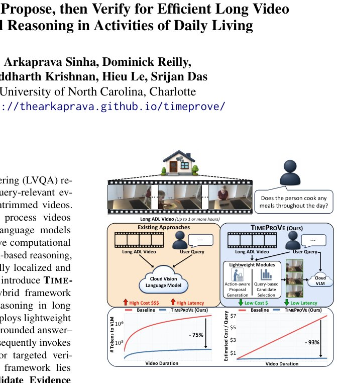

> *Generated by JarvisForResearchers Bot on 2026-06-22*

!!! tip "Why we featured this paper"
    Not yet indexed in S2 — assumed brand-new preprint

## TL;DR
TIMEPROVE introduces a hybrid framework to address the computational bottleneck in Long Video Question Answering (LVQA). It leverages lightweight modules to generate action-grounded answer-evidence hypotheses from long videos, subsequently invoking an expensive Vision-Language Model (VLM) only for targeted verification, achieving significant cost reduction.

## The Problem
Long Video Question Answering (LVQA) necessitates the identification of sparse, query-relevant evidence embedded within videos that can span hours. Current methodologies suffer from a fundamental trade-off: either they process the entire video densely using large VLMs, leading to prohibitive computational overhead due to context window limitations, or they rely on sparse caption-based reasoning. The latter approach frequently fails because sparse captions lack the necessary temporal grounding, subtle motion cues, or fine-grained detail required to answer complex questions about activities in the real world (ADL QA). Furthermore, existing agentic frameworks often select frames based on LLM reasoning over sparse captions, decoupling this selection from any learned visual prior regarding the occurrence of actions.

## Key Contributions
We introduce TIMEPROVE, a novel hybrid framework designed to mitigate the cost of dense video processing. This framework performs lightweight long-video temporal reasoning to generate action-grounded hypotheses, subsequently verifying only sparse RGB evidence using an expensive VLM. A core component is the Action-based Candidate Evidence (ACE) module, which transforms detected actions into query-conditioned answer-evidence candidates via lightweight LLM reasoning and structured reranking. Finally, we present OPENTSUBENCH (OTB), an open-ended benchmark specifically designed for temporally grounded LVQA using real-world, untrimmed ADL videos.

## How It Works


*Figure 1: TIMEPROVE reduces long-video LVQA cost
by proposing query-relevant evidence locally before
VLM verification. Instead of processing the full video,
it sends only short targeted clips to the cloud VLM.*

TIMEPROVE operates in a two-stage pipeline. The first stage utilizes the ACE module to process the full video using computationally inexpensive models. This begins with an Action Detector, which produces a sparse temporal action timeline. This timeline is then fed into a Query-conditioned Proposal Generator, which employs an edge LLM to convert the action timeline and the query ($q$) into a set of query-conditioned hypotheses, $H_q = \{(a_i, w_i)\}_{i=1}^M$. Here, $w_i$ represents evidence windows derived either from atomic events or merged events. These hypotheses are then locally ranked using a score $R(w|q)$ that aggregates temporal, semantic, coverage, and length criteria. The second stage, the Temporal Verifier, selectively invokes the expensive cloud VLM only on the short RGB evidence clip, $e_{V_t}$, corresponding to the highest-ranked unverified hypothesis $(a_t, w_t)$, to confirm if sufficient visual evidence supports the hypothesis and yield the final answer.

### Action Detector
The Action Detector performs a single pass over the input video. It utilizes a frozen visual backbone, such as I3D or CLIP, to predict action probabilities, $P = \text{fact}(v) \in [0, 1]^{T \times |C|}$, across temporal segments. These raw probabilities are then decoded into a discrete event timeline, $A = \{(c_i, s_i, e_i)\}_{i=1}^N$, representing detected actions with their start and end times.

### Query-conditioned Proposal Generator
This module leverages an edge LLM to perform reasoning over the generated event timeline $A$ and the input query $q$. Its function is to propose candidate answers ($a_i$) and their corresponding evidence windows ($w_i = [s_i, e_i]$). The generator outputs both atomic windows ($W_{\text{atom}}$) corresponding to individual detected events and merged windows ($W_{\text{merge}}$) that aggregate temporally proximate or semantically related events.

### Scoring & Reranking
This component executes a local ranking step to prioritize the most promising hypotheses. It computes a composite score $R(w|q) = R_{\text{tmp}}(w, q) + R_{\text{sem}}(w, q) + R_{\text{cov}}(w, q) - R_{\text{len}}(w)$. This structured scoring mechanism allows for the intelligent selection of the top-ranked hypothesis, $H^*_q$, which is then passed forward for verification.

### Temporal Verifier
The Temporal Verifier is the gatekeeper for the expensive VLM. It is invoked exclusively on the short RGB evidence clip, $e_{V_t}$, associated with the highest-ranked unverified hypothesis $(a_t, w_t)$. Its sole purpose is to determine if the visual evidence within $e_{V_t}$ sufficiently supports the hypothesis. If verified, it returns the final answer $(a^*, S^*, V^*)$.

## Results
| Metric | Value | Baseline | Source |
| :--- | :--- | :--- | :--- |
| Outperformance on OTB | 7.3% | strongest baseline | Empirical results |
| Reduction in VLM calls | 75% | N/A | Figure 1 |
| Reduction in inference cost | 93% | N/A | Figure 1 |
| Performance on CHARADES-STA | competitive performance | specialized temporal grounding VLMs | Empirical results |

## Why This Matters
The TIMEPROVE framework provides a viable pathway to deploying high-accuracy LVQA systems in real-world, long-form video analysis without incurring the prohibitive operational costs associated with dense VLM inference. By strategically decoupling the temporal proposal generation—a task amenable to lightweight, local reasoning—from the fine-grained visual verification, we achieve substantial efficiency gains. Furthermore, the introduction of OPENTSUBENCH establishes a necessary, rigorous evaluation standard for assessing true temporal grounding capabilities in complex ADL scenarios.

## Limitations & Open Questions
The efficacy of TIMEPROVE is inherently dependent on two factors: the fidelity of the initial action detection performed by the Action Detector, and the LLM's capacity within the Query-conditioned Proposal Generator to correctly aggregate atomic windows into contextually coherent merged windows. Additionally, the current pipeline terminates either upon successful verification of a candidate or when the predefined verification budget is exhausted, which may preclude finding the optimal answer if the initial hypotheses are systematically flawed.

---

## Citation

**Paper:** [2606.20561](https://arxiv.org/abs/2606.20561)

```bibtex
@article{260620561,
  title   = {TimeProVe: Propose, then Verify for Efficient Long Video Temporal Reasoning in Activities of Daily Living},
  author  = {Arkaprava Sinha and Dominick Reilly and Siddharth Krishnan and Hieu Le and Srijan Das},
  journal = {arXiv preprint arXiv:2606.20561},
  year    = {2026},
  url     = {https://arxiv.org/abs/2606.20561}
}
```
