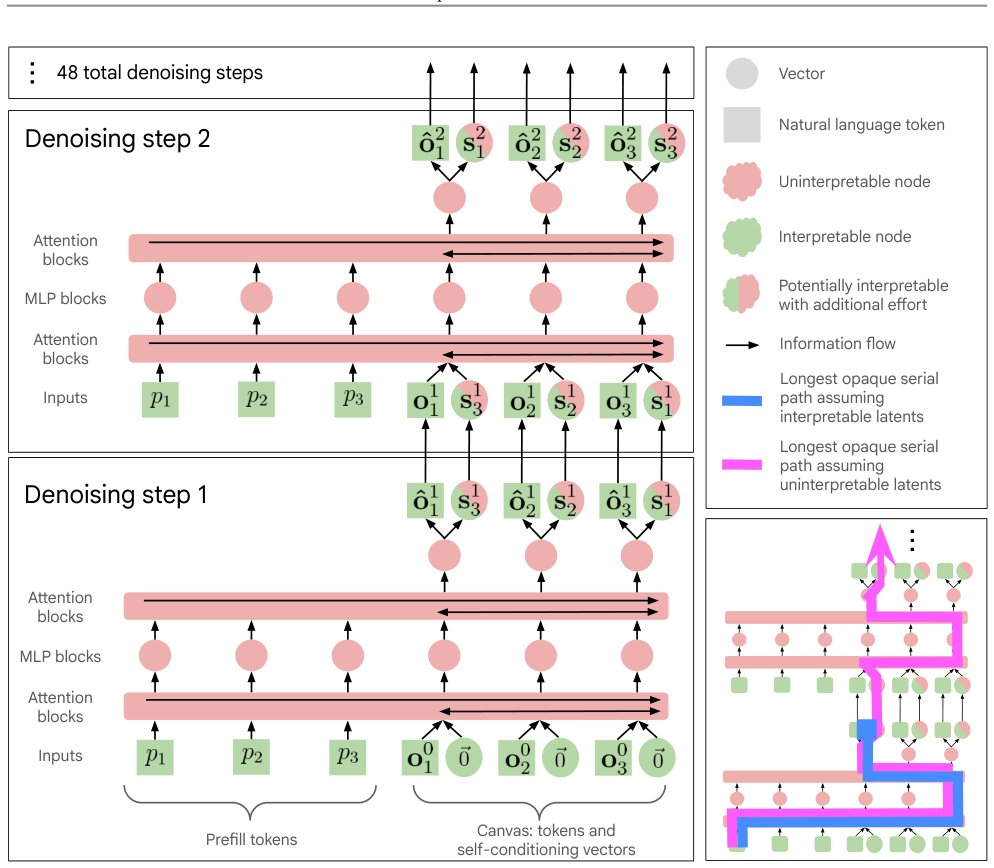

> *Generated by JarvisForResearchers Bot on 2026-06-23*

!!! tip "Why we featured this paper"
    Not yet indexed in S2 — assumed brand-new preprint

## TL;DR
This work establishes that the information flow within DiffusionGemma, a text diffusion model, can be constrained through an interpretable token bottleneck without incurring performance degradation. By restricting the self-conditioning matrix $S_t$ to a small set of tokens via logit modification functions, the opaque serial depth is reduced from a factor of 28.6X relative to Gemma 4 to 1.1X, while maintaining baseline performance. This suggests a pathway toward greater transparency in continuous latent space models.

## The Problem
The interpretability of Large Language Models (LLMs) is a critical concern for deployment in safety-critical or high-stakes applications. While autoregressive models have established methods for analyzing sequential decision-making, the transparency of models operating in continuous latent spaces, such as DiffusionGemma, remains poorly understood. Specifically, the inherent structure of diffusion models presents unique challenges: the serial depth is often significantly higher than that of comparable autoregressive models, and the nature of token prediction changes dynamically across every denoising step, complicating static analysis of information flow.

## Key Contributions
We present three primary contributions to this area:
1. We demonstrate that the information exchanged between denoising steps in DiffusionGemma can be successfully mapped through an interpretable token bottleneck without any measurable decrease in downstream performance.
2. We successfully reduce the opaque serial depth from $28.6\text{X}$ relative to Gemma 4 to $1.1\text{X}$ relative to Gemma 4 by treating the intermediate states as interpretable via bottlenecking.
3. We provide initial empirical evidence suggesting novel, diffusion-specific reasoning phenomena, including non-chronological reasoning, token and sequence smearing, and intermediate-context reasoning.

## How It Works


*Figure 1 | A simplified architecture diagram of DiffusionGemma, with the first two denoising steps
shown; see Section 2.1 for an in-depth description of DiffusionGemma’s architecture and sampling.
We additionally show the path with the largest opaque serial depth with and without the assumption
that*

The methodology employed decomposes the concept of transparency into variable and algorithmic components. For DiffusionGemma, the primary focus is on quantifying the opaque serial depth, which is dictated by the $T$ iterations of the denoising loop. Initially, the unconstrained information flow within the self-conditioning mechanism results in an opaque serial depth that is substantially larger than that observed in Gemma 4.

To address this, we introduce a mechanism to constrain the information content of the self-conditioning matrix $S_t \in \mathbb{R}^{C \times d_{model}}$. This matrix, which is passed between denoising steps, is derived from the softmax of the predicted logits $\hat{\ell}_t$ multiplied by a weight matrix $W_E$. We apply logit modification functions, such as $f_p$ or $f_k$, to $\hat{\ell}_{t_i}$. These functions effectively restrict the information carried by $S_t$ to only $k$ salient tokens, yielding a modified matrix $S'_t$. This targeted restriction successfully lowers the serial depth while preserving predictive capability.

### Canvas
The Canvas structure is defined by two primary components: $C_{tokens}$ and $C_{self-conditioning vectors}$. This structure dictates the dimensionality and composition of the information being processed across the latent space during the diffusion process.

### Self-conditioning matrix $S_t$
$S_t$ is a matrix of dimension $\mathbb{R}^{C \times d_{model}}$ that mediates information transfer between successive denoising steps. Its construction, $S_t = \text{softmax}(\hat{\ell}_t) \cdot W_E$, means it encapsulates the model's current predictive state, which is the target for our interpretability intervention.

### Denoising Loop
The core computational process involves the Denoising Loop, which executes for $T_{denoising}$ steps. Each iteration involves a forward pass through the diffusion model architecture followed by a sampling step, where the state is refined toward the final output.

### Logit modification functions $f$
These functions, exemplified by $f_p$ or $f_k$, are applied directly to the logits $\hat{\ell}_{t_i}$ at specific time steps $t_i$. Their purpose is to act as a filter, ensuring that the subsequent construction of $S_t$ only incorporates information relevant to a restricted set of $k$ tokens, thereby creating the interpretable bottleneck.

## Results
The quantitative analysis of the serial depth reduction and performance retention is summarized below.

| Metric | Value | Baseline | Source |
| :--- | :--- | :--- | :--- |
| Empirical opaque serial depth (Uninterpretable Bottleneck) | 608,016 | 21,235 (Gemma 4 26B A4B) | Table 1 |
| Empirical opaque serial depth (Interpretable Bottleneck) | 23,571 | 21,235 (Gemma 4 26B A4B) | Table 1 |
| Performance (Top-K Ablation $k=8$ vs Baseline) | Same performance as the baseline | Baseline | Figure 2 |

## Why This Matters
The findings suggest a viable architectural pathway toward achieving greater transparency in complex generative models operating in continuous latent spaces. By demonstrating that the critical information flow can be channeled through a constrained, token-based bottleneck ($S'_t$), we move beyond the purely opaque nature of diffusion processes. Furthermore, the observation that the restricted top tokens often correspond to the final token identities provides a concrete, actionable insight into the model's decision-making process at intermediate stages. The discovery of phenomena like non-chronological reasoning also opens new avenues for AI safety research, requiring us to develop diagnostic tools specific to diffusion dynamics.

## Limitations & Open Questions
The current results are intrinsically tied to the specific architectural parameters and training regime of DiffusionGemma. It is not guaranteed that this bottlenecking strategy generalizes perfectly to all diffusion model variants. A significant open question remains whether this interpretability gain persists when latent reasoning models are trained using fundamentally different paradigms, such as outcome-based Reinforcement Learning, which might induce even more opaque latent representations.

---

## Citation

**Paper:** [2606.20560](https://arxiv.org/abs/2606.20560)

```bibtex
@article{260620560,
  title   = {How Transparent is DiffusionGemma?},
  author  = {Joshua Engels and Callum McDougall and Bilal Chughtai and Janos Kramar and Senthoran Rajamanoharan and Cindy Wu et al.},
  journal = {arXiv preprint arXiv:2606.20560},
  year    = {2026},
  url     = {https://arxiv.org/abs/2606.20560}
}
```
