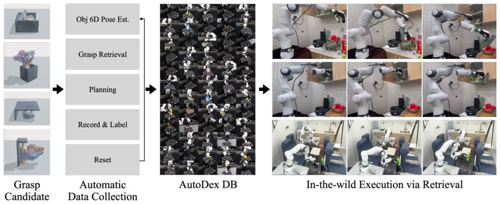

> *Generated by JarvisForResearchers Bot on 2026-06-24*

!!! tip "Why we featured this paper"
    Not yet indexed in S2 — assumed brand-new preprint

## TL;DR
AutoDex is an end-to-end automated system designed to populate a database of physically validated dexterous grasp trials without continuous human intervention. It integrates candidate generation, dense multi-view perception, collision-monitored execution, automated labeling, and active object resetting to achieve high throughput and reliable real-world data collection for complex grasping tasks.

## The Problem
The development of robust dexterous grasping policies is fundamentally constrained by the availability of high-quality, physically labeled real-world interaction data. Current methodologies present a dichotomy: simulation offers high-throughput data generation but lacks the fidelity to certify real-world contact validity, while manual teleoperation provides ground truth but is inherently slow, subject to operator fatigue, and prone to bias. Scaling hardware validation—the only path to true physical validity—requires automating the entire data collection loop, encompassing perception, execution, labeling, and state reset, without human oversight.

## Key Contributions
We introduce AutoDex, an end-to-end automated system capable of executing and labeling generated dexterous grasp candidates directly on physical hardware. This system has yielded a substantial real-world grasp-trial database, cataloging successes and failures across 100 distinct objects, complete with synchronized multi-view observations and robot-state trajectories. Furthermore, we provide a system-level evaluation demonstrating the throughput gains over teleoperation, the achieved real-world success rate against a model-screened baseline, the efficacy of autonomous reset across challenging pose transitions, and the impact of dense multi-view perception on collection reliability.

## How It Works


*Figure 1: The AutoDex pipeline. AutoDex builds a database of physically labeled dexterous-grasp
trials by executing generated candidates in a multi-camera workcell, labeling lift-and-hold success
or failure, and resetting the object between trials. At deployment, downstream systems retrieve
successf*

AutoDex functions as a closed-loop, automated data acquisition pipeline. The process initiates by receiving candidate grasp proposals from a modular candidate generator (specifically, BODex). These candidates are then subjected to initial object pose estimation and continuous execution-time tracking using dense multi-view perception. Viable candidates are selected and tested on a physical multi-finger robot hand within a calibrated workcell. Trial outcomes are determined automatically via a lift-and-hold criterion. Upon completion of a trial, an active reset module is engaged to transition the object to a new stable pose, enabling continuous, unattended data collection if unattempted candidates remain at the current location.

### Dense 20-camera perception
This component is responsible for maintaining state awareness throughout the execution phase. It provides the necessary input for both the initial estimation of the object's pose and for tracking the object's state dynamically during the grasp attempt, even when occluded by the robot hand.

### Collision-monitored motion execution
Execution is performed unattended using a learned residual-torque monitor. This monitor, implemented as $\hat{\tau}_{\theta} = MLP_{\theta}(q, \dot{q})$, calculates the expected torque based on the current state $(q, \dot{q})$. The residual torque, $\tau_{res} = \hat{\tau}_{\theta} - \tau_{motor}$, is used to detect unexpected physical contacts that deviate from the model's prediction, ensuring safe operation during unsupervised attempts.

### Physical success/failure labeling
The ground truth for each trial is established autonomously. The system employs a lift-and-hold criterion: a trial is classified as a success if the tracked object maintains a vertical separation of at least 5 cm from its initial height for a duration of 3 seconds.

### Active object reset
When the set of candidates for the current object pose is exhausted, this module takes over. It executes collision-free reset grasps to move the object from its current stable pose ($P_i$) to a new, distinct stable pose ($P_j$), thereby facilitating the exploration of the candidate space across multiple configurations without human intervention.

## Results
The implementation of the AutoDex pipeline yielded significant improvements in data collection efficiency and quality compared to manual methods.

| Metric | Value | Baseline | Source |
| :--- | :--- | :--- | :--- |
| Throughput Improvement | 4.8$\times$ | 49.4 h (teleoperation) | Figure 4 (left) |
| Real-world Success Rate | 76% | 34% | Figure 4 (right) |

## Why This Matters
For tasks involving high-dimensional manipulation, such as dexterous grasping, the bottleneck shifts from algorithmic design to data acquisition. AutoDex demonstrates that end-to-end automation is a necessary paradigm shift to bridge the gap between the scalability of simulation and the necessary reliability of real-world contact validation. The integration of dense multi-view perception with learned residual-torque monitoring provides a viable framework for safe, unsupervised execution in complex physical environments. Furthermore, the inclusion of an active reset mechanism proves critical for efficiently sampling the entire configuration space of an object.

## Limitations & Open Questions
A primary limitation is that the system relies on the modular candidate generator (BODex), which only guarantees kinematic and geometric feasibility; it does not inherently guarantee stability under the full spectrum of real contact dynamics. Additionally, the current reset module for flat objects may necessitate relaxing the placement endpoint constraint, allowing release at a height $h$ above the target pose, which introduces a descent constraint that requires further investigation.

---

## Citation

**Paper:** [2606.23689](https://arxiv.org/abs/2606.23689)

```bibtex
@article{260623689,
  title   = {AutoDex: An Automated Real-World System for Dexterous Grasping Data Collection},
  author  = {Mingi Choi and Gunhee Kim and Jisoo Kim and Taeksoo Kim and Taeyun Ha and Jongbin Lim et al.},
  journal = {arXiv preprint arXiv:2606.23689},
  year    = {2026},
  url     = {https://arxiv.org/abs/2606.23689}
}
```
